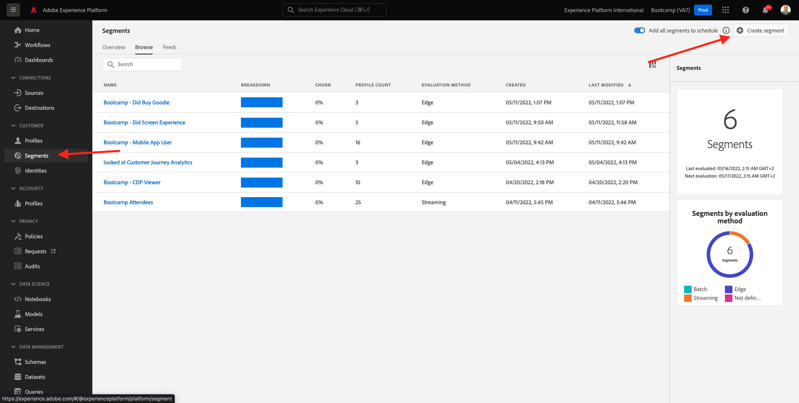

# 1.3 Segmento de Crie - Interface do usuário

Ouro, Você, Um segmento usando Construtor de Segmentos da Adobe Experience Platform.

## História

Acesse [Adobe Experience Platform](https://experience.adobe.com/platform). Depois de &quot;Faça&quot;, você vai acessar um início do logon no Adobe Experience Platform.

Antes de continuar, você precisa selecionar um **sandbox**. O nome do sandbox a ser selecionado é ``Bootcamp``. É possível isto clicando texto **[!UICONTROL Produto de produção]** na linha azul na parte superior da tela. Depois de selecionar o sandbox apropriado, você verá a tela mudando e agora está em sua [!UICONTROL sandbox] dedicado.

Sem menu à esquerda, acesse **Segmentos**. Volte, você tem uma visão geral de todos os segmentos existentes. no +  para um segmento de novo.

Quando, no construtor de segmentos você vai perceber imediatamente menu de **Atributos** e a referência **Perfil individual XDM**.

Como o XDM é a linguagem que alimenta o setor de experiência, o XDM também é a base para o construtor de segmentos. Todos os os dados ingeridos na plataforma devem ser eados em relação ao XDM e, portanto, todos os dados se tornam parte do leme de dados, independentemente da origem dos dados. Isso é uma grande vantagem ao segmentos, pois é uma interface do usuário do construtor de segmento, é possível combinação de qualquer origem não fluxo do trabalho. Os segmentos não criados Construtor de segmentos ser enviados para soluções Adobe Target, Adobe Campaign e Adobe Audience Manager para ativação.

Agora você vê o segmento de todos clientes **Real-Time CDP**.

Para construir este segmento, você é um Evento de experiência. Você pode clicando os de experiência no ícone **Eventos** na barra do menu **Campos**.

Em, você **ExperienceEvents XDM** faça superior. Clique em **ExperiênciaEvento XDM**.

Acesse **Itens da lista de produtos**.

Selecione **Nome** e arraste e solte o objeto **Nome** do menu à esquerda na tela do construtor de segmentos na seção **Eventos**. Em, seguinte será exibido:

O parâmetro de comparação. **igual** e, sem campo de entrada, insira **CDP em tempo real**.

Sempre que você elemento construtor clicar não **Atualizar Estimativa** para uma nova estimativa da população em segmento.

Parágrafo **Método de avaliação** selecione **Edge**.

Por fim, vamos um ao nome e salvá-lo.

Como da nomenclatura, use:

- `seuSobrenome - Interest in Real-Time CDP`

Em, nada **Salvar e fechar** para salvar segmento.

Agora você vai tornar ao &quot;Voltar do visão geral do segmento&quot;, onde verá uma visualização de amostra dos perfis de clientes que se qualificam para o segmento.

Agora você continuar no exercício próximo e seu segmento com o Adobe Target.

Proxima. [1.4 Ação: segmento do ambiente para o Adobe Target](./ex4.md)

[Retornar para Fluxo de Correio](./uc1.md)

[Retornar para Todos os Módulos](../../overview.md)
