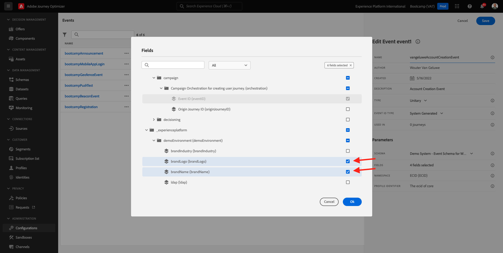

# 2.2 Criar seu evento

Faça logon no Adobe Journey Optimizer acessando a [Adobe Experience Cloud](https://experience.adobe.com). Clique em **Journey Optimizer**.

Você será redirecionado para a da **Início** sem Journey Optimizer. Primeiro, usar você está usando o sandbox correto. O nome do sandbox que deve ser usado é `Bootcamp`. Para alternar de um sandbox para outro, clique em Prod e o sandbox na lista. Exemplo, o nome do sandbox é **Bootcamp**. Você está na da **Início** fazer seu sandbox `Bootcamp`.

Sem menu à esquerda, papel para baixo e clique em **Configurações**. Em seguida, clique no botão **Gerenciar** abaixo de **Eventos**.

Você verá uma visão geral de todos os eventos. Clique em **Criar evento** para começar a criar seu próprio evento.

Uma nova janela de evento irá aparecer.

Em primeiro lugar, dê um nome ao seu evento como, por exemplo: `seuSobrenomeAccountCreationEvent` e descrição uma descrição como, por exemplo: `Account Creation Event`.

Em mudança, em mudança de que **Tipo** está definido como **Unitário** e, para a seleção de **Tipo de ID de evento**, **Gerado pelo sistema**.

A seguinte é a seleção do esquema. Um esquema foi preparado para este exercício. Uso do esquema `Demo System - Event Schema for Website (Global v1.1) v.1`.

Depois de selecionado o Schema, você verá vários vários campos vistos na história **Campos**. Agora você deve passar o mouse sobre a migração **Campos** e três pop-up é exibido. Clique no ➡ **Editar**.

Você verá uma janela pop-up de **Campos**, onde você deve selecionar alguns dos campos que mostram para as prioridades o e-mail. Arquivado do original em 19 de julho de 2012 &quot;Escolheremos outros, os dados já na Adobe Experience Platform&quot; .

Nenhum objeto `_experienceplatform.demoEnvironment`, pélvicos-se de seleção dos campos **brandLogo** e **brandName**.

Nenhum objeto `_experienceplatform.identification.core`, ➡-se de seleção o campo **email**.

Clique em **Ok** para a medição das alterações climáticas.

Em seguida, a tela abaixo deve ser exibido. Clique em **Salvar**  &quot;mais uma vez para a medição das alterações.&quot;

Seu evento agora está configurado e salvo.

Clique no seu evento para abrir mais uma vez a tela **Editar evento**. Passe o mouse sobre **Campos** para ver os 3 outra vez. Clique no ➡ **Exibir carga**.

Agora você vai um exemplo da carga útil.
Seu evento tem um eventID de orquestração única, que você pode encontrar rolando para baixo útil útil útil (carga útil) até `_experience.campaign.orchestration.eventID`.

O eventID é o que deve ser enviado à Adobe Experience Platform para acionar a jornada que você construirá em um dos relatórios publicados. -se deste eventID, você pode alterar a data.
`"eventID": "19cab7852cdef99d25b6d5f1b6503da39d1f486b1d585743f97ed2d1e6b6c74f"`

Clique em **Ok** e, em seguida, clique em **Cancelar**.

Agora você terminou este exercício.

Próxima etapa: [ 2.3 Sua mensagem de e-mail](./ex3.md)

[Retorno para Fluxo de monitoramento 2](./uc2.md)

[Retorno para Todos os compartilhados](../../overview.md)
