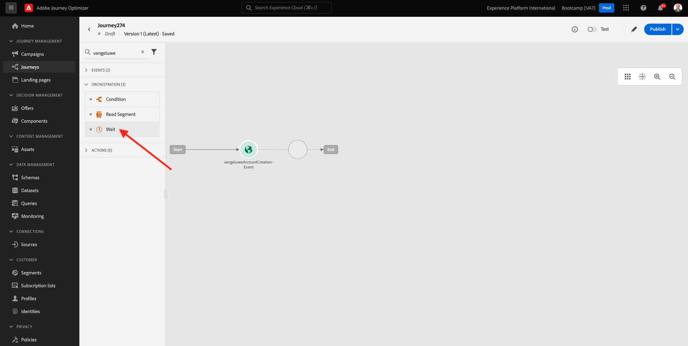
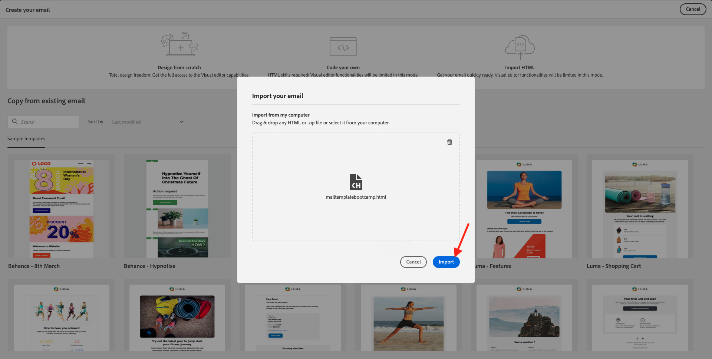

# 2.3 Criar sua jornada e mensagem de email

Neste exercício, você configurará a jornada que precisa ser acionada quando alguém criar uma conta no site de demonstração.

Faça logon no Adobe Journey Optimizer acessando [Adobe Experience Cloud](https://experience.adobe.com). Clique em **Journey Optimizer**.

Você será redirecionado para o **Início**  no Journey Optimizer. Primeiro, certifique-se de usar a sandbox correta. A sandbox a ser usada é chamada de `Bootcamp`. Para alterar de uma sandbox para outra, clique em **Prod** e selecione a sandbox na lista. Neste exemplo, a sandbox é chamada de **Bootcamp**. Você estará no **Início** exibição da sandbox `Bootcamp`.

## 2.3.1 Criar a jornada

No menu esquerdo, clique em **Jornada**. Em seguida, clique em **Criar Jornada** para criar uma nova jornada.

Você verá uma tela de jornada vazia.

No exercício anterior, você criou um novo **Evento**. Você o nomeou assim `yourLastNameAccountCreationEvent` e substituído `yourLastName` com seu sobrenome. Este foi o resultado da criação do Evento:

Agora é necessário tomar esse evento como o início desta Jornada. Você pode fazer isso indo para o lado esquerdo da tela e procurando pelo evento na lista de eventos.

Selecione seu evento, arraste-o e solte-o na tela de Jornada. A Jornada agora tem esta aparência:

Como a segunda etapa da jornada, é necessário adicionar um curto **Aguardar** etapa. Vá para o lado esquerdo da tela para **Orquestração** para encontrar isso. Você estará usando os atributos do perfil e precisará verificar se eles estão preenchidos no Perfil do cliente em tempo real.

Sua jornada agora fica assim. No lado direito da tela, é necessário configurar o tempo de espera. Defina para 1 minuto. Isso dará tempo suficiente para que os atributos do perfil estejam disponíveis após o acionamento do evento.

Clique em **Ok** para salvar as alterações.

Como a terceira etapa da jornada, é necessário adicionar um **Email** ação. Vá para o lado esquerdo da tela para **Ações**, selecione o **Email** , em seguida, arraste e solte no segundo nó da jornada. Agora você vê isso.

Defina as **Categoria** para **Marketing** e selecione uma superfície de email que permita enviar emails. Nesse caso, a superfície do email a ser selecionada é **Email**. Certifique-se de que as caixas de seleção de **Cliques no email** e **aberturas de email** estão ativadas.

A próxima etapa é criar a mensagem. Para fazer isso, clique em **Editar conteúdo**.

## 2.3.2 Criar sua mensagem

Para criar sua mensagem, clique em **Editar conteúdo**.

Agora você vê isso.

Clique no botão **Linha de assunto** campo de texto.

Na área de texto, comece a escrever **Oi**

A linha de assunto ainda não foi feita. Em seguida, é necessário trazer o token de personalização para o campo **Nome** armazenado em `profile.person.name.firstName`. No menu esquerdo, role para baixo até encontrar a variável **Pessoa** e clique na seta para ir um nível mais fundo.

Agora encontre a variável **Nome completo** e clique na seta para ir um nível mais fundo.

Finalmente, encontre a **Nome** e clique no botão **+** sinal ao lado. Em seguida, você verá o token de personalização aparecer no campo de texto.

Em seguida, adicione o texto **, obrigado por se inscrever!**. Clique em **Salvar**.

Então você estará de volta. Clique em **Email Designer** para criar o conteúdo do email.

Na próxima tela, você receberá 3 métodos diferentes para fornecer o conteúdo do email:

- **Design do zero**: Comece com uma tela em branco e use o editor WYSIWYG para arrastar e soltar a estrutura e os componentes de conteúdo para criar visualmente o conteúdo do email.
- **Codifique seu próprio**: Crie seu próprio modelo de email codificando-o usando o HTML
- **Importar HTML**: Importe um template HTML existente, que poderá editar.

Clique em **Importar HTML**.

Arraste e solte o arquivo **mailtemplatebootcamp.html**, que você pode baixar [here](../../assets/html/mailtemplatebootcamp.html.zip). Clique em Importar.

Você verá este template de email padrão:

Vamos personalizar o email. Clique ao lado do texto **Oi** e clique no botão **Adicionar personalização** ícone .

Em seguida, você precisa trazer o **Nome** token de personalização armazenado em `profile.person.name.firstName`. No menu, encontre a variável **Pessoa** elemento, navegue até o **Nome completo** e clique no botão **+** ícone para adicionar o campo Nome no editor de expressão.

Clique em **Salvar**.

Agora você perceberá como o campo de personalização foi adicionado ao texto.

Clique em **Salvar** para salvar sua mensagem.

Volte para o painel de mensagens clicando no botão **seta** ao lado do texto da linha de assunto no canto superior esquerdo.

Você concluiu a criação do email de registro. Clique na seta no canto superior esquerdo para retornar à jornada.

Clique em **Ok**.

## 2.3.3 Publicar a jornada

Você ainda precisa dar um Nome à sua jornada. Você pode fazer isso clicando no botão **Propriedades** no lado superior direito da tela.

Você pode então inserir o nome da jornada aqui. Use `yourLastName - Account Creation Journey`. Clique em **OK** para salvar as alterações.

Agora você pode publicar sua jornada clicando em **Publicar**.

Clique em **Publicar** novamente.

Em seguida, você verá uma barra de confirmação verde informando que sua jornada foi publicada.

Você já terminou este exercício.

Próxima etapa: [2.4 Teste sua jornada](./ex4.md)

[Voltar para Fluxo de Usuário 2](./uc2.md)

[Voltar para todos os módulos](../../overview.md)