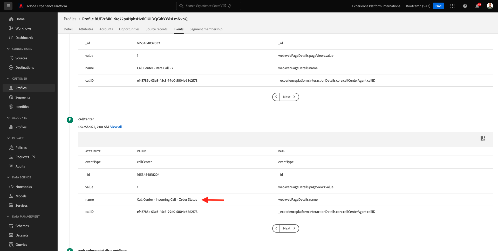

# 2.6 Personalização sem central de atendimento

Concerto discutido várias vezes durante o bootcamp, a experiência do cliente é algo que deve acontecer de maneira omnicanal. Um centro de atendimento é perfeito para não precisar ser assim a substituição da jornada do cliente e isso. Vamos mostrar um exemplo de como o call center pode ser alterado à Adobe Experience Platform, em tempo real.

## Fluxo da jornada do cliente

Sem exercícios anteriores, usando o movimente móvel, você tem que mudar no botão **Comprar**.

Vamos apoiar que você tem uma pergunta sobre o status do seu pedido, o que você faria? Obrigado, você ligaria para o call center.

Antes de ligar para o call center, você precisa saber sua **ID de fidelidade**. Você pode encontrar seu ID de visualização no Visualizador de Perfil do site.

Nesse caso, o **ID de fidelidade** é **5863105**. Como parte de nossa conduta personalizada do recurso de call center no ambiente de navegação, você deve mudar um prefixo ao seu **ID de fidelidade**. O prefixo é **11373**, portanto, o ID de fidelidade a ser usado exemplo é **11373 5863105**.

Vamos fazer isso agora. Use sua ligue e ligue para o número {0 (323) 745-1670 **.**

Será que você deseja insira seu ID de, de **#**. Carregar seu ID de.

Você virá **Olá, seu nome**. Esse nome é do cliente em tempo real no Adobe Experience Platform. Você tem 3. ➡ o número **1**, **Status do pedido**.

Depois de ouvir o status do seu pedido, você tem a opção de pressionar 1 **para ao menu principal ou pressionar 2.** **2**.

Em seguida, será que você está no centro de atendimento, avaliando um número entre 1 e 5, 1 baixo e 5 alto. Faça a sua escolha.

A música para o call center será encerrada.

Acessado [Adobe Experience Platform](https://experience.adobe.com/platform). Depois de fazer logon, você acessará a página inicial da Adobe Experience Platform.

Antes de continuar, você seleciona **sandbox**. O nome do sandbox a ser selecionado é ``Bootcamp``. É possível fazer isso no texto **[!UICONTROL Produção Prod]** na linha azul na parte superior da tela. Depois de escolher a [!UICONTROL sandbox], verá você a tela e agora você está em seu [!UICONTROL sandbox].

Nenhum menu à esquerda, acessado **Perfis** e **Procurar**.

o **Namespace de identidade** **Email** e insira o endereço de e-mail do perfil de cliente. Clique em **Exibir**. Clique para abrir seu perfil.

Você verá seu perfil de novo. Acessado **Eventos**.

Em eventos, você verá 2 eventos com um eventType de **callCenter**. O primeiro evento é o resultado da sua resposta à pergunta **Avalie a satisfação da sua chamada** (disponível seu tema).

Papel um pouco para baixo e você verá o que foi registrado quando você selecionar ou mudar de verificação o **Status do pedido**.

Acessada **Associação de segmento**. Agora você verá que 2 segmentos se qualifica cursos em seu perfil, em tempo real, com base nas interações que você vê por meio do call center. Essas pesquisas de segmento podem e devem ser usadas para impactar qual comunicação e personalização acontece em qualquer outro canal.

Você terminou este exercício.

[Retorno para Fluxo de monitoramento 2](./uc2.md)

[Retorno para Todos os compartilhados](../../overview.md)
