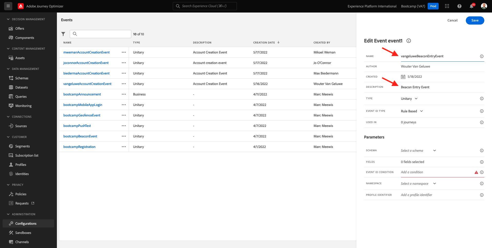

# 3.2 Criar seu evento

Faça logon no Adobe Journey Optimizer acessando [Adobe Experience Cloud](https://experience.adobe.com). Clique em **Journey Optimizer**.

Você será redirecionado para o **Início**  no Journey Optimizer. Primeiro, certifique-se de usar a sandbox correta. A sandbox a ser usada é chamada de `Bootcamp`. Para alterar de uma sandbox para outra, clique em **Prod** e selecione a sandbox na lista. Neste exemplo, a sandbox é chamada de **Bootcamp2**. Você estará no **Início** exibição da sandbox `Bootcamp`.

No menu esquerdo, role para baixo e clique em **Configurações**. Em seguida, clique no botão **Gerenciar** botão abaixo **Eventos**.

Em seguida, você verá uma visão geral de todos os eventos disponíveis. Clique em **Criar evento** para começar a criar seu próprio evento.

Uma nova janela de evento vazia aparecerá.

Primeiro de tudo, dê a seu Evento um Nome como este: `yourLastNameBeaconEntryEvent` e adicione uma descrição como esta `Beacon Entry Event`.

Em seguida, verifique se o **Tipo** está definida como **Unitário** e para o **Tipo de ID do evento** seleção, selecione **Sistema gerado**.

Em seguida está a seleção Esquema. Um esquema foi preparado para este exercício. Use o esquema `Demo System - Event Schema for Mobile App (Global v1.1) v.1`.

Após selecionar o Esquema, você verá vários campos sendo selecionados na variável **Campos** seção. Agora você deve passar o mouse sobre o **Campos** e você verá 3 ícones pop-up. Clique no botão **Editar** ícone .

Você verá um **Campos** pop-up de janela, em que é necessário selecionar alguns dos campos que precisamos para personalizar a jornada.  Escolheremos outros atributos de perfil posteriormente, usando os dados já existentes no Adobe Experience Platform.

Role para baixo até ver o objeto `Place context` e marque a caixa de seleção . Com isso, todo o contexto da localização do cliente será disponibilizado para a jornada. Clique em **Ok** para salvar as alterações.

Você deveria ver isso. Clique em **Salvar** mais uma vez para salvar suas alterações.

Seu evento agora está configurado e salvo.

Clique no evento novamente para abrir o **Editar evento** novamente. Passar o mouse **Campos** novamente para ver os 3 ícones. Clique no botão **Exibir** ícone .

Você verá um exemplo da carga esperada.
Seu evento tem uma orquestration eventID exclusiva, que pode ser encontrada ao rolar para baixo na carga útil até que você veja `_experience.campaign.orchestration.eventID`.

A ID do evento é o que precisa ser enviado para o Adobe Experience Platform para acionar a jornada que você criará em um dos próximos exercícios. Lembre-se dessa eventID, pois ela pode ser necessária posteriormente.
`"eventID": "e76c0bf0c77c3517e5b6f4c457a0754ebaf5f1f6b9357d74e0d8e13ae517c3d5"`

Clique em **Ok**, seguida de clicar em **Cancelar**.

Você já terminou este exercício.

Próxima etapa: [3.3 Criar sua jornada e notificação por push](./ex3.md)

[Voltar para Fluxo de Usuário 3](./uc3.md)

[Voltar para todos os módulos](../../overview.md)
