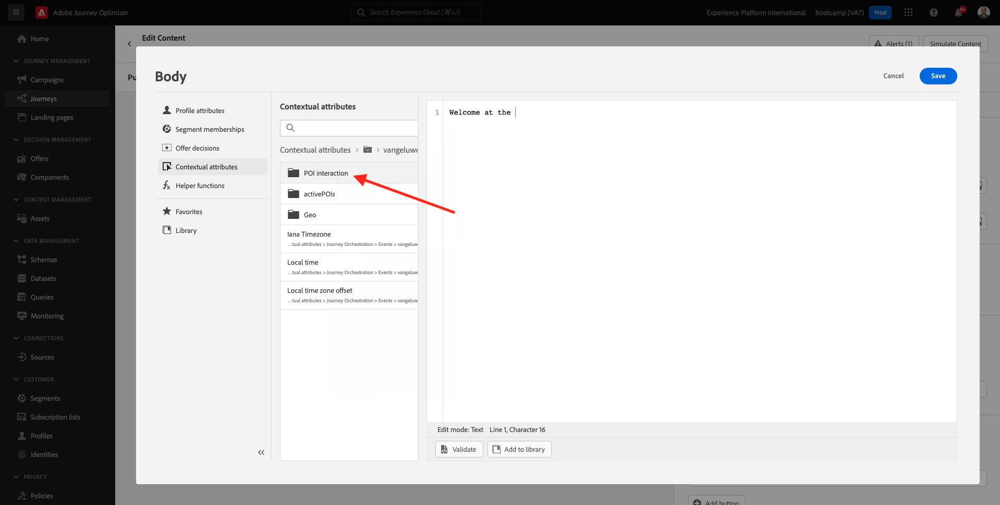
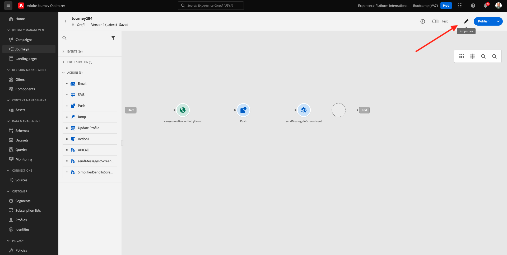

# 3.3 Promoção da notificação da jornada e da notificação

Neste exercício, você muda a jornada e a mensagem que precisa ser acionada quando uma mudança (beacon) usando o móvel.

Faça logon no Adobe Journey Optimizer acessando a [Adobe Experience Cloud](https://experience.adobe.com). Clique em **Journey Optimizer**.

Você será redirecionado para a da **Início** sem Journey Optimizer. Primeiro, usar você está usando o sandbox correto. O nome do sandbox que deve ser usado é `Bootcamp`. Para alternar de um sandbox para outro, clique em **Prod** e o sandbox na lista. Exemplo, o nome do sandbox é **Bootcamp**. Você está na da **Início**  fazer seu sandbox `Bootcamp`.

## 3.3.1 Criar a sua jornada

Sem menu à esquerda, clique em **Jornadas**. Em seguida, clique em **Criar Jornada** para criar uma nova jornada.

Você verá uma tela de vazia.

Não exercício anterior, você criou um novo **Evento**. Você consegue o evento `yourLastNameBeaconEntryEvent` e substituiu `yourLastName` pelo seu sobrenome. Este foi o resultado da criação do Evento:

Agora você deve este evento como o início desta Jornada. Você pode fazer o lado evento da tela e tendências pelo seu lista de eventos.

é possível encontrar seu evento, e solte o evento na tela de jornada. Sua jornada deve ser seguido. Clique em **Ok** para proteger o cliente.

Como segunda etapa da jornada, você deve mudar uma ação **Push**. Vá para o lado esquerdo da tela para **Ações**, uma ação **Push** e ➡ e nó solte a ação no segundo da jornada.

No lado direito da tela, agora você deve criar sua notificação push.

Definir um **Categoria** como **Marketing** e envio da superfície de push que muda o envio de. Nesse caso, a estratégia de push a seleção é **meeewis-app-mobile-bootcamp**.

## 3.3.2 Criar a sua mensagem

Clique em **Editar conteúdo**.

Em seguida, a tela abaixo é apresentada:

Vamos definir a notificação da notificação.

Clique no campo de texto **Título**.

Na área de texto, início **Olá**. Clique em nenhum momento personalizado.

Agora precisa o token de personalização para o campo **Nome** que está presente em `profile.person.name.firstName`. Sem menu à esquerda, **Atributos do perfil**, role para baixo/navegue para encontrar o elemento **Person** e clique na seta para explorar um nível até chegar ao campo `profile.person.name.firstName`. Clique no ➡ **+** para o campo à tela. Clique em **Salvar**.

Então, você muda para esta tela. Clique no domínio da personalização ao lado do campo **Corpo**.

Na área de texto, tela `Bem-vindo(a)`.

Em seguida, clique em  **Atributos contextuais** e **Journey Orchestration**.

Clique em **Eventos**.

Clique no nome nome nome, que deve ser observador do seu seguinte: **yourLastNameBeaconEntryEvent**.

Clique em **Contexto do local**.

Clique em **Interação de POI**.

Clique em **Detalhes do POI**.

Clique em não **+** ícone não **Nome do POI**.
Em seguida, o seguinte é apresentado. Clique em **Salvar**.

Sua mensagem está pronta. Clique na seta no canto superior para acompanhar a sua jornada.

Clique em **Ok**.

## 3.3.2 Envie uma mensagem para uma tela

Como etapa da jornada, você deve mudar uma ação  **sendMessageToScreen**. Vá para o lado esquerdo da tela para **Ações**, uma ação **sendMessageToScreen** e pesquisas e solte a ação no terceiro nó da sua jornada. Em seguida, você verá a tela abaixo.

**sendMessageToScreen** é uma ação exclusiva que publica uma mensagem no **Endpoint** para usar pela compra na loja. Uma ação **sendMessageToScreen** espera que pode mudar o que é preciso. Você pode alterar essa seleção rolando para baixo até **Parâmetros de ação**.

1999 &quot;Agora você precisa de acordo com as regras para cada domínio da ação&quot; . Fórum de dúvidas sobre o assunto...

| Parâmetro | Valor de  |
|:-------------:| :---------------:|
| ENTREGA | `'image'` |
| ECID | `@{yourLastNameBeaconEntryEvent._experienceplatform.identification.core.ecid}` |
| NOME | `#{ExperiencePlatform.ProfileFieldGroup.profile.person.name.firstName}` |
| EVENTSUBJECT | `#{ExperiencePlatform.ProductListItems.experienceevent.first(currentDataPackField.eventType == "commerce.productViews").productListItems.first().name}` |
| EVENTSUBJECTURL | `#{ExperiencePlatform.ProductListItems.experienceevent.first(currentDataPackField.eventType == "commerce.productViews").productListItems.first()._experienceplatform.core.imageURL}` |
| SANDBOX | `'bootcamp'` |
| CONTAINERID | `''` |
| ACTIVITYID | `''` |
| PLACEMENTID | `''` |

{style="table-layout:auto"}

Para definir valores, clique no monitoramento **Editar**.

Em seguida, **Modo avançado**.

Em seguida, cole o valor com base na tabela acima. Clique em **Ok**.

Repita esse processo para valores para cada campo.

>[!IMPORTANT]
>
>Para o campo ECID, há uma referência ao evento`yourLastNameBeaconEntryEvent`. -se de substituir  `yourLastName` pelo seu sobrenome.

O resultado final deve ser seguido:

Função para cima e clique em **Ok**.

Você ainda precisa dar um Nome à sua jornada. Você pode fazer isso clicando no link **Propriedades** no lado superior direito da tela.

Você pode o nome da jornada. Use `yourLastName - Beacon Entry Journey`. Clique em **OK** para proteger o cliente.

Agora você pode publicar sua rotina em **Publish**.

Clique em **Publish** novamente.

Você verá uma barra de verde informa que sua agora está Publicada.

Sua jornada agora está ativa e pode ser acionada.

Você terminou este exercício.

Próxima etapa: [3.4 Testa sua jornada](./ex4.md)

[Retorno para Fluxo de monitoramento 3](./uc3.md)

[Retorno para Todos os compartilhados](../../overview.md)
