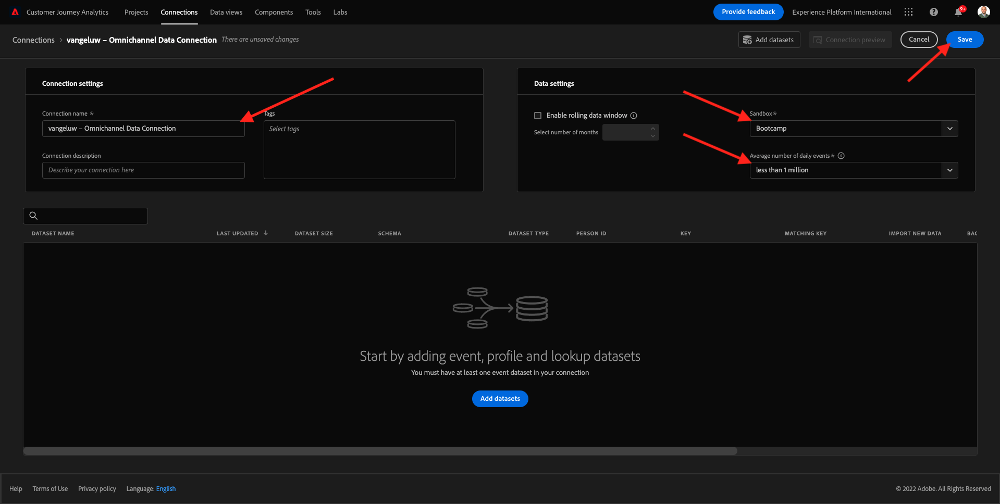

# 4.2 Conectar conjuntos de dados da Adobe Experience Platform sem Customer Journey Analytics

## Objetivos

- Compreenda uma interface da conexão de dados
- Traga os dados da Adobe Experience Platform para o CJA
- Entenda a ID da pessoa e a compilação de dados
- Aprenda o desenvolvimento de streaming de dados no Customer Jornada

## 4.2.1 Conexão

Acessado [analytics.adobe.com](https://analytics.adobe.com) para acesso ao Customer Journey Analytics.

Na página inicial do Customer Journey Analytics, acessos **Conexões**.

Aqui você pode ver todas as formas distribuídas entre o CJA e Plataforma. Essas tendências o mesmo objetivo dos conjuntos de informações no Adobe Analytics. Não no mundo, a coleta dos dados é completamente diferente. Todos os dados transmitidos de datasets da Adobe Experience Platform.

Vamos criar sua conexão. Clique em **Criar nova conexão**.

Você verá uma interface **Criar conexão** IU.

Agora você pode dar um nome à conexão.

Usar este modelo de nomenclatura: `yourLastName – Omnichannel Data Connection`.

Exemplo: `vangeluw - Omnichannel Data Connection`

Você também deve o pedido da sandbox correta para usar. Nenhuma sandbox de menu, sua sandbox, que deve ser `Bootcamp`. Exemplo, o sandbox a ser usado é o **Bootcamp**. E também você deve o **Número médio de eventos diários** para **menos de 1 milhão**.

Seleção do seu sandbox, você pode começar a navegação datasets a esta conexão. Clique em **Adicionar conjuntos de dados**.

## 4.2.2 conjuntos de dados da Adobe Experience Platform

Consulta ao conjunto de dados `Demo System - Event Dataset for Website (Global v1.1)`. Clique em **+** para o conjunto de dados a esta conexão.

Agora pesquise e marque as caixas de seleção `Demo System - Event Dataset for Voice Assistants (Global v1.1)` e `Demo System - Event Dataset for Call Center (Global v1.1)`.

Em seguida, você verá a tela abaixo. Clique em **Próxima**.

## 4.2.3 ID da pessoa e compilação de dados

### ID da pessoa

O capítulo agora é conjuntos de dados. Para cada conjunto de dados selecionado, você verá um campo **ID de pessoa**. Cada conjunto de dados tem seu próprio campo de ID de pessoa.

Como você pode ver, a maioria deles tem o ID da seleção reconhecida. Isso mostra porque um identificador principal é selecionado em cada modelo na Adobe Experience Platform. Como exemplo, aqui está o esquema para `Demo System - Event Schema for Call Center (Global v1.1)`, onde você pode ver que o Identificador Primário está definido como `phoneNumber`.

Não é possível, você ainda pode mudar o identificador será usado para compilar conjuntos de dados para sua conexão. Você pode usar qualquer identificador no esquema vinculado ao seu conjunto de dados. Clique no menu exibido para exibir as IDs garantidas em cada conjunto de dados.

Dados de pessoa para cada, você pode definir IDs. Isso permite reunir diferentes conjuntos de dados de responsabilidade no CJA. Imagine as pessoas que usam PS que mantêm e têm acesso para pesquisa o contexto e o motivo de um.

O nome do campo ID da pessoa não é importante, desde que o valor nos campos ID da pessoa correspondente. Digamos que temos `email` conjunto de dados em um e `emailAddress` em outro dataset definido como ID da pessoa. Se `delaigle@adobe.com` tiver o mesmo valor para o campo ID da pessoa em ambos os datasets, o CJA pode compilar os dados.

Compilação, compilação, comparação, comparação, comparação, anônimo para conhecido. Controlar como participantes: [Perguntas frequentes](https://experienceleague.adobe.com/docs/analytics-platform/using/cja-overview/cja-faq.html?lang=pt-BR).

### Compilando os dados usando o ID da pessoa

Agora que você seleciona o desenvolvedor datasets usando o ID da pessoa, selecionar `email` como ID da pessoa para cada conjunto de dados.

Acessar cada conjunto de dados para corrigir o ID da pessoa.

Agora a o campo ID da pessoa encarregando o `email` na lista suspensa.

Depois de compilar os três conjuntos de dados, disponíveis para continuar.

| conjunto de dados | ID de pessoa |
| ----------------- |-------------| 
| Sistema de demonstração - Conjunto de dados de evento para site (Global v1.1) | email |
| Sistema de demonstração - Conjunto de dados de evento para assistentes de voz (Global v1.1) | email |
| Sistema de demonstração - Conjunto de dados de evento para call center (Global v1.1) | email |

Você também garante que, para cada, essas habilitadas:

- Importar todos os novos dados
- Preencher todos os dados existentes
- Preencher tipo de fonte de dados com &quot;Outros&quot;
- Preencher a descrição com o mesmo nome do conjunto de dados

Clique em **Adicionar conjuntos de dados**.

Clique em **Salvar** e vá para o próximo exercício. Depois de criar sua **Conexão**, pode levar algumas vezes até que seus dados tenham obtido nenhum CJA.

Próxima etapa: [4.3 Crime uma Visualização de Dados](./ex3.md)

[Retorno para Fluxo de monitoramento 4](./uc4.md)

[Retorno para Todos os compartilhados](./../../overview.md)
