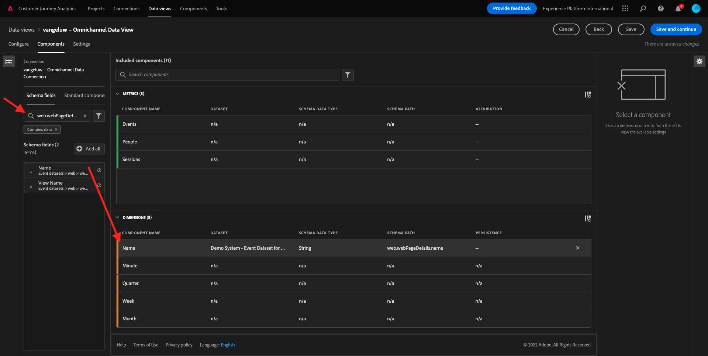

# 4.3 Crie uma Visualização de Dados

## Objetivos

- Entenda a UI de Visualização de dados
- Compreenda as configurações básicas de Passagem de Passagem
- Compreenda a atribuição e a Persistência em uma Visualização de

## 4.3.1 Visualização de dados

Agora, com seu concluída conexão, é possível progredir para influenciar a visualização. Uma entra o Adobe Analytics e o CJA é que o CJA precisa de uma visualização de dados limpar e preparar os dados da visualização.

Uma Visualização de dados é semelhante ao conceito de Conjuntos de relatórios virtuais no Adobe Analytics, onde estabelece como definições de visita com reconhecimento de contexto, filtragem e também como os são chamados.

necessário &#39;Será&#39;, &quot;uma visualização de dados por conexão. Sem entanto, para alguns de uso, é ótimo ter múltiplas Visualizações de Dados para a mesma, com o conexão de objetivo insights para fornecer. Se você deseja que seu empreendimento orientada por, adaptar um formato como os dados são vistos em cada equipe. exemplos:

- Design das Métricas de UX
- Use os mesmos para KPIs e para o Google Analytics e o Customer Journey Analytics, para o equipe de análise digital, para o idioma métricas.
- Visualização de Dados filtrados para mostrar, por exemplo, para fins de informação, ou Dispositivos para ou para.

Na tela de **Conexões** marque a caixa de seleção da conexão que você acabou de. Clique em  **Criar Exibição de Dados**.

Você será redirecion para o fluxo do trabalho **Criar Exibição de Dados** fluxo de trabalho.

## 4.3.2 Definição de Visualização de dados

Agora você configurar como definições para sua visualização de dados.

A **Conexão** que você já está selecionada. Sua conexão se chama `yourLastName – Omnichannel Data Connection`.

Em, Nome um nome à sua Visualização de seguindo. `yourLastName – Omnichannel Data View`.

Insira o truque para descrição: `yourLastName – Omnichannel Data View`.

| Nome | Descrição |
| ----------------- |-------------| 
| `yourLastName – Omnichannel Data View` | `yourLastName – Omnichannel Data View` |

Parágrafo **Fuso Horário** selecione o fuso horário **Alagoas, Estocolmo, Roma, Berna, Bruxelas, Viena, Amsterdã GMT+01:00**. Este é um realmente interessante, pois operam em diferentes geografias. Alocar o fuso horário certo para cada país evitará erros típ icos de dados, como, acreditar que a maioria das camisetas às 4h no Peru.

Você também pode modificar uma nomenclatura das métricas (Pessoa, Navegação). Não é obrigatório, mas alguns clientes gostam de usar, Visitas e Acessos em vez de Pessoa Eventos (convenção de padrão do Isso do Customer Journey Analytics).

Ágora você como seguintes configurações definidas:

Clique em **Salvar e continuar**.

## 4.3.3 Componentes da Visualização de Dados

exercício, você irá configurar os necessários para analisar os dados e usando o Analysis Workspace. ESTA IU, há áreas principais:

- Lado esquerdo: Componentes disponíveis conjuntos de dados dos selecionados
- Meio: Componentes adicionados à Visualização de Dados
- Lado: Configurações do fazem

>[!IMPORTANT]
>
>Se você não tem uma métrica específica, verifique se o campo `Contains data` foi removideo de sua visualização de dados. Caso contrário, exclua esse campo.
>
>

Agora você arrastar e soltar os necessários para a análise **Componentes adicionados**. Para isso, você selecionar os componentes no menu à esquerda e arrastá-los e solà na tela no meio.

Vamos começar com o. d. **Nome (web.webPageDetails.name)**. Pesquise esse esforço e arraste-o e solte-o na tela.

Esse é o nome do início, como você pode derivar da campo do campo `(web.webPageDetails.name)`.

Sem entanto, usar **Nome** Como o nome não é a melhor convenção de nomenclatura para um usuário corporativo rapidamente essa dimensão.

Vamos mudar o nome para **Nome da página**. Clique em e o renomeie na sa **Configurações do componente**.

As Configurações de persistência são **Configurações de persistência**. Os conceitos de eVars e prop não existem no CJA, mas as as configurações de Persistência possibilitam comportamento semelhante.

Se você não alterar essas configurações, o CJA irá interpretar um dimensão como um **Prop** (de ocorrência). Além disso, podemos alterar a Persistência para tornar uma dimensão uma **eVar** (persistindo o valor ao longo da jornada).

Se Você não está familiarizado com Props, [leia mais sobre isso na documentação](https://experienceleague.adobe.com/docs/analytics/landing/an-key-concepts.html)...

Vamos deixar o Nome da Página como Prop. Dessa forma, você não precisa alterar nenhuma **Configurações de persistência**.

| Nome do componente para pesquisa | Novo nome | Configurações de persistência |
| ----------------- |-------------| --------------------| 
| Nome (web.webPageDetails.name) | Nome da página |  |

Em, escolha um dimensão **phoneNumber** e solte-a na tela. O novo fenômeno **Número de telefone**.

Por fim, vamos alterar como Configurações de persistência, pois o Número do Celular persistente no nível do usuário.

Para alterar a Persistência, papel para no menu à direita e abra aba **Persistência**:

Marque um caixa de seleção para modificar como configurações de persistência. Selecione **Mais recente** e o escopo **Pessoa (janela Relatório)**, pois nos preocup amos com o número de calendário. Se o cliente não preencher o celular em futuras você, ainda será preenchido.

| Nome do componente para pesquisa | Novo nome | Configurações de persistência |
| ----------------- |-------------| --------------------| 
| phoneNumber | Número de telefone | Mais recente, Pessoa (janela de relatórios) |

O próximo é `web.webPageDetails.pageViews.value`.

Nenhum menu à esquerda, pesquisar `web.webPageDetails.pageViews.value`. Arraste e solte essa métrica na tela.

Alteração do nome para **Exibições de página** nos termos do **Configurações do componente**.

| Nome do componente para pesquisa | Novo nome | Configurações de atribuição |
| ----------------- |-------------| --------------------| 
| web.webPageDetails.pageViews.value | Page Views |  |

Pará as configurações de atribuição, pará em branco.

Observação: As configurações de persistência métricas podem ser alteradas no Analysis Workspace. Em alguns, você optar por configurá-las para evitar que os usuários de negócios tenham que pensar qual é o melhor de persistência.

Em, você terá que várias Dimensões e Métricas, em indicado na tabela.

### DIMENSÕES

| Nome do componente para pesquisa | Novo nome | Configurações de persistência |
| ----------------- |-------------| --------------------| 
| brandName | Nome da marca | Mais recente, sessão |
| calmaria | Feed de chamada |  |
| ID de chamada | Tipo de interação da chamada |  |
| callTopic | Tópico da Chamada | Mais recente, sessão |
| ecid | ECID | Mais recente, Pessoa (janela de relatórios) |
| email | ID de email | Mais recente, Pessoa (janela de relatórios) |
| Tipo de pagamento | Tipo de pagamento |  |
| Método de adição de produto | Método de adição de produto | Mais recente, sessão |
| Tipo de evento | Tipo de evento |  |
| Nome (productListItems.name) | Nome do produto |  |
| SKU | SKU (sessão) | Mais recente, sessão |
| ID da transação | ID da transação |  |
| URL (web.webPageDetails.URL) | URL |  |
| Agente do usuário | Agente do usuário | Mais recente, sessão |

### MÉTRICA

| Nome do componente para pesquisa | Novo nome | Configurações de atribuição |
| ----------------- |-------------| --------------------| 
| Quantidade | Quantidade |  |
| commerce.order.priceTotal | Receita |  |

Seu configuração, semelhante ao seguinte:

Não se esqueça de sua visualização de dados. Então clique em **Salvar**.

## 4.3.4 calculadas das metricas

Tensões os na Visualização de você, adaptar os prontos para o que usuários para os alguns .

Se você se lembra, não trouxemos especificamente Métricas Adicionar ao Carrinho, Visualização do produto ou Compras para a Visualização de dados. Não entanto, temos uma dimensão. **Tipo de evento**. Então, vamos derivar os ovos de criando 3 métricas calculadas.

Vamos começar com a primeira métrica: **Exibições do produto**.

Não esquerdo lado, pesquisar **Tipo de evento** selecione um dimensão. Em, set-o na tela **Componentes incluídos**.

Clique para selecionar nova métrica **Tipo de evento**.

Agora altere o nome e a descrição do para os seguintes valores:

| Nome do componente | Descrição do componente |
| ----------------- |-------------| 
| Visualizações de produto | Visualizações de produto |

Agora, contar eventos **Exibições do produto**. Para fazer isso, papel para baixo **Configurações do componente** até ver de Valores **Incluir valores de exclusão**. Certifique-se de reabilitação **Definir valores de inclusão/exclusão**.

Como queremos contar **Exibições do produto** especifique **commerce.productViews** critérios.

Agora a sua métrica calculada, esteja em andamento!

Em, répita o processador para os eventos **Adicionar ao carrinho** e **Compra**.

### Adicionar ao carrinho

Primeiro, arraste e solte um dimensão mesma **Tipo de evento**.

Você verá um pop-up de um Campo Duplicado, pois usando a mesma variável. Clique em **Adicionar assim mesmo**:

Agora, siga o mesmo processador que fizemos para a métrica Visualizações de produto:
- Primeiro altere o nome e descrição.
- Por fim, adicione **commerce.productListAdds** Como critério para contar Adicionar ao Carrinho

| Nome | Descrição | Critérios |
| ----------------- |-------------| -------------|
| Adicionar ao carrinho | Adicionar ao carrinho | commerce.productListAdds |

### Compras

Primeiro, arraste e solte um dimensão mesma **Tipo de evento** como fizemos para as duas métricas anteriores.

Você verá um pop-up de um Campo Duplicado, pois usando a mesma variável. Clique em **Adicionar assim mesmo**:

Agora, siga o mesmo processador que fizemos para as métricas visualizações do produto e Adicione ao carrinho:
- Primeiro altere o nome e descrição.
- Por fim, adicione **commerce.purches** Como critérios para contabil Compras

| Nome | Descrição | Critérios |
| ----------------- |-------------| -------------|
| Compras | Compras | commerce.purchases |

Seu configuração último fenômeno semelhante ao seguinte. Clique em **Salvar e continuar**.

## 4.3.5 Componentes da Configuração de Dados

Você é redirecion para esta tela:

NESTA, você modificar algumas configurações para alterar forma os dados são processados. Vamos começar definição o **Tempo limite da sessão** como 30 min. Ao registro de dados e de cada evento de experiência, você estender o conceito de uma vida em dias os canais. Por, o que acontece se um exemplo para o call center de visitar? Usando Tempos Limite de Sais Personalizados, flexibilidade item muita o decidir é cluma  e,  os dados.

NESTA, você modificar coisas como filtrar os dados usando um segmento/filtro. Você não precisa fazer &quot;isso&quot;.

Quando terminar, clique em **Salvar e concluir**.

>[!NOTE]
>
>Você pode promover uma visualização de uma esta posteriormente como configurações e os dados de um momento. Como alterações afetarão um formato como os dados históricos são mostrados.

Agora você continuar com a parte de visualização e análise!

Proxima. [4.4 Preparação de dados em Customer Journey Analytics](./ex4.md)

[Retornar para Fluxo 4](./uc4.md)

[Retornar para Todos os Módulos](./../../overview.md)
