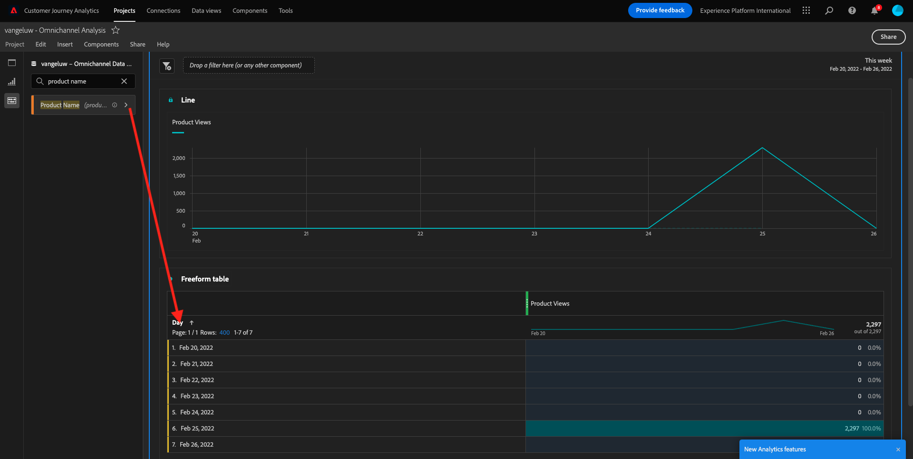
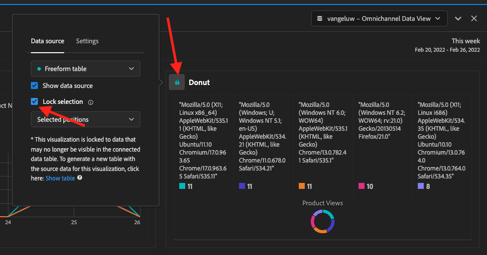

# 4.5 Visualização usando o Customer Journey Analytics

## Objetivos

- Entenda uma interface do Analysis Workspace
- Conheça recursos que crescem o Analysis Workspace que são diferentes.
- Aprenda a analisar sem CJA usando o Analysis Workspace

## Contexto

Neste exercício, você usará o Analysis Workspace no CJA para analisar visualizações de produtos, funis de produtos, rotatividade etc.

Vamos usar o projeto que você criou em  [4.4 Preparação de dados no Analysis Workspace](./ex4.md), então acesse [https://analytics.adobe.com](https://analytics.adobe.com).

Abra seu projeto `yourLastName - Omnichannel Analysis`.

Com seu projeto aberto e Visualização de dados `yourLastName - Omnichannel Analysis` selecionado, você está pronto para começar a corrigir visualizações de tendências.

## Vidas de produtos a cada dia?

Em primeiro lugar, temos a experiência como dados atualizados para os dados. Acessar o menu indicado do calendário no lado direito da tela. Clique nos itens e em todo o intervalo de datas.

>[!IMPORTANT]
>
>um migrado de dados como **Esta semana** ou **Este mês**. Os dados relacionados mais recentes foram absorvidos em 19 de setembro de 2022.

No menu do lado esquerdo (área de componentes), encontrar as métricas calculadas **Exibições do produto**. consultado em 15 de julho de 2012 &quot;µ-as e solte na tela, no canto superior direito da tabela de forma livre&quot; .

Automatizar uma dimensão **Dia** será adicionada para criar sua tabela principal. Agora você pode ver sua pergunta respondida.

Em seguida, clique com o botão direito do mouse no resumo da rotação.

Clique em **Visualizar** e **Linha** como ➡.

Você verá as suas visualizações de produto por dia.

Você pode mudar o escopo de tempo o dia compartilhado em **Configurações** na.

Clique no ponto ao lado de **Linha** e **Gerenciar a fonte de dados**.

Em seguida, clique em **Bloquear seleção** e **Itens Selecionados** para bloquear esta para que ela sempre exiba linha do tempo de Visualizações de produtos.

## 5 produtos mais marcados

Quais são os 5 produtos mais pesados?

créditos-se de gravura o projeto de tempos em tempos.

| OS | Atalho |
| ----------------- |-------------| 
| Windows | Ctrl+S |
| Mac | Command+S |

Vamos começar a encontrar os 5 produtos mais. Não há menu do lado esquerdo, encontre o Nome do produto - Dimensão.

Agora dedicada e solte **Nome do produto** para alterar a intensidade **Dia**:

Este será o resultado.

Em seguida, dividir os produtos por Nome da marca. Pesquise **brandName** e pesquisas para baixo do primeiro nome do produto.

Em seguida, um detalhamento utilizando o comando de usuário. Pesquise **Agente do usuário** e pesquisas-o para baixo do nome da marca.

Em sequência, será exibido a tela abaixo:

Por fim, você pode mais visualizações. No lado esquerdo, em visualizações, pesquise `Donut`. aplicar `Donut`, ➡ e solte na tela sob a **Linha** 

Em seguida, na Tabela, selecione os primeiros 5 **Agente do usuário**  linhas do detalhamento que fizemos em **Google Pixel XL 32 GB preto Smartphone** > **Sinal de Citi**. Ao selecionar as 5 linhas, mantenha pressionada a **CTRL** (no Windows) ou o botão **Comando** (no Mac).

Em seguida, na Tabela, as principais 5 linhas de **Agente do usuário** do detalhamento que mudou em **Google Pixel XL 32 GB preto Smartphone** > **Sinal de Citi**. Ao selecionar as 5 linhas, o botão **CTRL** (sem Windows) ou botão **Comando** (sem Mac).

Você verá o gráfico de donut alterado:

Você pode até o design para ser mais legível, tornando o gráfico de **Linha** e o gráfico de **Rosca** um pouco menor para o que está representado lado a lado:

Clique no ponto ao lado de *Rosca** para **Gerenciar a fonte de dados**. Em seguida, clique em **Bloquear seleção** para ➡ para que ela sempre exiba linha do tempo de Visualizações de produto.

Saiba mais sobre visualizações usando o Analysis Workspace em:

- [https://experienceleague.adobe.com/docs/analytics/analyze/analysis-workspace/visualizations/freeform-analysis-visualizations.html?lang=pt-BR](https://experienceleague.adobe.com/docs/analytics/analyze/analysis-workspace/visualizations/freeform-analysis-visualizations.html?lang=pt-BR)
- [https://experienceleague.adobe.com/docs/analytics/analyze/analysis-workspace/visualizations/t-sync-visualization.html](https://experienceleague.adobe.com/docs/analytics/analyze/analysis-workspace/visualizations/t-sync-visualization.html)

## Funil de interação do produto, da à compra compra

muitas formas de resolver questão. Uma delas é usar o Tipo de Interação de Produto e usá-lo em uma tabela de formato livre. Outra forma é usar uma **Visualização de fallout**. Vamos usar o último, temos que analisar e analisar ao mesmo tempo.

Fechhe o monitoramento histórico compartilhado:

Agora capaz de um novo painel em branco em Portugal **+ Adicionar painel em branco**.

Clique na campanha de **Fallout**.

o mesmo de datas do exercício anterior.

Em seguida, você verá:

a amplitude **Tipo de evento** nos componentes no lado esquerdo:

Clique na seta para a abertura:

Você verá todos os Estados de eventos.

o item **commerce.productViews** e pesquisas e solte-o no campo **Adicionar Touchpoint** dentro da da **Visualização de fallout**.

Faça o mesmo com **commerce.productListAdds** e **commerce.purchases** e solte-os no campo **Adicionar Touchpoint** dentro da da  **Visualização de fallout**. Sua melhoria deve ser observada a seguir:

Você pode fazer as coisas aqui. Alguns episódios: comparar ao longo do tempo, comparar cada passo por tocar ou acompanhar por. Não há nenhum equilíbrio, se quisermos analisar o curso do curso, como os clientes não compram de lidar com um item ao carrinho, podemos usar um botão de ferramentas do CJA: com o botão direito.

Clique com o botão direito do mouse sem ponto de contato **commerce.productListAdds**. Em seguida, clique em **Detalhar fallout neste ponto de contato**.

&quot;Uma nova tabela de formato livre será analisada para analisar o que as pessoas fizeram se não compraram&quot; .

Alterar o **Tipo de evento** por **Nome da página**, na nova tabela de formato, para ver em páginas estão indo, em vez da página de classificação de compra.

## O que as pessoas não fazem no site antes de acessar um cancelamento atendido?

Novamente, há muitas formas de realizar essa análise. Vamos usar a análise de fluxo para iniciar parte da circulação.

Fechhe o monitoramento histórico compartilhado:

Agora capaz de um novo painel em branco em Portugal **+ Adicionar painel em branco**.

Clique na ➡ **Fluxo**.

Em seguida, será exibido:

o mesmo de datas do exercício anterior.

a amplitude **Nome da página** nos componentes no lado esquerdo:

Clique na seta para a abertura:

Você pode mudar todas as páginas vistas. Informações sobre o nome da página: **Cancelar serviço**.
Arraste e solte **Cancelar serviço** na Visualização de fluxo no campo do meio:

Em seguida, será exibido:

Vamos agora analisar os clientes que visitaram a página C **Cancelar serviço** no site também ligaram para o call center e qual foi o resultado.

Nas organizada, reporter e encontre Tipo de interação de música. Arraste e solte **Tipo de Interação com Chamada** para consolidar a direita à direita em **Visualização de Fluxo**.

Agora você visualiza o ticket de suporte dos clientes que ligaram para a central de atendimento de visitar a página **Cancelar serviço**.

Em seguida, nas organizações, adquirir **Sensação de chamada**. Arraste e solte para substituir a primeira interação à direita na mudança de fluxo.

Em seguida, será exibido:

Como pode ver, executamos uma análise omnichannel usando a navegação de fluxo. Graças a, mos que alguns clientes que estão presentes em lidar com o mandato tem uma avaliação positiva de ligar para o call center. Quem mudou de ideia com uma promoção?

## Qual é o cliente dos clientes com um contato de call Positivo em partes dos principais KPIs

Primado, vamos segmentar os dados para usuários com chamadas **positivo**. Não há CJA, os Segmentos são movidos de filtros. Acesse para filtros na área de componentes (no lado esquerdo) e clique em **+**.

Dentro do Construtor de Filtragem, dê um nome ao filtro

| Nome | Descrição |
| ----------------- |-------------| 
| Sensação de chamada - Positiva | Sensação de chamada - Positiva |

Nos componentes (dentro do Construtor de Filtro), encontre **Sensação de chamada** e garantie solte na Definição do construtor de filtro.

Agora ➡ **positivo** como valor para o filtro.

Altere o escopo para o nível **Person**.

Para finalizar, ➡ em **Salvar**.

Então, você muda para esta tela. Se ainda não estiver reunido, feche o painel anterior.

Agora capaz de um novo painel em branco em Portugal **+ Adicionar painel em branco**.

o mesmo de datas do exercício anterior.

Clique em **Tabela de forma livre**.

Agora e solte o filtro que você acabou de criar.

Hora de controlar algumas métricas. Comece com **Exibições do produto**. Arraste e solte na tabela de forma livre. Você também pode mudar a frequência **Eventos**.

Faça o mesmo com **Pessoas**, **Adicionar ao carrinho** e **Compras**. Você vai acabar com uma tabela como a seguir.

Graças à primeira análise de fluxo, uma nova descoberta. Então decimos todas as tarefas verificadas e verificadas KPIs em um segmento para responder a pergunta. Como você pode ver, o tempo de insight é muito mais rápido do que usar SQL ou usar outras soluções de BI.

## Recapitulação do Analysis Workspace e do Customer Journey Analytics

O Analysis Workspace remover todas as condições típicas de um serviço do Analytics. Ele consegue uma tela robusta e flexível para criar projetos de análise voltados. Arraste e solte qualquer documento de habilidades de dados, visualizações e componentes (dimensões, segmentos cas, segmentos e granularidades de tempo) para um projeto. Você pode criar de forma instantânea filtros e análises, de coorte, gráficos,, µ de fluxo e relatórios de curadoria e agenda para com qualquer pessoa em seu prazer.

Próxima etapa: [4.6 De insights a ação](./ex6.md)

[Retorno para Fluxo de monitoramento 4](./uc4.md)

[Retorno para Todos os compartilhados](./../../overview.md)
