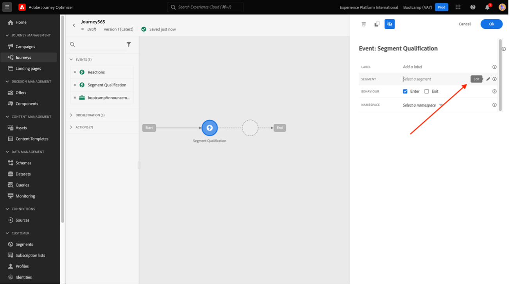

# 4.6 Dos insights à ação

## Objetivos

- Entenda como está com base em uma coletada no Customer Journey Analytics
- Use esse n.º CDP em tempo real e em Adobe Journey Optimizer

## 4.6.1 Crie uma audiência e publique-a

Em projeto, você criou um filtro chamado **Feelings de chamada** e conseguiu visualizar a quantidade de usuários que tiveram ligações centro de atendimento classificadas como **positivas**. Agora, você poderá um segmento com usuários e-los em jornadas ou de comunicação.

O Primeiro passo: Não painel em último lugar, selecione linha **1. Feed de chamada - Positivo**, o pano com o de seu rato e selecione um **Criar público-alvo a partir da seleção**:

Emaudiência **yourLastName - sentimento positivo da chamada de público-alvo de cia**:

Nota que é possível ter um preview audiência que está sendo criada:

Para finalizar, clique em **Publicar**:

## 4.6.2 Usar seu audiência como parte de segmento

Voltando para um Adobe Experience Platform, vá em **Segmentos > Procurar** e você consegu irá visualizar o seu segmento no CJA prontamente e disponível para ser usado suas ativações e jornadas!

Vamos agora usar esse segmento em uma ativação no Facebook e em uma jornada do cliente!

## 4.6.3 Uso do segmento no Real-Time CDP em tempo real

Na Adobe Experience Platform, vá em **Segmentos > Procurar** e Jo audiência que você criou no Ca:

Clique em no segmento e, em, clique em em **Ativar para destino**:

Selecione um dos programas de música de destino, o blootcamp-facebook e, em, clique em Next:

Em, clique em próximo:

Selecione **Origem do público-alvo** e defina como **Diretamente dos clientes** e clique em Próximo:

Por Voltar **Revisão** clique em Finish!

Pronto! Agora o seu segmento, abaixo da lista pública do Facebook.
Agora, o sul de AJO!

## 4.6.4 Uso do segmento no Adobe Journey Optimizer

Na na Journey Optimizer e, interface em Adobe Experience Platform, sem esquerdo de menu lateral **Jornada** e comece a jornada clicando em **Criar Jornada**:

Em Eventos, sem esquerdo lateral **Qualificação do segmento** e arraste-o até a jornada:

Em **Segmento** panelinha **Editar** para selecionar um segmento:

Selecione um audiência que você criou no CJA e clique em **Salvar**:

Pronto! A Partida de  para que esteja nesse segmento!

[Voltar para Fluxo de Usuário 4](./uc4.md)

[Voltar para todos os módulos](./../../overview.md)
