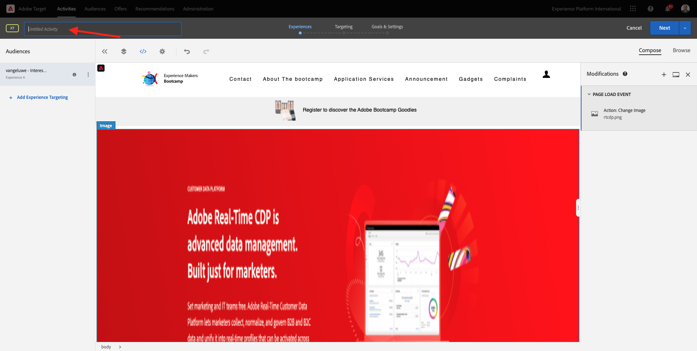

# 1.4 Ação: enviar o público-alvo para a Adobe Target

Ir para [Adobe Experience Platform](https://experience.adobe.com/platform). Depois de fazer logon, você chegará à página inicial do Adobe Experience Platform.

Antes de continuar, você precisa selecionar uma **sandbox**. A sandbox a ser selecionada é chamada ``Bootcamp``. Você pode fazer isso clicando no texto **[!UICONTROL Produção]** na linha azul na parte superior da tela. Depois de selecionar a [!UICONTROL sandbox] apropriada, você verá a alteração da tela e agora estará na [!UICONTROL sandbox] dedicada.

## 1.4.1 Ativar o público-alvo para o destino do Adobe Target

O Adobe Target está disponível como um destino no Real-Time CDP. Para configurar sua integração com o Adobe Target, vá para **Destinos**, para **Catálogo**.

Clique em **Personalization** no menu **Categorias**. Você verá o cartão de destino **Adobe Target**. Clique em **Ativar públicos**.

Selecione o destino ``Bootcamp Target`` e clique em **Avançar**.

Na lista de públicos disponíveis, selecione o público criado em [1.3 Crie um público](./ex3.md), que se chama `yourLastName - Interest in Real-Time CDP`. Em seguida, clique em **Avançar**.

Na próxima página, clique em **Avançar**.

Clique em **Concluir**.

Seu público-alvo agora está ativado para o Adobe Target.

>[!IMPORTANT]
>
>Quando você acaba de criar seu destino do Adobe Target no Real-Time CDP, pode levar até uma hora para o destino ficar ativo. Esse é um tempo de espera único, devido à definição da configuração de back-end. Quando o tempo de espera inicial de uma hora e a configuração de backend forem concluídas, os públicos-alvo de borda recém-adicionados enviados para o destino do Adobe Target estarão disponíveis para direcionamento em tempo real.

## 1.4.2 Configurar a atividade do Adobe Target baseada em formulários

Agora que seu público-alvo do Real-Time CDP está configurado para ser enviado para o Adobe Target, você pode configurar sua atividade de Direcionamento de experiência no Adobe Target. Neste exercício, você configurará uma atividade baseada no Visual Experience Composer.

Vá para a página inicial do Adobe Experience Cloud em [https://experiencecloud.adobe.com/](https://experiencecloud.adobe.com/). Clique em **Target** para abri-lo.

Na página inicial do **Adobe Target**, você verá todas as atividades existentes.
Clique em **+ Criar atividade** para criar uma nova Atividade.

Selecione **Direcionamento de experiência**.

Selecione **Visual** e defina a **URL da atividade** como `https://bootcamp.aepdemo.net/content/aep-bootcamp-experience/language-masters/en/exercises/particpantXX.html`, mas antes de fazer isso, substitua XX por um número entre 01 e 30.

>[!IMPORTANT]
>
>Todos os participantes da ativação devem usar uma página da Web separada para evitar a colisão de várias experiências do Adobe Target. Escolha uma página da Web e encontre a URL acessando aqui: [https://bootcamp.aepdemo.net/content/aep-bootcamp-experience/language-masters/en/exercises.html](https://bootcamp.aepdemo.net/content/aep-bootcamp-experience/language-masters/en/exercises.html).
>
>Todas as páginas compartilham o mesmo URL base e terminam no número do participante.
>
>Por exemplo, o participante 1 deve usar a URL `https://bootcamp.aepdemo.net/content/aep-bootcamp-experience/language-masters/en/exercises/particpant01.html`, o participante 30 deve usar a URL `https://bootcamp.aepdemo.net/content/aep-bootcamp-experience/language-masters/en/exercises/particpant30.html`.

Selecione o espaço de trabalho **AT Bootcamp**.

Clique em **Next**.

Você está agora no Visual Experience Composer. Pode levar de 20 a 30 segundos até que o site seja totalmente carregado.

O público-alvo padrão é atualmente **Todos os visitantes**. Clique nos **3 pontos** ao lado de **Todos os visitantes** e clique em **Alterar público**.

Você está vendo a lista de públicos-alvo disponíveis, e o público-alvo da Adobe Experience Platform criado anteriormente e enviado para o Adobe Target agora faz parte dessa lista. Selecione o público criado anteriormente no Adobe Experience Platform. Clique em **Atribuir público**.

Seu público-alvo do Adobe Experience Platform agora faz parte dessa atividade de direcionamento de experiência.

Antes de alterar a imagem herói, você precisará clicar em **Permitir tudo** no banner de cookie.

Para fazer isso, vá para **Procurar**

Em seguida, clique em **Permitir tudo**.

Em seguida, volte para **Compor**.

Agora vamos alterar a imagem herói na página inicial do site. Clique na imagem herói padrão do site, clique em **Substituir conteúdo** e selecione **Imagem**.

Procure o arquivo de imagem **rtcdp.png**. Selecione e clique em **Salvar**.

Você verá a nova experiência com a nova imagem para o Público-alvo selecionado.

Clique no título da atividade no canto superior esquerdo para renomeá-la.

Para o nome, use:

- `yourLastName - RTCDP - XT (VEC)`

Clique em **Next**.

Clique em **Next**.

Na página **Metas e configurações** -, vá para **Métricas de meta**.

Defina a Meta primária como **Envolvimento** - **Tempo no site**. Clique em **Salvar e fechar**.

Agora você está na página **Visão geral da atividade**. Você ainda precisa ativar sua Atividade.

Clique no campo **Inativo** e selecione **Ativar**.

Em seguida, você receberá uma confirmação visual de que sua atividade está online.

Sua atividade agora está online e pode ser testada no site de bootcamp.

Agora, ao voltar para o site de demonstração e visitar a página do produto do **Real-Time CDP**, você se qualificará instantaneamente para o público-alvo criado e verá a atividade do Adobe Target ser exibida na página inicial em tempo real.

>[!IMPORTANT]
>
>Todos os participantes da ativação devem usar uma página da Web separada para evitar a colisão de várias experiências do Adobe Target. Escolha uma página da Web e encontre a URL acessando aqui: [https://bootcamp.aepdemo.net/content/aep-bootcamp-experience/language-masters/en/exercises.html](https://bootcamp.aepdemo.net/content/aep-bootcamp-experience/language-masters/en/exercises.html).
>
>Todas as páginas compartilham o mesmo URL base e terminam no número do participante.
>
>Por exemplo, o participante 1 deve usar a URL `https://bootcamp.aepdemo.net/content/aep-bootcamp-experience/language-masters/en/exercises/particpant01.html`, o participante 30 deve usar a URL `https://bootcamp.aepdemo.net/content/aep-bootcamp-experience/language-masters/en/exercises/particpant30.html`.

Próxima Etapa: [1.5 Realizar Ação: enviar seu público-alvo para a Facebook](./ex5.md)

[Voltar para Fluxo de Usuário 1](./uc1.md)

[Voltar a todos os módulos](../../overview.md)
