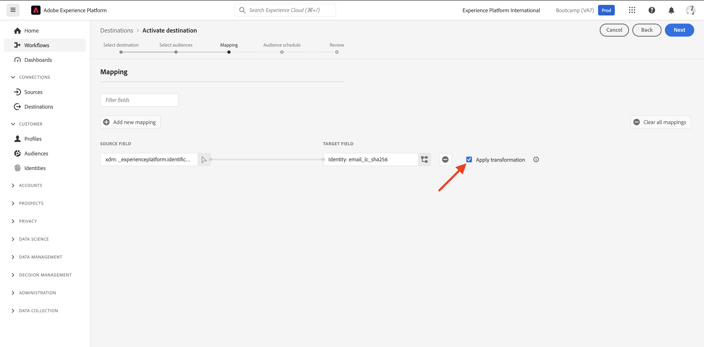

# 1.5 Tomar medidas: enviar seu segmento para a Facebook

Ir para [Adobe Experience Platform](https://experience.adobe.com/platform). Depois de fazer logon, você será direcionado para a página inicial do Adobe Experience Platform.

Antes de continuar, é necessário selecionar um **sandbox**. A sandbox a ser selecionada é chamada de ``Bootcamp``. Você pode fazer isso clicando no texto **[!UICONTROL Produto de produção]** na linha azul na parte superior da tela. Depois de selecionar a [!UICONTROL sandbox], você verá a tela mudar e agora você estará em seu [!UICONTROL sandbox].

No menu esquerdo, acesse **Destinos**, em seguida, vá para **Catálogo**. Você verá o **Catálogo de destinos**. Em **Destinos**, clique em **Ativar segmentos** no **Público-alvo personalizado do facebook** cartão.

Selecione o destino **bootcamp-facebook** e clique em **Próximo**.

Na lista de segmentos disponíveis, selecione o segmento que você criou no exercício anterior. Clique em **Próximo**.

No **Mapeamento** verifique se a variável **Aplicar transformação** a caixa de seleção está ativada. Clique em **Próximo**.

No **Agendamento do segmento** selecione o **Origem do público-alvo** e defina-o como **Diretamente dos clientes**. Clique em **Próximo**.

Por último, no **Revisão** página, clique em **Concluir**.

Seu segmento agora está vinculado aos Públicos personalizados da Facebook. Toda vez que um cliente se qualifica para esse segmento, um sinal será enviado para o lado do servidor do Facebook para incluir esse cliente no Público-alvo personalizado no lado do Facebook.

No Facebook, você encontrará seu segmento no Adobe Experience Platform em Públicos personalizados :

Agora é possível ver seu público-alvo personalizado aparecer no Facebook:

[Voltar para Fluxo de Usuário 1](./uc1.md)

[Voltar para todos os módulos](../../overview.md)
