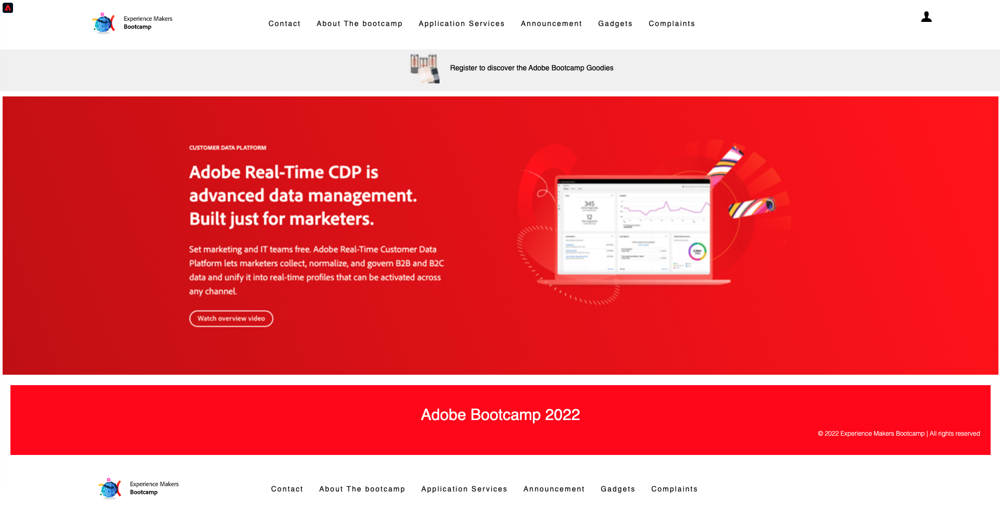
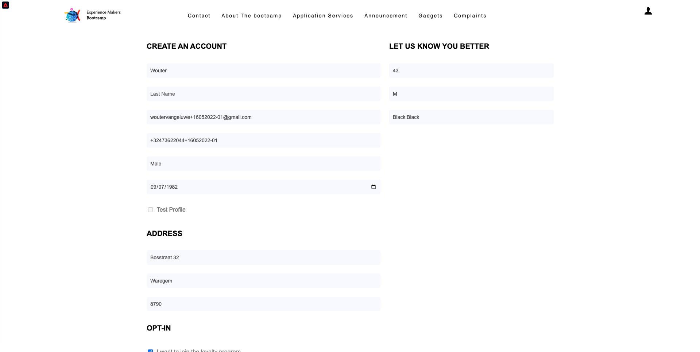

# 2.1 Visite o site e crie sua conta

## Contexto

A jornada de desconhecido para conhecido é um dos tópicos mais importantes entre as marcas nos dias de hoje, assim como a jornada do cliente desde a aquisição até a retenção.

A Adobe Experience Platform tem um papel enorme nesta jornada. Plataforma é o cérebro da comunicação, **sistema de experiência**.

A Platform é um ambiente no qual o termo cliente é mais amplo do que apenas os clientes conhecidos. Um visitante desconhecido no site também é um cliente da perspectiva da Platform e, como tal, todo o comportamento como um visitante desconhecido também é enviado para a Platform. Graças a essa abordagem, quando esse visitante se torna um cliente conhecido, uma marca pode visualizar o que aconteceu antes desse momento também. Isso ajuda na perspectiva de atribuição e otimização de experiência.

## Fluxo de jornada do cliente

Ir para [https://bootcamp.aepdemo.net](https://bootcamp.aepdemo.net). Clique em **Permitir Tudo**. Com base no seu comportamento de navegação no fluxo de usuário anterior, você verá a personalização acontecer na página inicial do site.

Clique no ícone do logotipo do Adobe no canto superior esquerdo da tela para abrir o Visualizador de perfil. Consulte o painel Visualizador de perfil e o Perfil do cliente em tempo real com a **Experience Cloud ID** como o identificador principal para este cliente atualmente desconhecido.

Você também pode ver todos os Eventos de experiência coletados com base no comportamento do cliente.

Clique no botão **Perfil** no canto superior direito da tela.

Clique em **Criar uma conta**.

Preencha todos os campos do formulário. Use um valor real para endereço de email e número de telefone, pois ele será usado em exercícios posteriores para delivery de email e SMS.

Role para baixo e clique em **Registrar**.

Você verá isso.

Você também receberá este email:

E alguns minutos depois, você também receberá este email:

Vamos ver como essa jornada de integração foi configurada a seguir.

Próxima etapa: [2.2 Criar seu evento](./ex2.md)

[Voltar para Fluxo de Usuário 2](./uc2.md)

[Voltar para todos os módulos](../../overview.md)
