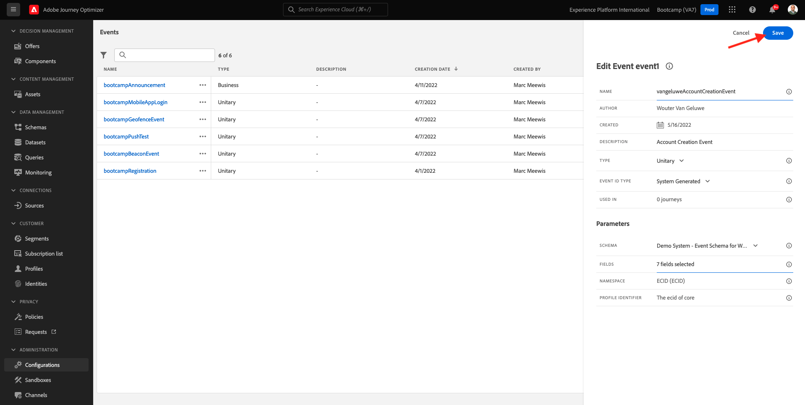

# 2.2 Criar o evento

Faça logon no Adobe Journey Optimizer acessando [Adobe Experience Cloud](https://experience.adobe.com). Clique em **Journey Optimizer**.

Você será redirecionado para a **Início**  exibir no Journey Optimizer. Primeiro, verifique se você está usando a sandbox correta. A sandbox a ser usada é chamada `Bootcamp`. Para alterar de uma sandbox para outra, clique em **Prod** e selecione a sandbox na lista. Neste exemplo, a sandbox é chamada de **Bootcamp**. Você estará no **Início** exibição da sua sandbox `Bootcamp`.

No menu esquerdo, role para baixo e clique em **Configurações**. Clique em **Gerenciar** botão em **Eventos**.

Você verá uma visão geral de todos os eventos disponíveis. Clique em **Criar evento** para começar a criar seu próprio evento.

Uma nova janela de evento vazia será exibida.

Primeiro de tudo, dê ao seu evento um nome como este: `yourLastNameAccountCreationEvent` e adicione uma descrição como esta `Account Creation Event`.

Em seguida, verifique se **Tipo** está definida como **Unitário** e para o **Tipo de ID de evento** seleção, selecione **Gerado pelo sistema**.

O próximo é a seleção Esquema. Um esquema foi preparado para este exercício. Use o esquema `Demo System - Event Schema for Website (Global v1.1) v.1`.

Depois de selecionar o esquema, você verá vários campos que estão sendo selecionados na **Campos** seção. Agora você deve passar o mouse sobre o **Campos** e você verá três ícones aparecendo. Clique no link **Editar** ícone.

Você verá um **Campos** janela pop-up, na qual você precisa selecionar alguns dos campos necessários para personalizar o email.  Escolheremos outros atributos de perfil posteriormente, usando os dados já existentes no Adobe Experience Platform.

No objeto `_experienceplatform.demoEnvironment`, selecione os campos **brandLogo** e **brandName**.

No objeto `_experienceplatform.identification.core`, selecione o campo **email**.

Clique em **Ok** para salvar as alterações.

Você deverá ver isso. Clique em **Salvar** mais uma vez para salvar as alterações.

Seu evento agora está configurado e salvo.

Clique no evento novamente para abrir a **Editar evento** novamente. Focalizar **Campos** novamente para ver os 3 ícones novamente. Clique no link **Exibir carga** ícone.

Agora você verá um exemplo da carga útil esperada.
Seu evento tem uma eventID de orquestração exclusiva, que pode ser encontrada rolando para baixo nessa carga até que você veja `_experience.campaign.orchestration.eventID`.

A ID do evento é o que precisa ser enviado para o Adobe Experience Platform para acionar a jornada que você criará em um dos próximos exercícios. Lembre-se dessa eventID, pois ela pode ser necessária posteriormente.
`"eventID": "19cab7852cdef99d25b6d5f1b6503da39d1f486b1d585743f97ed2d1e6b6c74f"`

Clique em **Ok**, seguido por um clique em **Cancelar**.

Você terminou este exercício agora.

Próxima etapa: [2.3 Criar sua mensagem de email](./ex3.md)

[Voltar para Fluxo de Usuário 2](./uc2.md)

[Voltar a todos os módulos](../../overview.md)
