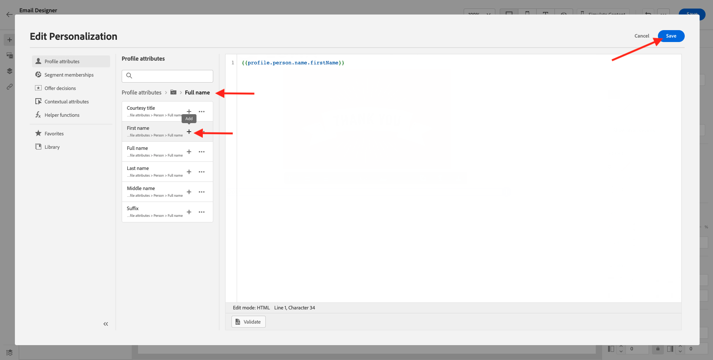

# 2.3 Criar a jornada e a mensagem de email

Neste exercício, você configurará a jornada que precisa ser acionada quando alguém criar uma conta no site de demonstração.

Faça logon no Adobe Journey Optimizer acessando [Adobe Experience Cloud](https://experience.adobe.com). Clique em **Journey Optimizer**.

Você será redirecionado para a **Início**  exibir no Journey Optimizer. Primeiro, verifique se você está usando a sandbox correta. A sandbox a ser usada é chamada `Bootcamp`. Para alterar de uma sandbox para outra, clique em **Prod** e selecione a sandbox na lista. Neste exemplo, a sandbox é chamada de **Bootcamp**. Você estará no **Início** exibição da sua sandbox `Bootcamp`.

## 2.3.1 Criar a jornada

No menu esquerdo, clique em **Jornadas**. Clique em **Criar Jornada** para criar uma nova jornada.

Você verá uma tela de jornada vazia.

No exercício anterior, você criou um novo **Evento**. Você a nomeou assim `yourLastNameAccountCreationEvent` e substituiu `yourLastName` com seu sobrenome. Este foi o resultado da criação do Evento:

Agora, é necessário tomar este evento como o início desta Jornada. Você pode fazer isso indo para o lado esquerdo da tela e procurando seu evento na lista de eventos.

Selecione o evento, arraste e solte-o na tela de Jornada. Agora a Jornada tem esta aparência:

Como a segunda etapa na jornada, é necessário adicionar um **Aguardar** etapa. Vá para o lado esquerdo da tela para a **Orquestração** para encontrar isso. Você estará usando atributos de perfil e precisa verificar se eles estão preenchidos no Perfil do cliente em tempo real.

Sua jornada agora está assim. No lado direito da tela, é necessário configurar o tempo de espera. Defina-o como 1 minuto. Isso dará bastante tempo para que os atributos de perfil estejam disponíveis após o acionamento do evento.

Clique em **Ok** para salvar as alterações.

Como a terceira etapa da jornada, é necessário adicionar um **E-mail** ação. Vá para o lado esquerdo da tela para **Ações**, selecione o **E-mail** e, em seguida, arraste e solte-a no segundo nó na jornada. Agora vocês podem ver isso.

Defina o **Categoria** para **Marketing** e selecione uma superfície de email que permita enviar emails. Nesse caso, a superfície de email a ser selecionada é **E-mail**. Verifique se as caixas de seleção de **Cliques no email** e **aberturas de email** são habilitados.

A próxima etapa é criar a mensagem. Para fazer isso, clique em **Editar conteúdo**.

## 2.3.2 Criar a mensagem

Para criar sua mensagem, clique em **Editar conteúdo**.

Agora vocês podem ver isso.

Clique em **Linha de assunto** campo de texto.

Na área de texto, comece a escrever **Oi**

A linha de assunto ainda não foi terminada. Em seguida, é necessário trazer o token de personalização para o campo **Nome** que é armazenado em `profile.person.name.firstName`. No menu esquerdo, role para baixo para encontrar o **Person** elemento e clique na seta para ir um nível mais fundo.

Agora encontre o **Nome completo** elemento e clique na seta para ir um nível mais fundo.

Por fim, encontre **Nome** e clique no botão **+** ao lado dele. Você verá o token de personalização aparecer no campo de texto.

Em seguida, adicione o texto **, obrigado por se inscrever!**. Clique em **Salvar**.

Você estará de volta aqui. Clique em **Email Designer** para criar o conteúdo do email.

Na próxima tela, 3 métodos diferentes serão exibidos para fornecer o conteúdo do email:

- **Criar do zero**: comece com uma tela em branco e use o editor WYSIWYG para arrastar e soltar componentes de estrutura e conteúdo para criar visualmente o conteúdo do email.
- **Desenvolva o seu**: crie seu próprio template de email codificando-o usando o HTML
- **Importar HTML**: importe um template de HTML existente, que poderá editar.

Clique em **Importar HTML**. Como alternativa, você pode clicar em **Modelos salvos** e selecione o template **Bootcamp - Modelo de email**.

Se você selecionou **Importar HTML**, agora você pode arrastar e soltar o arquivo **mailtemplatebootcamp.html**, que você pode baixar [aqui](../../assets/html/mailtemplatebootcamp.html.zip). Clique em Importar.

Em seguida, você verá este template de email padrão:

Vamos personalizar o email. Clique em próximo ao texto **Oi** e, em seguida, clique no link **Adicionar personalização** ícone.

Em seguida, você precisa trazer o **Nome** token de personalização armazenado em `profile.person.name.firstName`. No menu, localize a variável **Person** elemento, faça drill-down para a variável **Nome completo** e, em seguida, clique no botão **+** ícone para adicionar o campo Nome ao editor de expressão.

Clique em **Salvar**.

Agora você observará como o campo de personalização foi adicionado ao seu texto.

Clique em **Salvar** para salvar a mensagem.

Volte para o painel de mensagem clicando no ícone **seta** ao lado do texto da linha de assunto no canto superior esquerdo.

Você concluiu a criação do email de registro. Clique na seta no canto superior esquerdo para voltar à jornada.

Clique em **Ok**.

## 2.3.3 Publicar a jornada

Você ainda precisa dar um Nome à sua jornada. Você pode fazer isso clicando no link **Propriedades** no lado superior direito da tela.

Em seguida, você pode inserir o nome da jornada aqui. Use `yourLastName - Account Creation Journey`. Clique em **OK** para salvar as alterações.

Agora você pode publicar sua jornada clicando em **Publish**.

Clique em **Publish** novamente.

Você verá uma barra de confirmação verde informando que a jornada foi publicada.

Você terminou este exercício agora.

Próxima etapa: [2.4 Testar a jornada](./ex4.md)

[Voltar para Fluxo de Usuário 2](./uc2.md)

[Voltar a todos os módulos](../../overview.md)