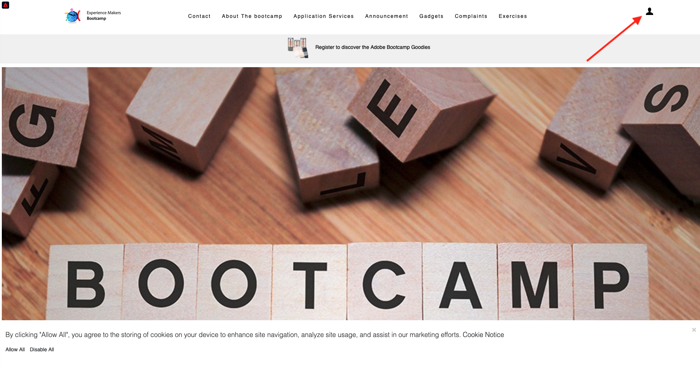

# 2.4 Teste sua jornada

## Fluxo de jornada do cliente

Abra uma nova janela do navegador limpa e incógnita e acesse [https://bootcamp.aepdemo.net](https://bootcamp.aepdemo.net). Clique em **Permitir Tudo**. Com base no seu comportamento de navegação no fluxo de usuário anterior, você verá a personalização acontecer na página inicial do site.

Clique no botão **Perfil** no canto superior direito da tela.

Clique em **Criar uma conta**.

Preencha todos os campos do formulário. Use um valor real para endereço de email e número de telefone, pois ele será usado em exercícios posteriores para delivery de email e SMS.

Role para baixo. Agora é necessário inserir a eventID do evento personalizado criado no exercício 2.2. Você pode encontrá-la aqui:

A ID de evento é o que precisa ser enviado para o Adobe Experience Platform para acionar a jornada criada. Este é o eventID neste exemplo: `19cab7852cdef99d25b6d5f1b6503da39d1f486b1d585743f97ed2d1e6b6c74f`

Preencha eventID no campo **Sua ID de evento de criação de conta** e clique em **Registrar**.

Você verá isso.

Você também receberá esse email, que é o email que você criou como parte deste exercício.

Você já terminou este exercício.

Próxima etapa: [2.5 Instalar e usar o aplicativo móvel](./ex5.md)

[Voltar para Fluxo de Usuário 2](./uc2.md)

[Voltar para todos os módulos](../../overview.md)
