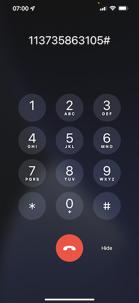

# 2.6 Personalization na central de atendimento

Conforme discutido várias vezes durante a conferência de inicialização, personalizar a experiência do cliente é algo que deve acontecer de forma omnicanal. Uma central de atendimento geralmente é bastante desconectada do restante da jornada do cliente, o que geralmente resulta em experiências frustrantes do cliente, mas não precisa ser. Vamos mostrar um exemplo de como a central de atendimento pode ser facilmente conectada ao Adobe Experience Platform, em tempo real.

## Fluxo de Jornada do cliente

No exercício anterior, usando o aplicativo móvel, você comprou um produto clicando no botão **Comprar**.

Vamos supor que você tenha uma pergunta sobre o status do seu pedido. O que você faria? Normalmente, você chamaria a central de atendimento.

Antes de ligar para a central de atendimento, você precisa saber sua **ID de fidelidade**. Você pode encontrar sua ID de fidelidade no Visualizador de perfil do site.

Nesse caso, a **ID de Fidelidade** é **5863105**. Como parte de nossa implementação personalizada do recurso da central de atendimento no ambiente de demonstração, você precisa adicionar um prefixo à sua **ID de fidelidade**. O prefixo é **11373**, portanto, a ID de Fidelidade a ser usada neste exemplo é **11373 5863105**.

Vamos fazer isso agora. Use seu telefone e ligue para o número **+1 (323) 745-1670**.

Você será solicitado a inserir sua ID de Fidelidade, seguido por **#**. Insira sua ID de fidelidade.

Você ouvirá **Olá, nome**. Esse nome é retirado do Perfil do cliente em tempo real no Adobe Experience Platform. Você tem 3 opções. Pressione o número **1**, **Status do pedido**.

Depois de saber o status do seu pedido, você poderá pressionar **1** para voltar ao menu principal ou pressionar 2. Pressione **2**.

Em seguida, você será solicitado a classificar sua experiência na central de atendimento, selecionando um número entre 1 e 5, sendo 1 baixo e 5 alto. Faça sua escolha.

Sua chamada para a central de atendimento será encerrada.

Ir para [Adobe Experience Platform](https://experience.adobe.com/platform). Depois de fazer logon, você chegará à página inicial do Adobe Experience Platform.

Antes de continuar, você precisa selecionar uma **sandbox**. A sandbox a ser selecionada é chamada ``Bootcamp``. Você pode fazer isso clicando no texto **[!UICONTROL Produção]** na linha azul na parte superior da tela. Depois de selecionar a [!UICONTROL sandbox] apropriada, você verá a alteração da tela e agora estará na [!UICONTROL sandbox] dedicada.

No menu esquerdo, vá para **Perfis** e para **Procurar**.

Selecione o **Namespace de identidade** **Email** e insira o endereço de email do seu perfil de cliente. Clique em **Exibir**. Clique em para abrir o perfil.

Você verá seu perfil de cliente novamente. Ir para **Eventos**.

Em eventos, você verá dois eventos com um eventType de **callCenter**. O primeiro evento é resultado de sua resposta à pergunta **Classifique a satisfação de sua chamada**.

Role para baixo um pouco e você verá o evento que foi gravado quando selecionou a opção para verificar seu **Status do pedido**.

Ir para **Segmento de afiliação**. Agora você verá que dois segmentos se qualificam no seu perfil, em tempo real, com base nas interações que você teve por meio da central de atendimento. Essas associações de segmento podem e devem ser usadas para afetar o que a comunicação e a personalização acontecem em qualquer outro canal.

Você terminou este exercício agora.

[Voltar para Fluxo de Usuário 2](./uc2.md)

[Voltar a todos os módulos](../../overview.md)
