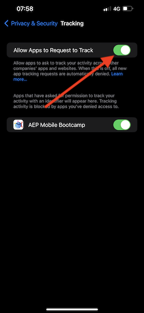
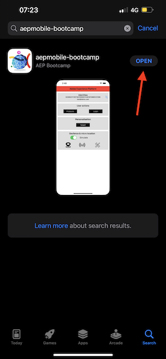

# 3.1 Use o aplicativo móvel e acione uma entrada de sinal

## Instalar o aplicativo móvel

Antes de instalar o aplicativo, é necessário ativar **Rastreamento** no dispositivo iOS. Para fazer isso, acesse **Configurações** > **Privacidade e segurança** > **Rastreamento** e garantir que a opção **Permitir que aplicativos solicitem o rastreamento**.

Acesse o Apple App Store e pesquise por `aepmobile-bootcamp`. Clique em **Instalar** ou **Baixar**.

Depois que o aplicativo estiver instalado, clique em **Abertura**.

Clique em **OK**.

Clique em **Permitir**.

Clique em **Concordo**.

Clique em **Permitir ao usar o aplicativo**.

Clique em **Permitir**.

Agora você está no aplicativo, na página inicial, pronto para acessar a jornada do cliente.

## Fluxo de jornada do cliente

Primeiro, é necessário fazer logon. Clique em **Logon**.

Depois de criar sua conta nos exercícios anteriores, você viu isso no site. Agora é necessário reutilizar o endereço de email da conta criada no aplicativo para fazer logon.

Insira o endereço de email que você usou no site aqui e clique em **Logon**.

Você receberá uma confirmação de que está conectado e uma notificação por push.

Volte para a página inicial no aplicativo e você verá recursos adicionais aparecendo.

Primeiro, vá para **Produtos**. Clique em qualquer produto, neste exemplo **Café para ir**.

Você verá o **Café para ir** página do produto no aplicativo.

Agora você simulará um evento de entrada de beacon em um local de loja offline. O objetivo da simulação é personalizar a experiência do cliente nas telas da loja. Para visualizar a experiência na loja, foi criada uma página que mostrará dinamicamente as informações relevantes para o cliente que acabou de entrar na loja.

Antes de continuar, abra esta página da Web no computador: [https://bootcamp.aepdemo.net/content/aep-bootcamp-experience/language-masters/en/screen.html](https://bootcamp.aepdemo.net/content/aep-bootcamp-experience/language-masters/en/screen.html)

Você verá isto:

Em seguida, volte para a página inicial. Clique em **sinal** ícone.

Você verá isso. Primeiro, selecione **Beacon de tela de bootcamp** e, em seguida, clique no link **entrada** botão. Isso permitirá simular uma entrada de sinal.

Agora, dê uma olhada na tela da loja. O último produto exibido aparecerá lá em 5 segundos.

Em seguida, volte para **Produtos**. Clique em qualquer produto, neste exemplo **Bandeja de praia**.

Em seguida, volte para a página inicial. Clique em **sinal** ícone.

Você verá isso. Primeiro, selecione **Beacon de tela de bootcamp** e, em seguida, clique no link **entrada** botão novamente. Isso permitirá simular uma entrada de sinal.

Agora, dê uma olhada na tela da loja novamente. O último produto exibido aparecerá lá em 5 segundos.

Agora também vamos dar uma olhada no seu Visualizador de perfil no site. Você verá muitos eventos que foram adicionados lá, apenas para mostrar que qualquer interação com um cliente é coletada e armazenada no Adobe Experience Platform.

Nos próximos exercícios, você configurará e testará sua própria jornada de entrada de beacon.

Próxima etapa: [3.2 Criar o evento](./ex2.md)

[Voltar para Fluxo de Usuário 3](./uc3.md)

[Voltar a todos os módulos](../../overview.md)
