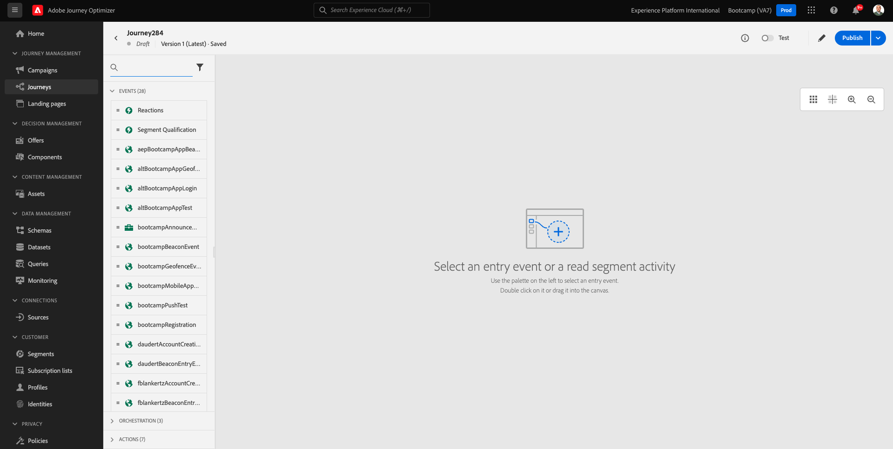

# 3.3 Criar sua jornada e notificação por push

Neste exercício, você configurará a jornada e a mensagem que precisam ser acionadas quando alguém entrar em um beacon usando o aplicativo móvel.

Faça logon no Adobe Journey Optimizer acessando [Adobe Experience Cloud](https://experience.adobe.com). Clique em **Journey Optimizer**.

Você será redirecionado para a **Início**  exibir no Journey Optimizer. Primeiro, verifique se você está usando a sandbox correta. A sandbox a ser usada é chamada `Bootcamp`. Para alterar de uma sandbox para outra, clique em **Prod** e selecione a sandbox na lista. Neste exemplo, a sandbox é chamada de **Bootcamp**. Você estará no **Início** exibição da sua sandbox `Bootcamp`.

## 3.3.1 Criar sua jornada

No menu esquerdo, clique em **Jornadas**. Clique em **Criar Jornada** para criar uma nova jornada.

Você verá uma tela de jornada vazia.

No exercício anterior, você criou um novo **Evento**. Você a nomeou assim `yourLastNameBeaconEntryEvent` e substituiu `yourLastName` com seu sobrenome. Este foi o resultado da criação do Evento:

Agora, é necessário tomar este evento como o início desta Jornada. Você pode fazer isso indo para o lado esquerdo da tela e procurando seu evento na lista de eventos.

Selecione o evento, arraste e solte-o na tela de jornada. Sua jornada agora está assim. Clique em **Ok** para salvar as alterações.

Como a segunda etapa da jornada, é necessário adicionar um **Push** ação. Vá para o lado esquerdo da tela para **Ações**, selecione o **Push** e, em seguida, arraste e solte-a no segundo nó na jornada.

No lado direito da tela, agora é necessário criar a notificação por push.

Defina o **Categoria** para **Marketing** e selecione uma superfície de push que permita enviar notificações por push. Nesse caso, a superfície de push a ser selecionada é **meeewis-app-mobile-bootcamp**.

## 3.3.2 Criar a mensagem

Clique em **Editar conteúdo**.

Você verá isto:

Vamos definir o conteúdo da notificação por push.

Clique em **Título** campo de texto.

Na área de texto, comece a escrever **Oi**. Clique no ícone de personalização.

Agora é necessário trazer o token de personalização para o campo **Nome** que é armazenado em `profile.person.name.firstName`. No menu esquerdo, selecione **Atributos do perfil**, role para baixo/navegue até encontrar o **Person** e clique na seta para ir um nível mais fundo até chegar ao campo `profile.person.name.firstName`. Clique em **+** ícone para adicionar o campo à tela. Clique em **Salvar**.

Você estará de volta aqui. Clique no ícone de personalização ao lado do campo **Corpo**.

Na área de texto, escreva `Welcome at the `.

Clique em **Atributos contextuais** e depois **Journey Orchestration**.

Clique em **Eventos**.

Clique no nome do evento, que deve ter esta aparência: **yourLastNameBeaconEntryEvent**.

Clique em **Contexto do local**.

Clique em **Interação de POI**.

Clique em **Detalhes do POI**.

Clique em **+** ícone em **Nome do POI**.
Você verá isso. Clique em **Salvar**.

Sua mensagem agora está pronta. Clique na seta no canto superior esquerdo para voltar à jornada.

Clique em **Ok**.

## 3.3.2 Enviar uma mensagem para uma tela

Como a terceira etapa da jornada, é necessário adicionar um **sendMessageToScreen** ação. Vá para o lado esquerdo da tela para **Ações**, selecione o **sendMessageToScreen** e, em seguida, arraste e solte-a no terceiro nó na jornada. Você verá isso.

A variável **sendMessageToScreen** ação é uma ação personalizada que publicará uma mensagem no endpoint usado pela exibição na loja. A variável **sendMessageToScreen** A ação espera que várias variáveis sejam definidas. É possível ver essas variáveis ao rolar para baixo até ver **Parâmetros de ação**.

Agora é necessário definir os valores de cada parâmetro de ação. Siga esta tabela para entender quais valores são necessários e onde.

| Parâmetro | Valor de  |
|:-------------:| :---------------:|
| ENTREGA | `'image'` |
| ECID | `@{yourLastNameBeaconEntryEvent._experienceplatform.identification.core.ecid}` |
| NOME | `#{ExperiencePlatform.ProfileFieldGroup.profile.person.name.firstName}` |
| EVENTSUBJECT | `#{ExperiencePlatform.ProductListItems.experienceevent.first(currentDataPackField.eventType == "commerce.productViews").productListItems.first().name}` |
| EVENTSUBJECTURL | `#{ExperiencePlatform.ProductListItems.experienceevent.first(currentDataPackField.eventType == "commerce.productViews").productListItems.first()._experienceplatform.core.imageURL}` |
| SANDBOX | `'bootcamp'` |
| CONTAINERID | `''` |
| ACTIVITYID | `''` |
| PLACEMENTID | `''` |

{style="table-layout:auto"}

Para definir esses valores, clique no link **Editar** ícone.

Em seguida, selecione **Modo avançado**.

Em seguida, cole o valor com base na tabela acima. Clique em **Ok**.

Repita esse processo para adicionar valores a cada campo.

>[!IMPORTANT]
>
>Para o campo ECID, há uma referência ao evento `yourLastNameBeaconEntryEvent`. Substitua `yourLastName` pelo seu sobrenome.

O resultado final deve ficar assim:

Role para cima e clique em **Ok**.

Você ainda precisa dar um Nome à sua jornada. Você pode fazer isso clicando no link **Propriedades** no lado superior direito da tela.

Em seguida, você pode inserir o nome da jornada aqui. Use `yourLastName - Beacon Entry Journey`. Clique em **OK** para salvar as alterações.

Agora você pode publicar sua jornada clicando em **Publish**.

Clique em **Publish** novamente.

Você verá uma barra de confirmação verde informando que a jornada foi publicada.

Sua jornada agora está ativa e pode ser acionada.

Você terminou este exercício agora.

Próxima etapa: [3.4 Testar a jornada](./ex4.md)

[Voltar para Fluxo de Usuário 3](./uc3.md)

[Voltar a todos os módulos](../../overview.md)
