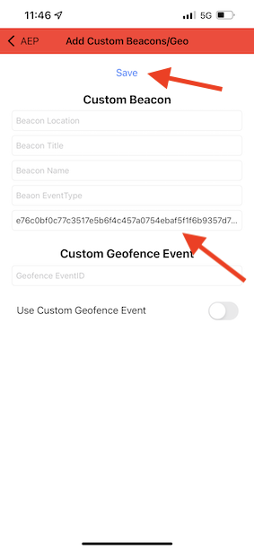

# 3.4 Testar a jornada

Para testar sua jornada, será necessário usar a ID de evento do evento criado no exercício 3.2, que tem esta aparência.

A ID do evento é o que precisa ser enviado ao Adobe Experience Platform para acionar a jornada. Neste exemplo, a eventID é:
`e76c0bf0c77c3517e5b6f4c457a0754ebaf5f1f6b9357d74e0d8e13ae517c3d5`.

Abra o aplicativo móvel e vá para a página inicial. Clique no ícone de **Configurações**.

Cole sua eventID no campo **EventID de sinal** e clique em **Salvar**.

Antes de continuar, abra esta página da Web no computador: [https://bootcamp.aepdemo.net/content/aep-bootcamp-experience/language-masters/en/screen.html](https://bootcamp.aepdemo.net/content/aep-bootcamp-experience/language-masters/en/screen.html)

Você verá isto:

Em seguida, volte para a página inicial. Clique em **sinal** ícone.

Você verá isso. Primeiro, selecione **Beacon de tela de bootcamp** e, em seguida, clique no link **entrada** botão. Isso permitirá simular uma entrada de sinal.

Agora, dê uma olhada na tela da loja. O último produto exibido aparecerá lá em 5 segundos.

Você também receberá sua notificação por push.

Você terminou este exercício agora.

[Voltar para Fluxo de Usuário 3](./uc3.md)

[Voltar a todos os módulos](../../overview.md)
