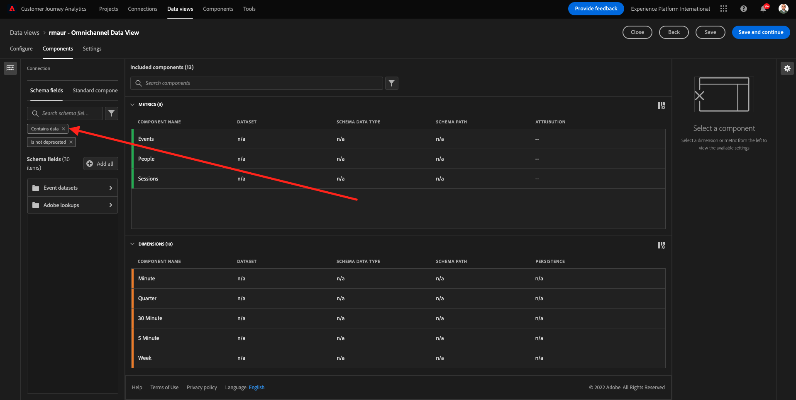
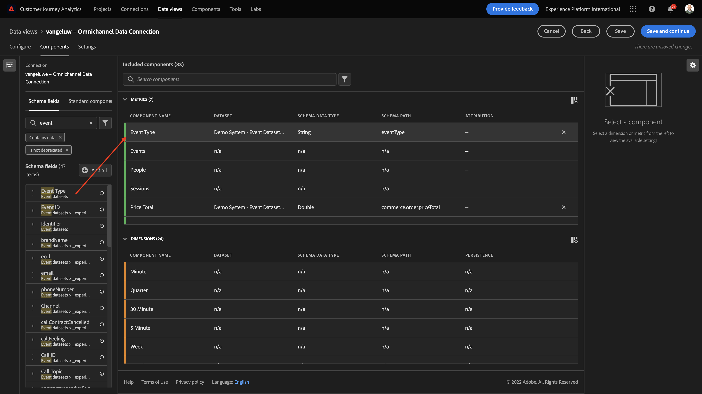

# 4.3 Criar uma visualização de dados

## Objetivos

- Entender a interface do usuário da visualização de dados
- Entender as configurações básicas da definição de visita
- Entender a atribuição e a persistência em uma visualização de dados

## 4.3.1 Visualização de dados

Com a conexão concluída, agora é possível avançar para influenciar a visualização. Uma diferença entre o Adobe Analytics e o CJA é que o CJA precisa de uma Exibição de dados para limpar e preparar os dados antes da visualização.

Uma Exibição de dados é semelhante ao conceito de Conjuntos de relatórios virtuais no Adobe Analytics, onde você define definições de visitas sensíveis ao contexto, filtragem e também como os componentes são chamados.

Você precisará de no mínimo uma Exibição de dados por Conexão. No entanto, para alguns casos de uso, é ótimo ter várias Visualizações de dados para a mesma conexão, com o objetivo de fornecer diferentes insights para diferentes equipes.
Se quiser que sua empresa se torne orientada por dados, você deve adaptar como os dados são visualizados em cada equipe. Alguns exemplos:

- Métricas UX somente para a equipe de Design UX
- Use os mesmos nomes para KPIs e Métricas para Google Analytics, assim como para o Customer Journey Analytics, para que a equipe de análise digital possa falar apenas um idioma.
- A Exibição de dados foi filtrada para mostrar, por exemplo, dados de um mercado, uma marca ou apenas para dispositivos móveis.

No **Conexões** marque a caixa de seleção na frente da conexão que você acabou de criar. Clique em **Criar Exibição de Dados**.

Você será redirecionado para o **Criar Exibição de Dados** fluxo de trabalho.

## 4.3.2 Definição da visualização de dados

Agora você pode configurar as definições básicas para sua Exibição de dados.

O **Conexão** você criou no exercício anterior já está selecionado. Sua conexão é nomeada `yourLastName – Omnichannel Data Connection`.

Em seguida, dê um nome à Exibição de dados seguindo esta convenção de nomenclatura: `yourLastName – Omnichannel Data View`.

Insira o mesmo valor para a descrição: `yourLastName – Omnichannel Data View`.

| Nome | Descrição |
| ----------------- |-------------| 
| `yourLastName – Omnichannel Data View` | `yourLastName – Omnichannel Data View` |

Para o **Fuso Horário**, selecione o fuso horário **Berlim, Estocolmo, Roma, Berna, Bruxelas, Viena, Amesterdã GMT+01:00**. Esse cenário é realmente interessante, já que algumas empresas operam em diferentes países e regiões. Alocar o fuso horário certo para cada país evitará erros típicos de dados, como acreditar que, por exemplo, no Peru, a maioria das pessoas compra camisetas às 4:00 AM.

Também é possível modificar o nome das métricas principais (Pessoa, Sessão e Evento). Isso não é necessário, mas alguns clientes gostam de usar Pessoas, Visitas e Ocorrências em vez de Pessoa, Sessão e Eventos (convenção de nomenclatura padrão do Customer Journey Analytics).

Agora você deve ter as seguintes configurações definidas:

Clique em **Salvar e continuar**.

## 4.3.3 Componentes da visualização de dados

Neste exercício, você configurará os componentes necessários para analisar os dados e visualizá-los usando o Analysis Workspace. Nesta interface do usuário, há três áreas principais:

- Lado esquerdo: Componentes disponíveis dos conjuntos de dados selecionados
- Meio: Componentes adicionados à Exibição de dados
- Lado direito: Configurações do componente

>[!IMPORTANT]
>
>Se não conseguir encontrar uma métrica ou dimensão específica, verifique se o campo `Contains data` é removido da visualização de dados. Caso contrário, exclua esse campo.
>
>

Agora é necessário arrastar e soltar os componentes necessários para a análise para a **Componentes adicionados**. Para fazer isso, você precisa selecionar os componentes no menu esquerdo e arrastá-los e soltá-los na tela no meio.

Vamos começar com o primeiro componente: **Nome (web.webPageDetails.name)**. Procure esse componente e arraste e solte-o na tela.

Esse componente é o nome da página, como você pode derivar da leitura do campo de esquema `(web.webPageDetails.name)`.

No entanto, usando **Nome** já que o nome não é a melhor convenção de nomenclatura para um usuário empresarial entender rapidamente essa dimensão.

Vamos alterar o nome a ser **Nome da página**. Clique no componente e renomeie-o no **Configurações do componente** área.

Algo realmente importante é o **Configurações de persistência**. O conceito de evars e prop não existe no CJA, mas as configurações de Persistência possibilitam um comportamento semelhante.

Se você não alterar essas configurações, o CJA interpretará a dimensão como uma **Prop** (nível de ocorrência). Além disso, podemos alterar a Persistência para tornar a dimensão uma **eVar** (mantenha o valor na jornada).

Se você não estiver familiarizado com eVars e Props, será possível [leia mais sobre eles na documentação](https://experienceleague.adobe.com/docs/analytics/landing/an-key-concepts.html).

Vamos deixar o Nome da página como uma Prop. Dessa forma, você não precisa alterar nenhuma **Configurações de persistência**.

| Nome do componente para pesquisa | Novo nome | Configurações de persistência |
| ----------------- |-------------| --------------------| 
| Nome (web.webPageDetails.name) | Nome da página |  |

Em seguida, escolha a dimensão **phoneNumber** e solte na tela. O novo nome deve ser **Número de telefone**.

Por fim, vamos alterar as configurações de Persistência, já que o Número do celular deve persistir no nível do usuário.

Para alterar a Persistência, role para baixo no menu direito e abra o **Persistência** guia :

Marque a caixa de seleção para modificar as configurações de persistência. Selecionar **Mais recente** e **Pessoa (janela Relatório)** , já que nos preocupamos apenas com o último número de celular dessa pessoa. Se o cliente não preencher o dispositivo móvel em visitas futuras, você ainda verá esse valor preenchido.

| Nome do componente para pesquisa | Novo nome | Configurações de persistência |
| ----------------- |-------------| --------------------| 
| phoneNumber | Número de telefone | Mais recente, Pessoa (janela de relatórios) |

O próximo componente é `web.webPageDetails.pageViews.value`.

No menu do lado esquerdo, procure por `web.webPageDetails.pageViews.value`. Arraste e solte essa métrica na tela.

Alterar o nome a ser **Exibições de página** nos termos do **Configurações do componente**.

| Nome do componente para pesquisa | Novo nome | Configurações de atribuição |
| ----------------- |-------------| --------------------| 
| web.webPageDetails.pageViews.value | Page Views |  |

Para as configurações de atribuição, deixaremos isso em branco.

Observação: Configurações de persistência em métricas também podem ser alteradas no Analysis Workspace. Em alguns casos, você pode optar por defini-lo aqui para evitar que os usuários corporativos precisem pensar qual é o melhor modelo de persistência.

Em seguida, é necessário configurar muitas Dimension e métricas, conforme indicado na tabela abaixo.

### DIMENSION

| Nome do componente para pesquisa | Novo nome | Configurações de persistência |
| ----------------- |-------------| --------------------| 
| brandName | Nome da marca | Mais recente, sessão |
| calmaria | Feed de chamada |  |
| ID de chamada | Tipo de interação da chamada |  |
| callTopic | Tópico da Chamada | Mais recente, sessão |
| ecid | ECID | Mais recente, Pessoa (janela de relatórios) |
| email | ID de email | Mais recente, Pessoa (janela de relatórios) |
| Tipo de pagamento | Tipo de pagamento |  |
| Método de adição de produto | Método de adição de produto | Mais recente, sessão |
| Tipo de evento | Tipo de evento |  |
| Nome (productListItems.name) | Nome do produto |  |
| SKU | SKU (sessão) | Mais recente, sessão |
| ID da transação | ID da transação |  |
| URL (web.webPageDetails.URL) | URL |  |
| Agente do usuário | Agente do usuário | Mais recente, sessão |

### MÉTRICAS

| Nome do componente para pesquisa | Novo nome | Configurações de atribuição |
| ----------------- |-------------| --------------------| 
| Quantidade | Quantidade |  |
| commerce.order.priceTotal | Receita |  |

Sua configuração deve ter esta aparência:

Não se esqueça de **Salvar** sua Exibição de dados. Então clique em **Salvar** agora.

## 4.3.4 Métricas calculadas

Embora tenhamos organizado todos os componentes na Exibição de dados, você ainda precisa adaptar alguns deles, para que os usuários empresariais estejam prontos para iniciar a análise.

Se você se lembrar, não incluímos especificamente métricas como Adicionar ao carrinho, Visualização do produto ou Compras na Visualização de dados.
No entanto, temos uma dimensão chamada: **Tipo de evento**. Portanto, vamos derivar esses tipos de interação criando 3 métricas calculadas.

Vamos começar com a primeira métrica: **Exibições do produto**.

No lado esquerdo, pesquise **Tipo de evento** e selecione a dimensão . Em seguida, arraste e solte no **Componentes incluídos** tela.

Clique para selecionar a nova métrica **Tipo de evento**.

Agora, altere o nome e a descrição do componente para os seguintes valores:

| Nome do componente | Descrição do componente |
| ----------------- |-------------| 
| Visualizações de produto | Visualizações de produto |

Agora vamos contar somente **Exibições do produto** eventos. Para fazer isso, role para baixo no **Configurações do componente** até que você veja **Incluir valores de exclusão**. Certifique-se de ativar a opção **Definir valores de inclusão/exclusão**.

Como só queremos contar **Exibições do produto**, especifique **commerce.productViews** de acordo com os critérios.

Sua métrica calculada agora está pronta!

Em seguida, repita o mesmo processo para **Adicionar ao carrinho** e **Compra** eventos.

### Adicionar ao carrinho

Primeiro arraste e solte a mesma dimensão **Tipo de evento**.

Você verá um pop-up de alerta de um campo duplicado, pois estamos usando a mesma variável. Clique em **Adicionar assim mesmo**:

Agora, siga o mesmo processo que seguimos para a métrica Visualizações de produto:
- Primeiro, altere o nome e a descrição.
- Finalmente adicionar **commerce.productListAdds** como critério para contar somente Adicionar ao carrinho

| Nome | Descrição | Critérios |
| ----------------- |-------------| -------------|
| Adicionar ao carrinho | Adicionar ao carrinho | commerce.productListAdds |

### Compras

Primeiro arraste e solte a mesma dimensão **Tipo de evento** como fizemos para ambas as métricas anteriores.

Você verá um pop-up de alerta de um campo duplicado, pois estamos usando a mesma variável. Clique em **Adicionar assim mesmo**:

Agora, siga o mesmo processo que seguimos para as métricas Exibições do produto e Adicionar ao carrinho:
- Primeiro, altere o nome e a descrição.
- Finalmente adicionar **commerce.purches** como critérios para contar somente compras

| Nome | Descrição | Critérios |
| ----------------- |-------------| -------------|
| Compras | Compras | commerce.purchases |

A configuração final deve ser semelhante a esta. Clique em **Salvar e continuar**.

## 4.3.5 Configurações da visualização de dados

Você deve ser redirecionado para esta tela:

Nesta guia, é possível modificar algumas configurações importantes para alterar o modo como os dados são processados. Vamos começar definindo a variável **Tempo limite da sessão** até 30 min. Graças ao carimbo de data e hora de cada evento de experiência, você pode estender o conceito de uma sessão em todos os canais. Por exemplo, o que acontece se um cliente chamar a central de atendimento depois de visitar o site? Com o uso de Limites de tempo de sessão personalizados, você tem muita flexibilidade para decidir o que é uma sessão e como essa sessão unirá os dados.

Nesta guia, é possível modificar outras coisas, como filtrar os dados usando um segmento/filtro. Você não precisará fazer isso neste exercício.

Quando terminar, clique em **Salvar e concluir**.

>[!NOTE]
>
>Você pode voltar a essa Exibição de dados depois e alterar as configurações e os componentes a qualquer momento. As alterações afetarão a forma como os dados históricos são mostrados.

Agora você pode continuar com a parte de visualização e análise!

Próxima etapa: [4.4 Preparação de dados no Customer Journey Analytics](./ex4.md)

[Voltar para Fluxo de Usuário 4](./uc4.md)

[Voltar para todos os módulos](./../../overview.md)
