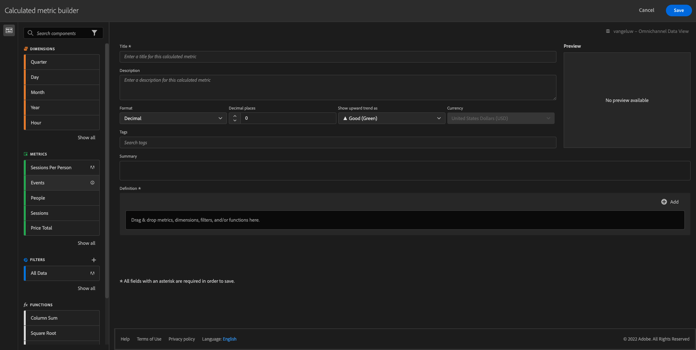

# 4.4 Preparação de dados no Analysis Workspace

## Objetivos

- Compreensão da interface do Analysis Workspace no CJA
- Entenda os conceitos de preparação de dados no Analysis Workspace
- Saiba como fazer cálculos de dados

## 4.4.1 Interface do usuário do Analysis Workspace no CJA

O Analysis Workspace remove todas as limitações típicas de um único relatório do Analytics. Ele fornece uma tela robusta e flexível para a criação de projetos de análise personalizados. Arraste e solte qualquer número de tabelas de dados, visualizações e componentes (dimensões, métricas, segmentos e granularidades de tempo) em um projeto. Crie detalhamentos e segmentos instantaneamente, coorte para análise, crie alertas, compare segmentos, faça análises de fluxo e fallout e prepare e programe relatórios para compartilhamento com qualquer pessoa em sua empresa.

A Customer Journey Analytics traz essa solução para os dados da plataforma. Recomendamos assistir a este vídeo de visão geral de quatro minutos:

>[!VIDEO](https://video.tv.adobe.com/v/35109?quality=12&learn=on&enablevpops)

Se você não usou o Analysis Workspace antes, recomendamos assistir a este vídeo:

>[!VIDEO](https://video.tv.adobe.com/v/35802?quality=12&learn=on&enablevpops&captions=por_br)

### Criar seu projeto

Agora é hora de criar seu primeiro projeto do CJA. Acesse a guia Projetos no CJA.
Clique em **Criar novo**.

Você verá isso. Selecione **Projeto em branco** e clique em **Criar**.

Você verá um projeto vazio.

Primeiro, selecione a Visualização de dados correta no canto superior direito da tela. Neste exemplo, a Visualização de Dados a ser selecionada é `CJA Bootcamp - Omnichannel Data View`.

Em seguida, salve seu projeto e dê um nome a ele. Você pode usar o seguinte comando para salvar:

| Sistema operacional | Atalho |
| ----------------- |-------------| 
| Windows | Ctrl+S |
| Mac | Command+S |

Você verá este pop-up:

Use esta convenção de nomenclatura:

| Nome | Descrição |
| ----------------- |-------------| 
| `yourLastName - Omnichannel Analysis` | `yourLastName - Omnichannel Analysis` |

Em seguida, clique em **Salvar**.

## 4.4.2 Métricas calculadas

Embora tenhamos organizado todos os componentes na Visualização de dados, ainda é necessário adaptar alguns deles para que os usuários empresariais estejam prontos para iniciar sua análise. Além disso, durante qualquer análise, é possível criar métricas calculadas para aprofundar a descoberta de insights.

Como exemplo, criaremos uma **Taxa de conversão** calculada usando a métrica/evento **Compras** que definimos na Exibição de dados.

### Índice de conversão

Vamos abrir o construtor de métricas calculadas. Clique em **+** para criar sua primeira Métrica calculada no Analysis Workspace.

O **Construtor de Métricas Calculadas** será exibido:

Localize as **Compras** na lista de Métricas no menu do lado esquerdo. Em **Métricas**, clique em **Mostrar tudo**

Agora arraste e solte a métrica **Compras** na definição da métrica calculada.

Normalmente, o índice de conversão significa **Conversões/Sessões**. Vamos fazer o mesmo cálculo na tela de definição Métrica calculada. Localize a métrica **Sessões** e arraste-a e solte-a no construtor de definições, no evento **Compras**.

Observe que o operador de divisão é selecionado automaticamente.

A taxa de conversão geralmente é representada em porcentagem. Então, vamos alterar o formato para ser porcentagem e também selecionar 2 decimais.

Por fim, altere o nome e a descrição da métrica calculada:

| Título | Descrição |
| ----------------- |-------------| 
| yourLastName - Taxa de conversão | yourLastName - Taxa de conversão |

Você terá algo assim na tela:

Não esqueça de **Salvar** a Métrica calculada.

## 4.4.3 Dimensões calculadas: filtros (segmentação) e intervalos de datas

### Filtros: Dimensões calculadas

Os cálculos não devem ser feitos apenas para métricas. Antes de iniciar qualquer análise, também é interessante criar algumas **Dimensões calculadas**. Isso basicamente significava **segmentos** de volta ao Adobe Analytics. No Customer Journey Analytics, esses segmentos são chamados de **Filtros**.

A criação de filtros ajudará os usuários empresariais a iniciar a análise com algumas dimensões calculadas valiosas. Isso automatizará algumas tarefas, além de ajudar na parte de adoção. Veja alguns exemplos:

1. Própria mídia, mídia paga,
2. Visitas novas vs recorrentes
3. Clientes com carrinho abandonado

Esses filtros podem ser criados antes ou durante a parte de análise (o que você fará no próximo exercício).

### Intervalos de datas: dimensões de tempo calculadas

Dimensões de tempo são outro tipo de dimensões calculadas. Algumas já foram criadas, mas você também tem a capacidade de criar suas próprias Dimensões de tempo personalizadas na fase de preparação dos dados.

Essas Dimensões de tempo calculadas ajudarão os analistas e usuários empresariais a lembrar datas importantes e usá-las para filtrar e alterar o tempo do relatório. Perguntas típicas e dúvidas que vêm à nossa mente quando fazemos análises:

- Quando foi Black Friday no ano passado? 21-29?
- Quando fizemos aquela campanha de TV em dezembro?
- De quando a quando fizemos as Vendas de Verão de 2018? Quero compará-la com 2019. A propósito, você sabe quais são os dias exatos de 2019?

Agora você concluiu o exercício de preparação de dados usando o CJA Analysis Workspace.

Próxima Etapa: [4.5 Visualização usando o Customer Journey Analytics](./ex5.md)

[Voltar para Fluxo de Usuário 4](./uc4.md)

[Voltar a todos os módulos](./../../overview.md)
