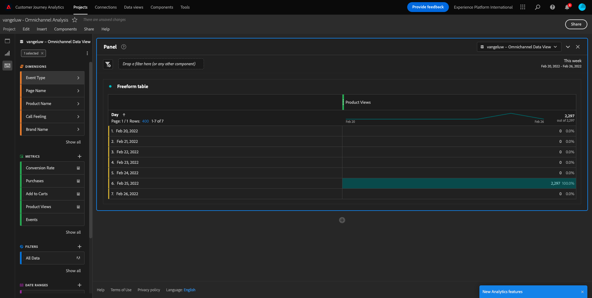
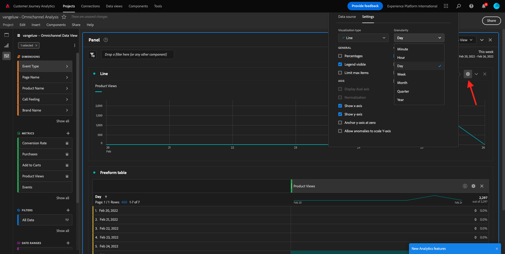
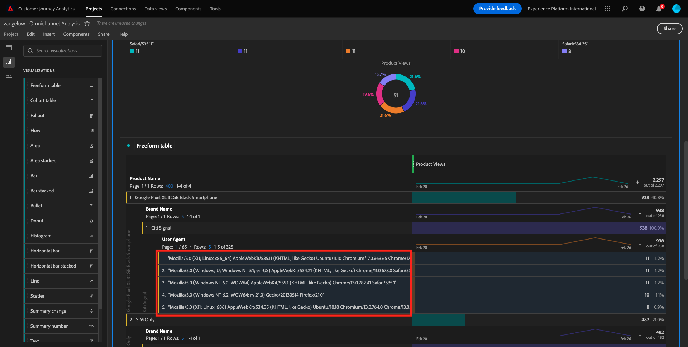
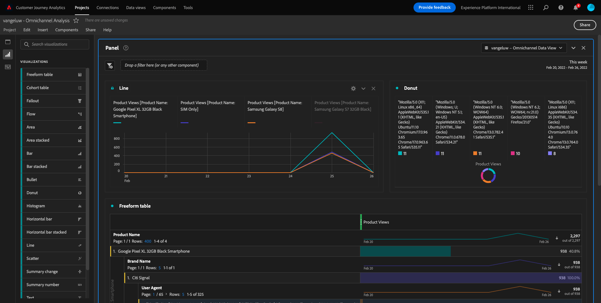
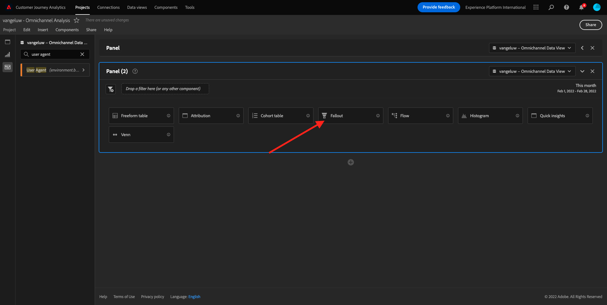
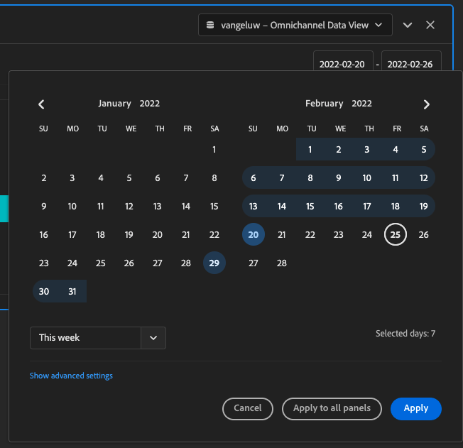
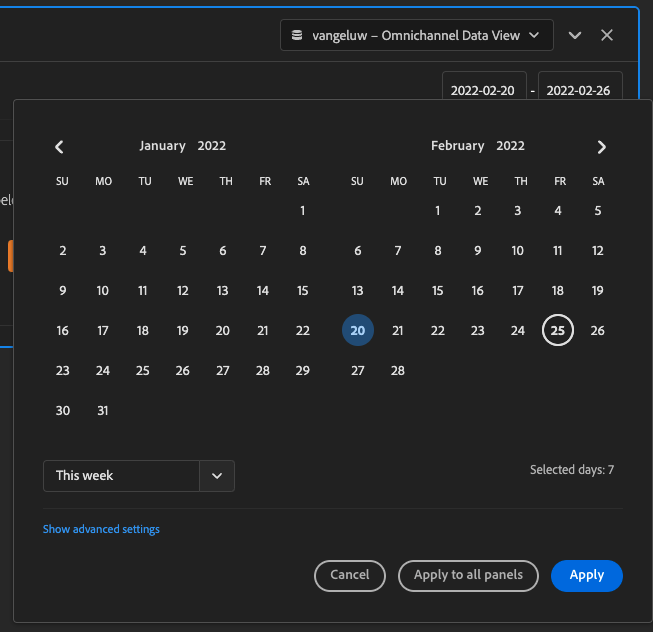

# 4.5 Visualização usando Customer Journey Analytics

## Objetivos

- Entender a interface do usuário do Analysis Workspace
- Saiba mais sobre alguns recursos que tornam o Analysis Workspace tão diferente.
- Saiba como analisar no CJA usando o Analysis Workspace

## Contexto

Neste exercício, você usará o Analysis Workspace no CJA para analisar exibições de produtos, funis de produtos, churn etc.

Vamos usar o projeto criado em [4.4 Preparação de dados no Analysis Workspace](./ex4.md), vá para [https://analytics.adobe.com](https://analytics.adobe.com).

Abra o projeto `yourLastName - Omnichannel Analysis`.

Com seu projeto aberto e a Exibição de dados `yourLastName - Omnichannel Analysis` selecionado, você está pronto para começar a criar suas primeiras visualizações.

## Quantas visualizações de produtos temos diariamente

Primeiro, precisamos selecionar as datas certas para analisar os dados. Vá para a lista suspensa do calendário no lado direito da tela de desenho. Clique nele e selecione o intervalo de datas aplicável.

>[!IMPORTANT]
>
>Selecione um intervalo de datas como **Nesta Semana** ou **Este mês**. Os dados disponíveis mais recentes foram assimilados em 19 de setembro de 2022.

No menu à esquerda (área de componentes), localize a Métrica calculada **Exibições do produto**. Selecione-o e arraste-o e solte-o na tela, na parte superior direita da tabela de forma livre.

Dimensionar automaticamente a dimensão **Dia** serão adicionadas para criar a primeira tabela. Agora vocês podem ver sua pergunta respondida em tempo real.

Em seguida, clique com o botão direito do mouse no resumo da métrica.

Clique em **Visualizar** e depois selecione **Linha** como visualização.

Você verá suas visualizações de produtos por dia.

Você pode alterar o escopo de tempo para dia clicando em **Configurações** na visualização.

Clique no ponto ao lado de **Linha** para **Gerenciar a fonte de dados**.

Em seguida, clique em **Bloquear seleção** e selecione **Itens Selecionados** para bloquear essa visualização de modo que ela sempre exiba uma linha do tempo de Exibições do produto.

## Os 5 principais produtos visualizados

Quais são os 5 principais produtos visualizados?

Lembre-se de salvar o projeto de vez em quando.

| OS | Curto |
| ----------------- |-------------| 
| Windows | Controle + S |
| Mac | Command+S |

Vamos começar a encontrar os 5 principais produtos visualizados. No menu lateral esquerdo, localize a variável **Nome do produto** - Dimension.

Arrastar e soltar **Nome do produto** para substituir o **Dia** dimensão:

Esse será o resultado

Em seguida, tente detalhar um dos produtos por Nome da Marca. Procurar por **brandName** e arraste-o para baixo do nome do produto.

Em seguida, faça um detalhamento usando o Agente do usuário. Procurar por **Agente do usuário** e arraste-a sob o nome da marca.

Você verá isso:

Por fim, é possível adicionar mais visualizações. No lado esquerdo, em visualizações, procure por `Donut`. Tome `Donut`, arraste-o e solte-o na tela sob a **Linha** visualização.

Em seguida, na Tabela, selecione os primeiros 5 **Agente do usuário**  linhas do detalhamento em que fizemos **Google Pixel XL Smartphone preto de 32 GB** > **Signal do Haqqani**. Ao selecionar as 5 linhas, mantenha pressionada a tecla **CTRL** (no Windows) ou o botão **Comando** (no Mac).

Você verá o gráfico de rosca alterado:

Você pode até adaptar o design para que seja mais legível, tornando **Linha** e o **Rosca** gráfico um pouco menor para que se ajustem um ao outro:

Clique no ponto ao lado de **Rosca** para **Gerenciar a fonte de dados**.
Em seguida, clique em **Bloquear seleção** para bloquear essa visualização de modo que ela sempre exiba uma linha do tempo de Exibições do produto.

Saiba mais sobre visualizações usando o Analysis Workspace aqui:

- [https://experienceleague.adobe.com/docs/analytics/analyze/analysis-workspace/visualizations/freeform-analysis-visualizations.html?lang=pt-BR](https://experienceleague.adobe.com/docs/analytics/analyze/analysis-workspace/visualizations/freeform-analysis-visualizations.html?lang=pt-BR)
- [https://experienceleague.adobe.com/docs/analytics/analyze/analysis-workspace/visualizations/t-sync-visualization.html](https://experienceleague.adobe.com/docs/analytics/analyze/analysis-workspace/visualizations/t-sync-visualization.html)

## Funil de interação do produto, da visualização à compra

Há muitas maneiras de resolver essa questão. Uma delas é usar o Tipo de interação do produto e usá-lo em uma tabela de forma livre. Outra maneira é usar um **Visualização de fallout**. Vamos usar o último como queremos visualizar e analisar ao mesmo tempo.

Feche o painel atual clicando aqui:

Em seguida, adicione um novo painel em branco clicando em **+ Adicionar painel em branco**.

Clique na visualização **Fallout**.

Selecione o mesmo intervalo de datas do exercício anterior.

Você verá isso.

Encontre a dimensão **Tipo de evento** sob os componentes do lado esquerdo:

Clique na seta para abrir a dimensão:

Você verá todos os tipos de evento disponíveis.

Selecionar o item **commerce.productViews** e arraste e solte-o no **Adicionar ponto de contato** dentro do **Visualização de fallout**.

Faça o mesmo com **commerce.productListAdds** e **commerce.purches** e solte-os no **Adicionar ponto de contato** dentro do **Visualização de fallout**. A visualização terá esta aparência:

Você pode fazer muitas coisas aqui. Alguns exemplos: comparar ao longo do tempo, comparar cada etapa por dispositivo ou comparar por fidelidade. No entanto, se queremos analisar coisas interessantes como por que os clientes não compram depois de adicionar um item ao carrinho, podemos usar a melhor ferramenta no CJA: clique com o botão direito do mouse.

Clique com o botão direito no ponto de contato **commerce.productListAdds**. Em seguida, clique em **Detalhar o fallout neste ponto de contato**.

Será criada uma nova tabela de forma livre para analisar o que as pessoas fizeram se não compraram.

Altere o **Tipo de evento** por **Nome da página**, na nova tabela de forma livre, para ver quais páginas estão indo, em vez da Página de confirmação de compra.

## O que as pessoas fazem no site antes de acessar a página Cancelar Serviço?

Novamente, há muitas maneiras de executar essa análise. Vamos usar a análise de fluxo para iniciar a parte de descoberta.

Feche o painel atual clicando aqui:

Em seguida, adicione um novo painel em branco clicando em **+ Adicionar painel em branco**.

Clique na visualização **Fluxo**.

Você verá isso:

Selecione o mesmo intervalo de datas do exercício anterior.

Encontre a dimensão **Nome da página** sob os componentes do lado esquerdo:

Clique na seta para abrir a dimensão:

Você encontrará todas as páginas visualizadas. Encontre o nome da página: **Cancelar Serviço**.
Arrastar e soltar **Cancelar Serviço** no campo Fluxo Visualization no meio:

Você verá isso:

Agora vamos analisar se os clientes que visitaram o **Cancelar Serviço** A página no site também chamou o callcenter e qual foi o resultado.

Sob as dimensões, volte e localize **Tipo de interação da chamada**.
Arrastar e soltar **Tipo de interação da chamada** para substituir a primeira interação à direita no **Visualização de fluxo**.

Agora você está vendo o tíquete de suporte dos clientes que chamaram a central de atendimento depois de visitar o **Cancelar Serviço** página.

Em seguida, nas dimensões, pesquise por **Feed de chamada**.  Arraste e solte-o para substituir a primeira interação à direita no **Visualização de fluxo**.

Você verá isso:

Como você pode ver, executamos uma análise omnicanal usando a Visualização de fluxo. Graças a isso, descobrimos que alguns clientes que pensavam em cancelar seu serviço tinham um sentimento positivo depois de ligar para o centro de atendimento. Será que talvez tenhamos mudado de ideias com uma promoção?

## Como os clientes com um contato Callcenter positivo estão se saindo em relação aos KPIs principais?

Vamos primeiro segmentar os dados para obter somente usuários com **positivo** chamadas . No CJA, os segmentos são chamados de Filtros. Vá para filtros dentro da área do componente (no lado esquerdo) e clique em **+**.

No Construtor de filtros, dê um nome ao filtro

| Nome | Descrição |
| ----------------- |-------------| 
| Feed de chamada - Positivo | Feed de chamada - Positivo |

Nos componentes (dentro do Construtor de filtros), encontre **Feed de chamada** e arraste e solte-o em Definição do Construtor de filtros.

Em seguida, selecione **positivo** como valor para o filtro.

Alterar o escopo a ser **Pessoa** nível.

Para concluir, basta clicar em **Salvar**.

Então você estará de volta. Se ainda não tiver sido feito, feche o painel anterior.

Em seguida, adicione um novo painel em branco clicando em **+ Adicionar painel em branco**.

Selecione o mesmo intervalo de datas do exercício anterior.

Clique em **Tabela de forma livre**.

Agora, arraste e solte o filtro que acabou de criar.

Tempo para adicionar algumas métricas. Comece com **Exibições do produto**. Arraste e solte na tabela de forma livre. Também é possível excluir o **Eventos** métrica.

Faça o mesmo com **Pessoas**,  **Adicionar ao carrinho** e **Compras**. Você vai acabar com uma mesa como esta.

Graças à primeira análise de fluxo, veio-me à mente uma nova questão. Então decidimos criar esta tabela e verificar alguns KPIs em relação a um segmento para responder essa pergunta. Como você pode ver, o tempo de insight é muito mais rápido do que usar SQL ou outras soluções de BI.

## Recapitulação do Customer Journey Analytics e Analysis Workspace

Como você aprendeu neste laboratório, a Analysis Workspace une os dados de todos os canais para analisar toda a jornada do cliente. Além disso, lembre-se de que é possível trazer dados para o mesmo espaço de trabalho que não é compilado para a jornada.
Pode ser realmente útil trazer dados desconectados para sua análise para contextualizar a jornada. Alguns exemplos incluem informações como dados NPS, pesquisas, eventos Facebook Ads ou interações offline (não identificadas).

Próxima etapa: [4.6 De insights à ação](./ex6.md)

[Voltar para Fluxo de Usuário 4](./uc4.md)

[Voltar para todos os módulos](./../../overview.md)
