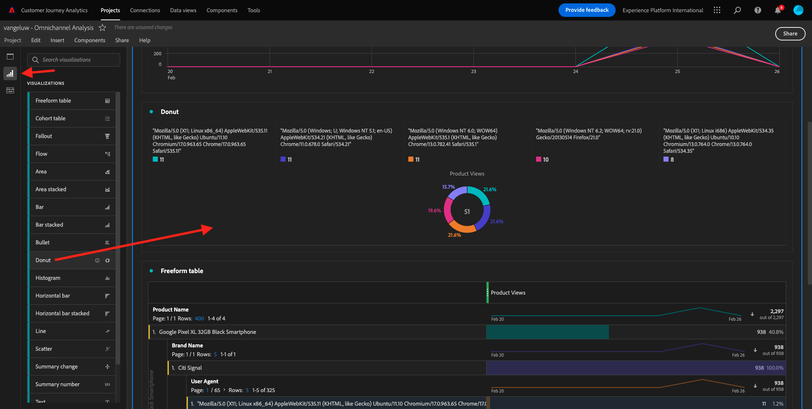
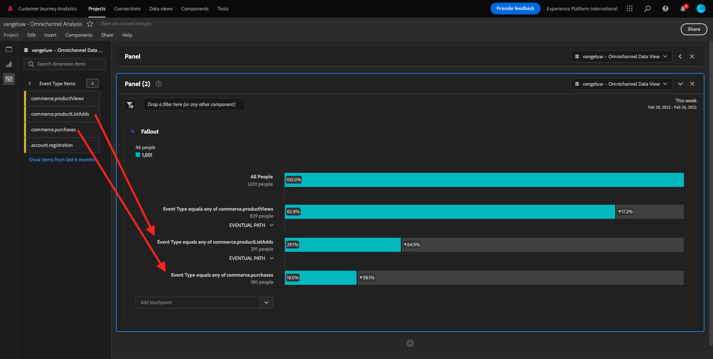
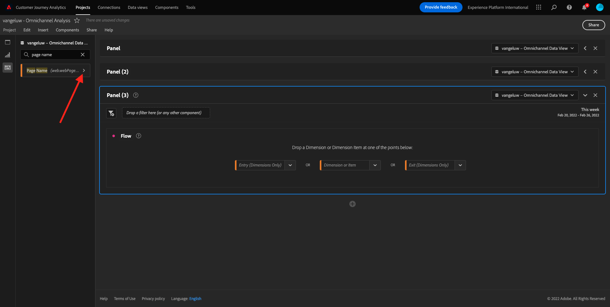
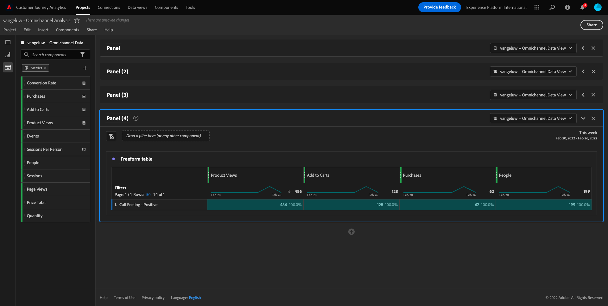

# 4.5 Visualização usando o Customer Journey Analytics

## Objetivos

- Compreensão da interface do Analysis Workspace
- Conheça alguns recursos que tornam o Analysis Workspace tão diferente.
- Saiba como analisar no CJA usando o Analysis Workspace

## Contexto

Neste exercício, você usará o Analysis Workspace no CJA para analisar exibições de produtos, funis de produtos, churn etc.

Vamos usar o projeto que você criou no [4.4 Preparação de dados no Analysis Workspace](./ex4.md), então vá para [https://analytics.adobe.com](https://analytics.adobe.com).

Abra o projeto `yourLastName - Omnichannel Analysis`.

Com seu projeto aberto e a Visualização de dados `CJA Bootcamp - Omnichannel Data View` selecionada, você estará pronto para começar a criar suas primeiras visualizações.

## Quantas visualizações de produto temos diariamente

Primeiro, precisamos selecionar as datas certas para analisar os dados. Vá para a lista suspensa de calendário no lado direito da tela. Clique nele e selecione o intervalo de datas aplicável.

>[!IMPORTANT]
>
>Os dados mais recentes disponíveis foram assimilados em 19/09/2022, selecione um intervalo de datas que inclua essa data.

No menu à esquerda (área Componentes), localize a Métrica calculada **Exibições do produto**. Selecione-a e arraste-a e solte-a na tela de desenho, na parte superior direita da tabela de forma livre.

Automaticamente a dimensão **Dia** serão adicionados para criar sua primeira tabela. Agora você pode ver sua pergunta respondida em tempo real.

Em seguida, clique com o botão direito do mouse no resumo da métrica.

Clique em **Visualizar** e selecione **Linha** como visualização.

Você verá suas visualizações de produtos por dia.

Você pode alterar o escopo de tempo para dia clicando em **Configurações** na visualização.

Clique no ponto ao lado de **Linha** para **Gerenciar a fonte de dados**.

Clique em **Bloquear seleção** e selecione **Itens Selecionados** para bloquear essa visualização para que ela sempre exiba uma linha do tempo de Exibições do produto.

## 4 principais produtos visualizados

Quais são os 4 principais produtos visualizados?

Lembre-se de salvar o projeto de vez em quando.

| OS | Atalho |
| ----------------- |-------------| 
| Windows | Ctrl+S |
| Mac | Command+S |

Vamos começar a encontrar os 4 principais produtos visualizados. No menu do lado esquerdo, localize o **Nome do produto** - Dimension.

Arrastar e soltar **Nome do produto** para substituir o **Dia** dimensão:

Este será o resultado

Em seguida, tente detalhar um dos produtos por Nome da marca. Pesquisar por **brandName** e arraste-o sob o nome do primeiro produto.

Em seguida, faça um detalhamento usando o nível de fidelidade. Pesquisar por **Nível de fidelidade** e arraste-o sob o nome da marca.

Você verá isto:

Por fim, você pode adicionar mais visualizações. No lado esquerdo, em Visualizações, procure por `Donut`. Tomar `Donut`, arraste-o e solte-o na tela sob a **Linha** visualização.

Em seguida, na Tabela, selecione o 3 **Nível de fidelidade**  linhas do detalhamento que fizemos em **Google Pixel XL 32 GB preto Smartphone** > **Sinal de Citi**. Ao selecionar as 3 linhas, mantenha pressionada a **CTRL** (no Windows) ou o botão **Comando** (no Mac).

Você verá o gráfico de rosca alterado:

É possível até adaptar o design para torná-lo mais legível, tornando as **Linha** gráfico e a **Rosca** gerar um gráfico um pouco menor para que eles possam se ajustar próximos um do outro:

Clique no ponto ao lado de **Rosca** para **Gerenciar a fonte de dados**.
Clique em **Bloquear seleção** para bloquear essa visualização para que ela sempre exiba uma linha do tempo de Exibições do produto.

Saiba mais sobre visualizações usando o Analysis Workspace aqui:

- [https://experienceleague.adobe.com/docs/analytics/analyze/analysis-workspace/visualizations/freeform-analysis-visualizations.html?lang=pt-BR](https://experienceleague.adobe.com/docs/analytics/analyze/analysis-workspace/visualizations/freeform-analysis-visualizations.html?lang=pt-BR)
- [https://experienceleague.adobe.com/docs/analytics/analyze/analysis-workspace/visualizations/t-sync-visualization.html](https://experienceleague.adobe.com/docs/analytics/analyze/analysis-workspace/visualizations/t-sync-visualization.html)

## Funil de interação do produto, da visualização à compra

Há muitas maneiras de resolver essa questão. Uma delas é usar o Tipo de interação do produto e usá-lo em uma tabela de forma livre. Outra maneira é usar um **Visualização de fallout**. Vamos usar o último conforme queremos visualizar e analisar ao mesmo tempo.

Feche o painel atual que temos clicando aqui:

Agora adicione um novo painel em branco clicando em **+ Adicionar painel em branco**.

Clique na visualização **Fallout**.

Selecione o mesmo intervalo de datas do exercício anterior.

Você verá isso.

Localizar a dimensão **Tipo de evento** na parte inferior dos componentes à esquerda:

Clique na seta para abrir a dimensão:

Você verá todos os Tipos de evento disponíveis.

Selecionar o item **commerce.productViews** e arraste-o e solte-o na **Adicionar Touchpoint** campo dentro do **Visualização de fallout**.

Faça o mesmo com **commerce.productListAdds** e **commerce.purchases** e solte-os na **Adicionar Touchpoint** campo dentro do **Visualização de fallout**. Agora, sua visualização ficará assim:

Você pode fazer muitas coisas aqui. Alguns exemplos: compare ao longo do tempo, compare cada etapa por dispositivo ou compare por fidelidade. No entanto, se queremos analisar coisas interessantes, como por que os clientes não compram depois de adicionar um item ao carrinho, podemos usar a melhor ferramenta no CJA: clicar com o botão direito do mouse.

Clique com o botão direito no ponto de contato **commerce.productListAdds**. Depois clique em **Detalhar fallout neste ponto de contato**.

Uma nova tabela de forma livre será criada para analisar o que as pessoas fizeram se não compraram.

Altere o **Tipo de evento** por **Nome da página**, na nova tabela de forma livre, para ver em quais páginas eles estão indo, em vez da página de Confirmação de compra.

## O que as pessoas fazem no site antes de acessar a página Cancelar Serviço?

Novamente, há muitas maneiras de fazer essa análise. Vamos usar a análise de fluxo para iniciar a parte de descoberta.

Feche o painel atual clicando aqui:

Agora adicione um novo painel em branco clicando em **+ Adicionar painel em branco**.

Clique na visualização **Fluxo**.

Você verá isto:

Selecione o mesmo intervalo de datas do exercício anterior.

Localizar a dimensão **Nome da página** na parte inferior dos componentes à esquerda:

Clique na seta para abrir a dimensão:

Você encontrará todas as páginas visualizadas. Localize o nome da página: **Cancelar serviço**.
Arrastar e soltar **Cancelar serviço** na Visualização de fluxo no campo intermediário:

Você verá isto:

Agora vamos analisar se os clientes que visitaram o **Cancelar serviço** página no site também chamou a central de atendimento e qual foi o resultado.

Nas dimensões, volte e localize **Tipo de Interação com Chamada**.
Arrastar e soltar **Tipo de Interação com Chamada** para substituir a primeira interação à direita na variável **Visualização de Fluxo**.

Você está vendo o tíquete de suporte dos clientes que ligaram para a central de atendimento depois de visitarem o **Cancelar serviço** página.

Em seguida, nas dimensões, pesquise **Sensação de chamada**.  Arraste e solte-a para substituir a primeira interação à direita na **Visualização de Fluxo**.

Você verá isto:

Como você pode ver, executamos uma análise omnicanal usando a Visualização de fluxo. Graças a isso, descobrimos que parece que alguns clientes que estavam pensando em cancelar seu serviço, tiveram uma sensação positiva depois de ligar para a central de atendimento. Será que mudamos de ideia com uma promoção?

## Como os clientes com um contato de Callcenter positivo estão se saindo em relação aos KPIs principais?

Primeiro, vamos segmentar os dados para obter somente usuários com **positivo** chamadas. No CJA, os segmentos são chamados de Filtros. Vá para filtros dentro da área de componente (no lado esquerdo) e clique em **+**.

No construtor de filtros, dê um nome ao filtro

| Nome | Descrição |
| ----------------- |-------------| 
| Sensação de chamada - Positiva | Sensação de chamada - Positiva |

Nos componentes (dentro do Construtor de filtros), localize **Sensação de chamada** e arraste e solte-o na Definição do construtor de filtros.

Agora selecione **positivo** como valor para o filtro.

Alterar o escopo para ser **Person** nível.

Para concluir, basta clicar em **Salvar**.

Você estará de volta aqui. Se ainda não tiver sido feito, feche o painel anterior.

Agora adicione um novo painel em branco clicando em **+ Adicionar painel em branco**.

Selecione o mesmo intervalo de datas do exercício anterior.

Clique em **Tabela de forma livre**.

Agora, arraste e solte o filtro que acabou de criar.

Tempo para adicionar algumas métricas. Iniciar com **Exibições do produto**. Arraste e solte na tabela de forma livre. Também é possível excluir a variável **Eventos** métrica.

Faça o mesmo com **Pessoas**,  **Adicionar ao carrinho** e **Compras**. Você vai acabar com uma mesa como esta.

Graças à primeira análise de fluxo, surgiu-me uma nova questão. Decidimos criar essa tabela e verificar alguns KPIs em relação a um segmento para responder a essa pergunta. Como você pode ver, o tempo de insight é muito mais rápido do que o SQL ou o uso de outras soluções de BI.

## Customer Journey Analytics e recapitulação do Analysis Workspace

Como você aprendeu neste laboratório, a Analysis Workspace compila os dados de todos os canais para analisar a jornada completa do cliente. Além disso, lembre-se de que é possível trazer dados para o mesmo espaço de trabalho que não está anexado à jornada.
Pode ser realmente útil trazer dados desconectados para a análise para contextualizar a jornada. Alguns exemplos incluem dados de NPS, pesquisas, eventos do Facebook Ads ou interações offline (não identificadas).

Próxima etapa: [4.6 Dos insights à ação](./ex6.md)

[Voltar para Fluxo de Usuário 4](./uc4.md)

[Voltar a todos os módulos](./../../overview.md)
