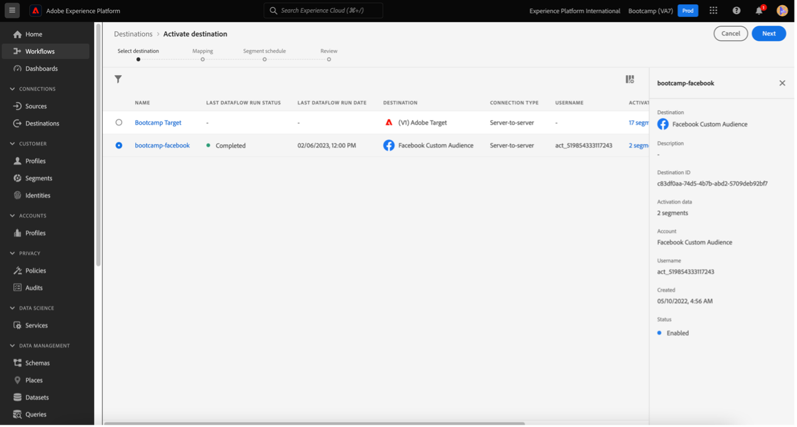
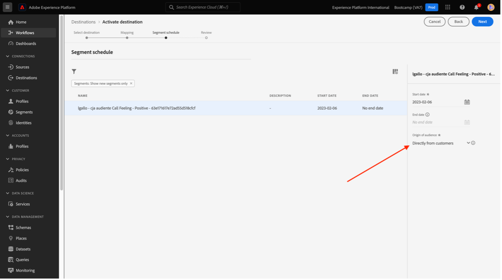
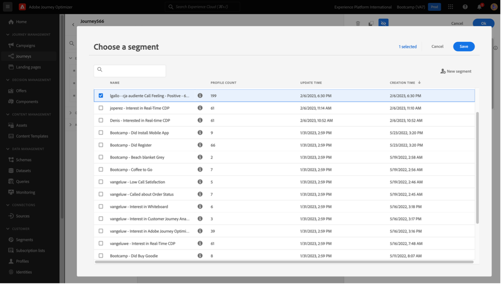

# 4.6 De insights à ação

## Metas

- Saiba como criar um público-alvo com base em uma exibição coletada no Customer Journey Analytics
- Usar este público-alvo no Real-Time CDP e Adobe Journey Optimizer

## 4.6.1 Criar um público-alvo e publicá-lo

No seu projeto, você criou um filtro chamado **Feelings de chamada** e puderam visualizar o número de usuários que tiveram suas chamadas para a central de atendimento classificadas como **positivo**. Agora é possível criar um segmento com esses usuários e ativá-los em jornadas ou canais de comunicação.

O primeiro passo é: No painel criado no último exercício, selecione a linha **1. Feed de chamada - Positivo**, clique com o botão direito do mouse e selecione o **Criar público-alvo a partir da seleção** opção:

Em seguida, dê um nome ao público-alvo seguindo o modelo **yourLastName - Chamada de público-alvo CJA positiva**:

Observe que é possível ter uma pré-visualização do público-alvo que está sendo criado:

Finalmente, clique em **Publicar**.

## 4.6.2 Usar seu público-alvo como parte de um segmento

Volte para a Adobe Experience Platform e acesse **Segmentos > Procurar** e você poderá ver seu segmento criado no CJA pronto e disponível para ser usado em suas ativações e jornadas!

Agora vamos usar esse segmento em uma ativação do Facebook e em uma jornada do cliente!

## 4.6.3 Usar seu segmento no Real-Time CDP em tempo real

No Adobe Experience Platform, acesse **Segmentos > Procurar** e encontre o público-alvo que você criou no CJA:

Clique no seu segmento e, em seguida, clique em **Ativar para destino**:

Selecione o destino com o nome **bootcamp-facebook** e, em seguida, clique em **Próximo**.

Clique em **Próximo** novamente.

Selecione o **Origem do público-alvo** e defina-a como **Diretamente dos clientes**, clique em **Próximo**.

Clique em **Concluir**.

Seu segmento agora está conectado aos Públicos-alvo personalizados da Facebook. Agora vamos usar o mesmo segmento no Adobe Journey Optimizer.

## 4.6.4 Usar seu segmento no Adobe Journey Optimizer

No Adobe Experience Platform, clique em **Journey Optimizer** e, em seguida, no menu à esquerda, clique em **Jornada** e comece a criar uma jornada clicando em **Criar Jornada**.

Em seguida, no menu lateral esquerdo, em **Eventos**, selecione **Qualificação do segmento** e arraste-o para a jornada:

Em Segmento, clique em **Editar** para selecionar um segmento:

Selecione o público-alvo criado anteriormente no CJA e clique em  **Salvar**.

Pronto! Aqui, você pode criar uma jornada para clientes qualificados para este segmento.

[Voltar para Fluxo de Usuário 4](./uc4.md)

[Voltar para todos os módulos](./../../overview.md)
