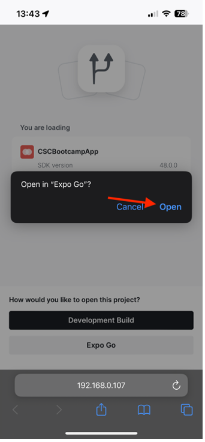

# Verificar aplicativo móvel

## Android

- Baixe o aplicativo móvel de [aqui](https://tinyurl.com/CSCBootcampApp) no seu dispositivo Android. Você pode baixá-lo em um [Emulador do Android](https://developer.android.com/studio/run/emulator) ou em seu dispositivo Android físico.

- Abra o arquivo baixado tocando nele.

- Na janela pop-up, clique no botão Instalar e, em seguida, confirme clicando em &quot;Instalar mesmo assim&quot;.

- Depois que o aplicativo for instalado com êxito, abra-o clicando no botão &quot;Abrir&quot;.

## iOS

>[!WARNING]
>
> Verifique se você está conectado à rede Bootcamp Wifi. Isso é essencial, pois o aplicativo só funcionará se você estiver na mesma rede Wi-Fi.

Como este não é um aplicativo distribuído oficialmente, a configuração do iOS é um pouco diferente do que você está acostumado.

- Baixe o aplicativo Expo Go da [App Store](https://itunes.apple.com/app/apple-store/id982107779).

- No aplicativo iPhone Camera, examine o código QR que a equipe do Adobe projetará no bootcamp. Quando solicitado, clique no botão que aparece.

- Isso carregará uma página da Web com a qual é possível abrir o aplicativo no iPhone. Clique no botão &quot;Expo Go&quot; para abri-lo no aplicativo que acabou de baixar.

- Na caixa de diálogo que aparece, selecione &quot;Abrir&quot; para que o aplicativo Expo Go possa ser carregado com as informações corretas.

- Depois que o aplicativo Expo Go for aberto, ele solicitará que você encontre dispositivos na rede local. Como mencionado anteriormente, isso é necessário para que possamos baixar o aplicativo de nossos dispositivos Adobe para o seu telefone. Clique em &quot;Permitir&quot; para carregar isso.

- Você pode receber uma página de erro em primeiro lugar. Basta clicar no botão &quot;Tentar novamente&quot; para finalmente carregar o aplicativo em seu dispositivo. Observe que fechar o aplicativo Expo Go ou desconectar seu dispositivo da rede Wi-Fi fará com que o aplicativo não responda mais.

## Navegação no aplicativo

No aplicativo, você pode selecionar sua equipe na lista suspensa. Isso carregará dinamicamente no conteúdo criado no AEM. Se você não estiver satisfeito com o conteúdo, poderá atualizá-lo sempre no fragmento de conteúdo criado anteriormente e, em seguida, republicar o conteúdo. Você verá as alterações refletidas no aplicativo.

Próxima Etapa: [Fase 3 - Entrega: Criar página no AEM](./page-in-aem.md)

[Retorne à Fase 2 - Produção: criar conteúdo para aplicativos móveis](../production/app.md)

[Voltar a todos os módulos](../../overview.md)
