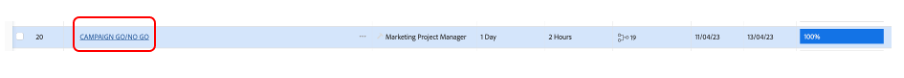

# Campaign GO/NO-GO

## Aprovação da campanha no Adobe Workfront

Como agora concluímos todas as tarefas e, como resultado, definimos todas as tarefas como 100%, precisamos apenas do &quot;Campaign go/no go&quot; - que é uma tarefa de revisão e aprovação - para poder publicar a campanha.

É claro que estamos aprovando nossa campanha, portanto, defina a tarefa 20 &#39;CAMPAIGN GO/NO GO&#39; para 100% concluída. Isso acionará automaticamente um processo de revisão e aprovação:

Vamos analisar o processo que temos em vigor. Clique no nome da tarefa 20 &#39;CAMPAIGN GO/NO GO&#39;:

Agora vamos analisar a seção aprovações:

Podemos ver que é um processo de duas etapas, em que eu, Petra ou qualquer um de vocês precisa revisar e/ou aprovar este ir/não ir como uma primeira etapa, e, em seguida, Olivia (que é nossa Director de Operações de Marketing) pode dar seu ir final.

Portanto, no canto superior direito, meus botões de aprovação apareciam e agora eu posso aprovar esse &quot;Go No/Go&quot; para a primeira etapa. Clique no sinal verde para aprovar:

Todos os nossos projetos estão aguardando a aprovação da Olivia. Uma vez aprovada - o que, claro, ela fará -, nossa Campanha pode ser publicada.

## Iniciar a campanha de mídia social

Como agora verificamos que nossa campanha está pronta para ser lançada, e estamos prontos para começar a vender nossas bicicletas, é hora de fazer um zumbido. E qual maneira melhor de fazer isso, então, com uma publicação nas mídias sociais?

Como já criamos e aprovamos uma publicação de mídia social, agora podemos publicá-la em nossa conta de demonstração do Instagram.

>[!WARNING]
> Algumas regras de manutenção
> 
> Esta é uma conta feita apenas para completar a história do nosso acampamento. **não se destina a ser compartilhado, seguido ou tornado público**. Mantenha sua postagem **respeitosa e profissional**. **Não compartilhe as credenciais** com ninguém fora da área de inicialização e observe **todos os dispositivos serão desconectados** após este exercício.

- Você receberá a senha de uma conta da Instagram chamada &quot;csc_bootcamp_emea&quot;.
- Crie uma nova publicação na qual você adiciona como última parte da legenda o local de onde está entrando, bem como a data e o número da sua equipe.
- Fique à vontade para acessar todas as diferentes postagens e ver como outras equipes obtiveram alguma liberdade artística com o mesmo material.

## Parabéns, sua campanha foi publicada.

Próxima Etapa: [Fase 4 - Insights: Visão Geral](../insights/overview.md)

[Voltar para a Fase 3 - Entrega: criar página no AEM](./app.md)

[Voltar a todos os módulos](../../overview.md)
