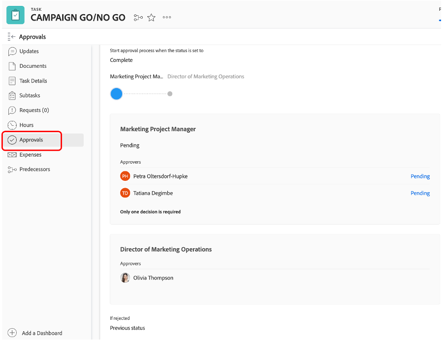

# Campanha GO/NO-GO

## Aprovação da campanha no Adobe Workfront

Como agora concluímos todas as tarefas, e como resultado definido todas as tarefas para 100%, precisamos apenas do &#39;Campaign go/no go&#39; - que é uma tarefa de revisão e aprovação - para poder publicar a campanha.

É claro que estamos aprovando nossa campanha, então defina a tarefa 20 &#39;CAMPAIGN GO/NO GO&#39; como 100% concluída. Isso acionará automaticamente um processo de revisão e aprovação:

Vamos olhar para o processo que temos em vigor. Clique no nome da tarefa 20 &quot;CAMPAIGN GO/NO GO&quot;:

Agora vamos examinar a seção de aprovações:

Podemos ver que é um processo de duas etapas pelo qual eu, a Petra, ou qualquer um de vocês precisa revisar e/ou aprovar esse passo/não, e então a Olivia (que é nossa Director de Operações de Marketing) pode lhe dar a última opção.

Portanto, no canto superior direito, meus botões de aprovação apareceram e agora posso aprovar esse &#39;Go No/Go&#39; para o primeiro passo. Clique na marca de verificação Verde para aprovar:

Todos os nossos projetos estão agora pendentes na aprovação da Olivia. Uma vez aprovada - o que é claro que vai -, a nossa Campanha pode ser publicada.

## Inicie a campanha de mídia social

Como verificamos agora que nossa campanha está pronta para o lançamento, e estamos prontos para começar a vender nossas bicicletas, é hora de fazer um burburinho. E qual a melhor maneira de fazer isso, então com uma postagem nas redes sociais?

Como já criamos e aprovamos uma publicação nas redes sociais, agora podemos publicá-la em nossa conta de demonstração do Instagram.

>[!WARNING]
> Algumas regras de casa
> 
> Esta é uma conta feita apenas para completar a história do nosso campo de bootcamp. É **não se destinam a ser partilhadas, seguidas ou tornadas públicas**. Por favor, mantenha sua postagem **respeitosos e profissionais**. **Não compartilhar as credenciais** com alguém fora do campo de bootcamp, por favor note **todos os dispositivos serão desconectados** após este exercício.

- Você receberá a senha de uma conta da Instagram chamada &quot;csc_bootcamp_emea&quot;.
- Crie uma nova publicação, na qual você adiciona como última parte da legenda o local de onde está se unindo, bem como a data e o número da equipe.
- Sinta-se à vontade para acessar todos os posts diferentes, para ver como outras equipes usaram a liberdade artística com o mesmo material.

## Parabéns, sua campanha foi publicada!

Próxima etapa: [Fase 4 - Insights: Visão geral](../insights/overview.md)

[Volte para a Fase 3 - Delivery: Criar página no AEM](./app.md)

[Voltar para todos os módulos](../../overview.md)
