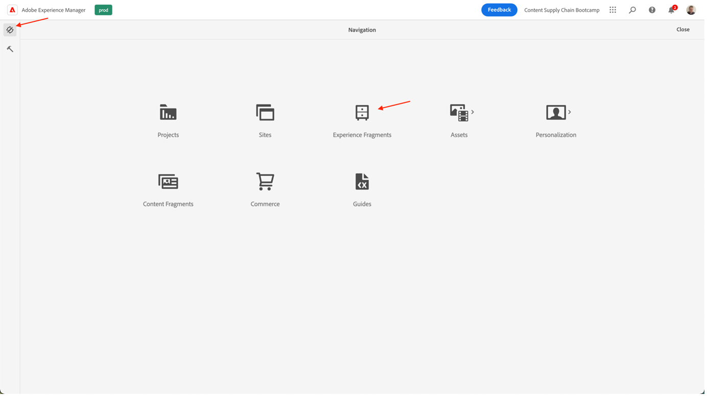
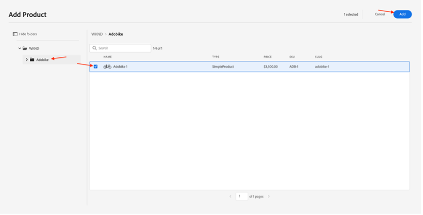

# Criar página no AEM

O AEM fornece dois ambientes: o Ambiente do autor e o Ambiente do Publish. Eles interagem para permitir que você disponibilize conteúdo no seu site, para que seus visitantes possam experimentá-lo.

O ambiente de criação fornece os mecanismos para criar, atualizar e revisar esse conteúdo antes de realmente publicá-lo:

- Um autor cria e revisa o conteúdo (que pode ser de vários tipos; por exemplo, páginas, ativos, publicações etc.)
- que será, em algum momento, publicado no seu site.

Como autor, você precisará organizar seu site dentro do AEM. Isso envolve criar e nomear suas páginas de conteúdo para que:

- Você pode encontrá-los facilmente no ambiente de criação
- Os visitantes do seu site podem navegá-los facilmente no ambiente de publicação

A estrutura de um site pode ser considerada como uma estrutura em árvore que armazena suas páginas de conteúdo. Os nomes dessas páginas de conteúdo são usadas para formar os URLs, enquanto o título é exibido quando o conteúdo da página é visualizado. No exemplo abaixo, o URL acessível da página será /content/adobike/language-masters/en.html

Vamos analisar como adicionar algumas páginas novas a um site existente, bem como reutilizar algum conteúdo.

## Criação da página inicial

Conforme explicado na seção anterior, a hierarquia de página do AEM funciona como uma estrutura em árvore. Isso significa que começaremos com a página no nível mais alto: a página inicial.

- Vá para o autor do AEM em [https://author-p71057-e991028.adobeaemcloud.com/](https://author-p71057-e991028.adobeaemcloud.com/) e faça logon com as credenciais fornecidas.

- No menu Iniciar do AEM, selecione Navegação \> Sites

- Primeiro, vamos navegar pela estrutura de árvore existente até o local em que desejamos criar nossa página inicial. Navegue pela estrutura de árvore, selecionando &quot;Adobike&quot; na primeira coluna e &quot;Bootcamp&quot; na segunda coluna. Em seguida, para criar uma página abaixo desta página, clique no botão &quot;Criar&quot; e selecione &quot;Página&quot; no menu que aparece.

- Isso abrirá uma nova tela para configurar nossa nova página. Primeiro, selecionamos um modelo de página. Os modelos de página no AEM permitem definir a estrutura de uma página, bem como definir qual conteúdo pode ser usado nesta página. Como queremos criar a página inicial, que é uma página de aterrissagem, selecionaremos o Modelo de página de aterrissagem e clicaremos no botão &quot;Avançar&quot; para continuar.

- Na próxima tela, você poderá preencher sua página com algumas informações iniciais. A parte mais importante das informações é o título (uma propriedade obrigatória, indicada por um \* ), que se destina a dar um nome significativo à sua página. Se você não preencher o &quot;Nome&quot;, o AEM gerará automaticamente o URL no qual sua página estará disponível, seguindo as práticas recomendadas da SEO. Nesse caso, você pode deixar esse campo vazio. Algumas outras propriedades também podem ser preenchidas. Você pode explorar as outras guias, mas, para esse efeito, não preencha outras propriedades ainda. Quando estiver pronto para criar sua página, basta clicar no botão &quot;Criar&quot;.

- O AEM agora criará sua página. Depois de concluído, você receberá um pop-up, que permite abrir a página recém-criada clicando no botão &quot;Abrir&quot;.

- Agora você chegará ao Editor de AEM. Este é um editor &quot;o que você vê é o que você obtém&quot; (ou WYSIWYG), no qual você pode arrastar e soltar componentes em uma página para criar sua página. Vamos dar uma olhada na navegação:
  
   - No lado esquerdo, você tem o painel lateral com os ativos que podem ser usados nas páginas, os componentes (ou blocos de construção) que podem ser usados nesta página e uma visualização em árvore útil que mostra como a página é estruturada. Clique em qualquer um desses ícones para abrir a visualização.
   - No lado direito, você verá o &quot;container de layout&quot;. Essa é uma área em que você pode soltar os componentes desejados.
   - Vamos preencher nossa página com conteúdo. Sinta-se à vontade para preencher a página inicial da maneira que desejar. No exemplo abaixo, usamos um componente de imagem vinculado à página do produto, bem como dois componentes de teaser.

## Reutilizar experiências aproveitando os Fragmentos de experiência

Agora criamos a página inicial, que está totalmente pronta para o lançamento da Adobe. No entanto, parte do conteúdo lá, por exemplo, os pontos de venda exclusivos de nossa bicicleta, pode ser reutilizado em várias páginas.

Idealmente, desejaríamos criar essa experiência exclusiva de pontos de venda apenas uma vez para que possamos gerenciá-la centralmente e garantir uma experiência personalizada, mas consistente. No AEM, podemos fazer isso com &quot;Fragmentos de experiência&quot;. Um Fragmento de experiência é um grupo de um ou mais componentes, incluindo conteúdo e layout, que podem ser referenciados nas páginas. Eles podem conter qualquer componente.

Vamos colocar isso para usar imediatamente:

- Vá para o autor do AEM em [https://author-p71057-e991028.adobeaemcloud.com/](https://author-p71057-e991028.adobeaemcloud.com/) e faça logon com as credenciais fornecidas.

- No menu Iniciar do AEM, selecione Navegação \> Fragmentos de experiência

- Na tela a seguir, vamos criar uma pasta que sua equipe pode usar para armazenar suas experiências reutilizáveis. Na exibição de coluna, navegue até Adobe > Bootcamp e clique nos botões Criar > Pasta.

- Na janela pop-up modal, forneça à pasta o nome da equipe. Você pode deixar o campo de nome vazio. O AEM o gerará automaticamente para você. Depois de dar um nome à pasta, clique no botão Create para criar a pasta.

- Agora você deve ver sua pasta pop-up. Clique nele e, em seguida, clique nos botões Criar \> Fragmento de experiência.

- Primeiro, vamos selecionar um modelo de fragmento de experiência. Assim como as páginas, os Fragmentos de experiência podem ser baseados em vários modelos, cada um prevendo uma experiência predefinida. Em nosso caso, como queremos reutilizar nosso conteúdo em nosso site, vamos escolher um &quot;Modelo de variação de Web de fragmento de experiência&quot; marcando a caixa de seleção na parte superior esquerda e clicando no botão &quot;Próximo&quot;.

- Dê um título significativo ao fragmento de experiência, por exemplo, &quot;Adobe USPs&quot;, e clique no botão Criar.

- Depois que o fragmento de experiência for criado, clique no botão &quot;Abrir&quot; no modal para que possamos adicionar conteúdo ao fragmento de experiência.

- Assim como ao editar uma página, você pode ver um contêiner de layout no qual pode adicionar conteúdo.

- O que faremos é copiar os componentes da página inicial. Em uma nova guia, navegue até a página inicial da conforme explicado no capítulo anterior, selecione o componente que deseja copiar e clique no ícone copiar.

- Em seguida, de volta ao fragmento de experiência, clique no contêiner de layout e no botão Colar.

>[!NOTE]
>
> Dica: o AEM permite usar o &quot;modo de layout&quot; em qualquer página ou fragmento de experiência. Isso permite redimensionar os componentes e otimizar as experiências para qualquer dispositivo.

- No menu superior, abra o menu suspenso e selecione &quot;Layout&quot; para entrar no modo de layout.

- Em seguida, selecione qualquer componente e redimensione-o simplesmente arrastando as alças em ambos os lados do componente para aderir às colunas visíveis na tela.

- Por padrão, você está editando para todos os pontos de interrupção. No entanto, se quiser editar para um ponto de interrupção específico, selecione um dispositivo correspondente na barra de ferramentas na parte superior da página. O ponto de interrupção para o qual você está criando será destacado.

- Como você pode ver, um layout de duas colunas em dispositivos móveis não parece ótimo. Vamos criar um layout de uma coluna no dispositivo móvel. Como você pode ver no desktop, nossa experiência permanece a mesma, mas no móvel, agora temos uma experiência melhor com apenas uma coluna de conteúdo.

- Finalmente, agora podemos reutilizar essa experiência na página inicial. Arraste e solte um componente &quot;Fragmento de experiência&quot; na página no local onde deseja que o conteúdo seja exibido. Você pode excluir o conteúdo que copiamos, pois ele será usado do fragmento de experiência.

- Abra a caixa de diálogo de configuração do componente de fragmento de experiência e use o seletor de caminho para selecionar o local em que você criou seu fragmento de experiência.

- E finalmente, agora temos nossa experiência reutilizável na página.

## Criação da página do produto

Ao usar o Adobe Commerce integrado com AEM, você pode ter uma página de detalhes do produto genérica que é usada ao navegar no site a partir das visões gerais geradas. No entanto, às vezes também queremos prever uma página inspiradora que combine conteúdo específico do produto com conteúdo inspirador. Vamos copiar a loja conforme pré-feito por nós, então vamos criar uma página de produto inspiradora.

- Vá para o autor do AEM em [https://author-p71057-e991028.adobeaemcloud.com/](https://author-p71057-e991028.adobeaemcloud.com/) e faça logon com as credenciais fornecidas.

- No menu Iniciar do AEM, selecione Navegação \> Sites

- Na visão geral da coluna, navegue pelo site pré-fabricado até a loja: Adobike \> Language Masters \> Adobike \> Shop. Em seguida, marque a página Comprar com a caixa de seleção e clique em Criar \> Live Copy. Sem entrar em pormenores demais, isso criará uma cópia da página que você pode usar no seu site para que possa reutilizar as páginas e o conteúdo já existentes, usando o Gerenciador de vários sites do AEM.

- Na tela que aparece, selecione o site das equipes como destino marcando a caixa de seleção ao lado do nome. Em seguida, clique no botão Next.

- Como não vamos nos aprofundar no Gerenciamento de vários sites, você pode apenas assumir essa configuração.\
  Título: Loja\
  Nome: loja\
  Configurações de implantação: configuração padrão de implantação\
  Depois de configurar a live copy, clique no botão Create.

>[!NOTE]
>
> Curioso para saber mais sobre as live copies? Confira [&quot;Criando e Sincronizando Live Copies&quot;.](https://experienceleague.adobe.com/docs/experience-manager-cloud-service/content/sites/administering/reusing-content/msm/creating-live-copies.html?lang=en)

- Depois de concluído, você deve ver a loja disponível em seu site. Selecione-a e clique em Criar \> Página para criar nossa página de produto inspiradora.

- Como queremos mostrar informações de produto na página, vamos criar uma página usando o modelo de página de produto. Selecione-a e clique no botão Next.

- Preencha os metadados da página e clique no botão Create, assim como na página inicial. Depois de criada, você pode abrir a página clicando no botão open. Como você pode ver, ele já está preenchido com um componente de detalhes do produto.

- Primeiro, adicionaremos nosso fragmento de experiência que criamos anteriormente. Em seguida, podemos adicionar qualquer conteúdo adicional que ainda queremos na página. Por fim, configuraremos o componente de detalhes do produto para mostrar nosso produto Adobe, selecionando o localizador de produto na caixa de diálogo de configuração e selecionando nossa categoria Adobe e marcando a caixa ao lado do produto. Em seguida, clique no botão Add.

- Agora temos nossa página inspiradora completa, incluindo conteúdo gerenciado centralmente e informações de produtos provenientes da Adobe Commerce.

Próxima Etapa: [Fase 3 - Entrega: Campanha GO/NO-GO](./go-nogo.md)

[Voltar à Fase 3 - Entrega: verificar aplicativo móvel](./app.md)

[Voltar a todos os módulos](../../overview.md)
