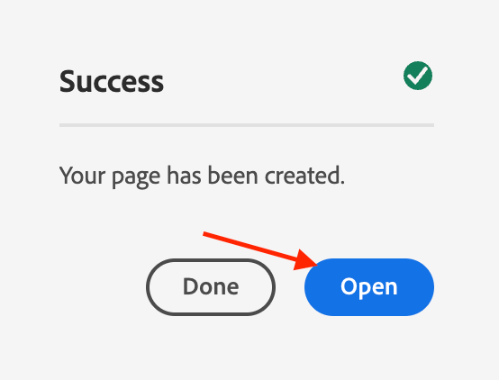

# Criar página no AEM

O AEM fornece dois ambientes: o Ambiente de criação e o Ambiente de publicação. Elas interagem para permitir que você disponibilize conteúdo no seu site, para que os visitantes possam acessá-lo.

O ambiente de criação fornece os mecanismos para criar, atualizar e revisar esse conteúdo antes de realmente publicá-lo:

- Um autor cria e revisa o conteúdo (que pode ser de vários tipos; por exemplo, páginas, ativos, publicações etc)
- que será, em algum momento, publicado no seu site.

Como autor, você precisará organizar o site dentro do AEM. Isso envolve criar e nomear suas páginas de conteúdo para que:

- Você pode encontrá-las facilmente no ambiente de criação
- Os visitantes do seu site possam navegar facilmente por elas no ambiente de publicação

A estrutura de um site pode ser considerada como uma estrutura em árvore que armazena suas páginas de conteúdo. Os nomes dessas páginas de conteúdo são usadas para formar os URLs, enquanto o título é exibido quando o conteúdo da página é visualizado. No exemplo abaixo, o URL acessível da página será /content/adobike/language-masters/en.html

Vamos analisar como adicionar novas páginas a um site existente, bem como como reutilizar algum conteúdo.

## Criação da página inicial

Conforme explicado na seção anterior, AEM hierarquia de página funciona como uma estrutura em árvore. Isso significa que começaremos com a página no nível mais alto: a página inicial.

- Acesse o autor do AEM em [https://author-p71057-e991028.adobeaemcloud.com/](https://author-p71057-e991028.adobeaemcloud.com/) e faça logon com as credenciais que fornecemos.

- No menu Iniciar AEM, selecione Navegação \> Sites

- Primeiro, vamos navegar pela estrutura de árvore existente até o local onde gostaríamos de criar a página inicial. Navegue pela estrutura de árvore selecionando &quot;Adobike&quot; na primeira coluna e, em seguida, &quot;Bootcamp&quot; na segunda coluna. Em seguida, para criar uma página sob esta página, clique no botão &quot;Criar&quot; e selecione &quot;Página&quot; no menu que aparece.

- Isso abrirá uma nova tela para configurar a nova página. Primeiro, podemos selecionar um modelo de página. Os modelos de página no AEM permitem definir a estrutura de uma página, bem como definir qual conteúdo pode ser usado nesta página. Como queremos fazer a página inicial, que é uma página de aterrissagem, vamos selecionar o Modelo de página de aterrissagem e clicar no botão &quot;Próximo&quot; para continuar.

- Na próxima tela, você poderá preencher a página com algumas informações iniciais. As informações mais importantes são o título (uma propriedade obrigatória, indicada com um \* ), que se destina a dar à sua página um nome significativo. Se você não preencher o &quot;Nome&quot;, o AEM gerará automaticamente o URL no qual sua página estará disponível, seguindo as práticas recomendadas de SEO. Nesse caso, é possível deixar esse campo vazio. Algumas outras propriedades também podem ser preenchidas, você pode explorar as outras guias, mas para o propósito deste bootcamp não preenche nenhuma outra propriedade ainda. Quando estiver pronto para criar sua página, basta clicar no botão &quot;Criar&quot;.

- AEM criará sua página. Quando terminar, você receberá um pop-up que permitirá abrir a página recém-criada clicando no botão &quot;Abrir&quot;.

- Agora você chegará ao Editor de AEM. Este é um editor &quot;o que você vê é o que você obtém&quot; (ou WYSIWYG), no qual você pode arrastar e soltar componentes em uma página para criar sua página. Vamos dar uma olhada na navegação:
   
   - No lado esquerdo, há o painel lateral com os ativos que podem ser usados nas páginas, os componentes (ou blocos de construção) que podem ser usados nessa página e uma visualização em árvore útil que mostra como a página está estruturada. Clique em qualquer um desses ícones para abrir a visualização.
   - No lado direito, você verá o &quot;contêiner de layout&quot;. Essa é uma área na qual você pode soltar os componentes desejados.
   - Vamos preencher nossa página com algum conteúdo. Sinta-se à vontade para preencher a página inicial como desejar. No exemplo abaixo, usamos um componente de imagem vinculado à página do produto, bem como dois componentes de teaser.

## Reutilizar experiências aproveitando fragmentos de experiência

Agora nós criamos a página inicial, que está totalmente pronta para nosso lançamento do Adobike. No entanto, parte do conteúdo ali, por exemplo, os pontos de venda exclusivos de nossa bicicleta, pode ser reutilizado em várias páginas.

Idealmente, gostaríamos de criar essa experiência exclusiva de pontos de venda apenas uma vez, para que possamos gerenciá-la centralmente e garantir uma experiência personalizada, mas consistente. No AEM, podemos fazer isso com &quot;Fragmentos de experiência&quot;. Um Fragmento de experiência é um grupo de um ou mais componentes, incluindo conteúdo e layout que podem ser referenciados nas páginas. Eles podem conter qualquer componente.

Vamos colocar para usar imediatamente:

- Acesse o autor do AEM em [https://author-p71057-e991028.adobeaemcloud.com/](https://author-p71057-e991028.adobeaemcloud.com/) e faça logon com as credenciais que fornecemos.

- No menu Iniciar do AEM, selecione Navegação \> Fragmentos de experiência

- Na tela a seguir, criaremos uma pasta que sua equipe pode usar para armazenar suas experiências reutilizáveis. Na exibição de coluna, navegue até Adobike \> Bootcamp e clique nos botões Create \> Folder .

- Na janela pop-up modal , dê à pasta o nome da equipe. Você pode deixar o campo de nome vazio, AEM o gerará automaticamente para você. Depois de dar um nome à pasta, clique no botão Create para criar a pasta.

- Agora você deve ver o pop-up da sua pasta. Clique nele e, em seguida, clique nos botões Criar \> Fragmento de experiência .

- Primeiro, vamos selecionar um modelo de fragmento de experiência. Assim como nas páginas, os Fragmentos de experiência podem ser baseados em vários modelos, cada um prevendo uma experiência predefinida. Em nosso caso, como queremos reutilizar nosso conteúdo no site, vamos escolher um &quot;Modelo de variação da Web do fragmento de experiência&quot; marcando a caixa de seleção na parte superior esquerda e clicando no botão &quot;Próximo&quot;.

- Dê um título significativo ao seu fragmento de experiência, por exemplo &quot;Adobike USPs&quot;, em seguida, clique no botão criar.

- Depois que o fragmento de experiência for criado, clique no botão &quot;Abrir&quot; no modal para adicionarmos conteúdo ao fragmento de experiência.

- Assim como ao editar uma página, você pode ver um contêiner de layout no qual pode adicionar conteúdo.

- O que faremos é copiar os componentes da página inicial. Em uma nova guia, navegue até a página inicial conforme explicado no capítulo anterior, selecione o componente que deseja copiar e clique no ícone copiar.

- Em seguida, de volta ao fragmento de experiência, clique no contêiner de layout e clique no botão colar .

>[!NOTE]
>
> Dica: AEM permite usar o &quot;modo de layout&quot; em qualquer página ou fragmento de experiência. Isso permite redimensionar os componentes e otimizar experiências para qualquer dispositivo.

- No menu superior, abra a lista suspensa e selecione &quot;Layout&quot; para entrar no modo de layout.

- Em seguida, selecione qualquer componente e redimensione-o simplesmente arrastando as alças em ambos os lados do componente para ajustá-lo às colunas visíveis na tela.

- Por padrão, você está editando para todos os pontos de interrupção. No entanto, se você deseja editar um ponto de interrupção específico, é possível selecionar um dispositivo correspondente na barra de ferramentas na parte superior da página. O ponto de interrupção para o qual você está criando será destacado então.

- Como você pode ver, um layout de duas colunas em dispositivos móveis não parece ótimo. Vamos criar um layout de uma coluna em dispositivos móveis. Como você pode ver no desktop, nossa experiência permanece a mesma, mas no dispositivo móvel agora temos uma experiência melhor com apenas uma coluna de conteúdo.

- Finalmente, agora podemos reutilizar essa experiência na página inicial. Arraste e solte um componente &quot;Fragmento de experiência&quot; na página no local onde deseja que o conteúdo seja exibido. Você pode excluir o conteúdo que copiamos, já que o usaremos do fragmento de experiência.

- Abra a caixa de diálogo de configuração do componente do fragmento de experiência e use o seletor de caminho para selecionar o local em que você criou o fragmento de experiência.

- E finalmente, agora temos nossa experiência reutilizável em nossa página.

## Criação da página do produto

Ao usar o Adobe Commerce integrado ao AEM, você pode ter uma página de detalhes genérica do produto usada ao navegar pelo site a partir das exibições geradas. No entanto, às vezes também queremos prever uma página inspiradora que combine conteúdo específico do produto com conteúdo inspirador. Vamos copiar a loja como pré-feito por nós, então vamos criar uma página de produto inspiradora.

- Acesse o autor do AEM em [https://author-p71057-e991028.adobeaemcloud.com/](https://author-p71057-e991028.adobeaemcloud.com/) e faça logon com as credenciais que fornecemos.

- No menu Iniciar AEM, selecione Navegação \> Sites

- Na visão geral da coluna, navegue pelo site pré-criado até a loja: Adobike \> Language Masters \> Adobike \> Shop. Em seguida, selecione a página Comprar com a caixa de seleção e clique em Criar \> Live Copy. Sem entrar em especificações demais, isso criará uma cópia da página que você pode usar em seu site para que você possa reutilizar as páginas e o conteúdo já existentes, usando AEM Multi Site Manager.

- Na tela que aparece, selecione o site das equipes como destino, marcando a caixa de seleção ao lado do nome. Em seguida, clique no botão Next .

- Como não vamos aprofundar o Multi Site Manager, você pode assumir essa configuração.\
   Título: Loja\
   Nome: loja\
   Configurações de implantação: Configuração de implementação padrão\
   Depois de configurar a live copy, clique no botão Criar .

>[!NOTE]
>
> Curioso para saber mais sobre cópias ao vivo? Veja [&quot;Criando e Sincronizando Live Copies&quot;.](https://experienceleague.adobe.com/docs/experience-manager-cloud-service/content/sites/administering/reusing-content/msm/creating-live-copies.html?lang=en)

- Depois de concluído, você deverá ver a loja disponível em seu site. Selecione-o e clique em Criar \> Página para criar nossa página de produto inspiracional.

- Como queremos mostrar informações do produto na página, vamos criar uma página usando o modelo da página do produto. Selecione-o e clique no botão Next .

- Preencha os metadados da página e clique no botão Create , exatamente como na página inicial. Depois de criada, você pode abrir a página clicando no botão abrir . Como você pode ver, ele já está preenchido com um componente de detalhes do produto.

- Primeiro, adicionaremos nosso fragmento de experiência criado anteriormente. Em seguida, podemos adicionar qualquer conteúdo adicional que ainda desejarmos na página. Por fim, vamos configurar o componente de detalhes do produto para mostrar nosso produto Adobike selecionando o localizador de produto na caixa de diálogo de configuração, selecionando a categoria Adobike e marcando a caixa ao lado do produto. Em seguida, clique no botão Add .

- Agora temos nossa página de inspiração completa, incluindo conteúdo gerenciado centralmente e informações de produtos provenientes do Adobe Commerce.

Próxima etapa: [Fase 3 - Entrega: Campanha GO/NO-GO](./go-nogo.md)

[Volte para a Fase 3 - Delivery: Verificar aplicativo móvel](./app.md)

[Voltar para todos os módulos](../../overview.md)
