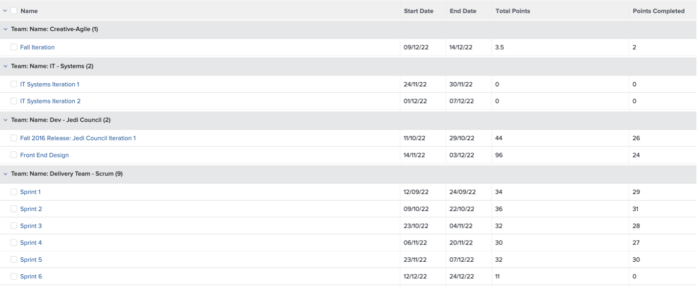

# Insights para um Gerente de marketing

## Exibição Semanal do Líder do Projeto

Na coluna da esquerda, clique em &#39;Exibição semanal do líder do projeto&#39;:

Isso abrange uma grande variedade de relatórios, sempre clicáveis/acionáveis para obter mais detalhes:

- As **tarefas Com Vencimento Esta Semana Pelo Projeto**

- As próximas Etapas do **Gerenciamento de Projetos**:

- Os **Problemas em Aberto por Prioridade**

- As **Tarefas Atrasadas por Departamento**

- As **Tarefas Atrasadas por Indivíduo**

## Insights relacionados ao SCRUM

Na coluna da esquerda, clique em &#39;Status da iteração&#39;

Se suas equipes trabalham com a metodologia SCRUM, este é um conjunto de relatórios de gerenciamento interessante:

- **Velocidade por iteração**

- **Velocidade média por equipe**

- **Totais de Horas Concluídas das Iterações Atuais pelo Destinatário**

- **Iterações por equipe**

## Emissão de relatórios de eficiência

Ainda na coluna à esquerda, clique em &#39;Eficiência&#39;

- **Taxa Planejada/Não Planejada** (do trabalho concluído)

- **Solicitações concluídas por semana**

## Insights do projeto em andamento

Ainda na coluna à esquerda, clique em &quot;Marketing - Projetos em andamento&quot;

- **Status dos projetos em andamento**

- **Projetos Por Condição Por Mês**

- Lista, andamento e detalhes financeiros dos **Projetos em andamento**

## Visualizar dependências (entre projetos)

De volta à linha &#39;PIN&#39;, clique em &#39;Portfolio Gant View&#39;:

Aqui você tem uma **exibição de Gráfico de Gant de um grupo de projetos** com possíveis dependências (predecessores) entre projetos

## Insights de integração de terceiros

>[!NOTE]
>
> Este é um exemplo de integração com um software de terceiros. Esta é uma integração com o Adobe Campaign como ilustração. Ela importa os resultados das campanhas concluídas no Adobe Campaigns.

Na linha &quot;PIN&quot;, clique em &quot;Resumo da campanha&quot;:

- **Resumo do Adobe Campaign**

- **Adobe Campaign Enviado para Aberturas**

- **O Adobe Campaign abre com cliques**

Próxima Etapa: [Conclusão](../../conclusion.md)

[Retorne à Fase 4 - Insights para um gerente de projeto](./project-manager.md)

[Voltar a todos os módulos](../../overview.md)
