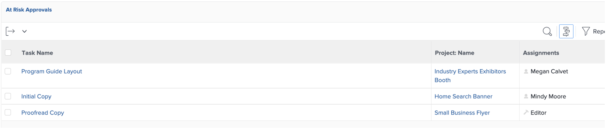

# Insights de um gerente de projeto

## Relatórios de progresso do projeto interativo

Na linha &quot;PIN&quot;, clique em &quot;Percepção do aplicativo móvel&quot; e em &quot;Métricas&quot;:

Aqui, você tem uma exibição gráfica do status de um único projeto/campanha.

>[!NOTE]
>
> Cada área pode ser clicada para obter mais detalhes, é o caso da maioria dos insights no Workfront. Dê uma chance!

## Relatórios específicos de campanha

Na linha &quot;PIN&quot;, clique em &quot;Projetos:

Na coluna à esquerda, clique em &quot;Status da campanha&quot;:

A parte superior fornece insights em uma única campanha sobre 1/Campanha **planejado vs. real** horas gastas e 2/ A **Condição de campanha** para cada canal:

A parte inferior oferece insights sobre o **Deliverables da campanha** status:

## Insights com base em vários projetos

Ainda na coluna à esquerda, clique em &quot;Monitoramento&quot;

A parte superior fornece informações sobre o status de um grupo de projetos, ambos da **Status das tarefas** do ponto de vista e da **Condição do projeto** ponto de vista:

A parte inferior mostra todos **aprovações de risco** e precisará perseguir:

## O Painel de conteúdo

Ainda na coluna à esquerda, clique em &quot;CONTENT DASHBOARD&quot;:

A parte superior fornece um bom insight sobre todas as **aprovação de prova do documento** status (foi aprovado, quantas versões precisávamos, etc.)

A parte inferior é uma **Revisão da aprovação da prova** que dê outro ângulo de visão aos estados de aprovação comprovantes:

Próxima etapa: [Fase 4 - Insights de um Gerenciador de marketing](./marketing-manager.md)

[Retorne à Fase 4 - Insights: Visão geral](./overview.md)

[Voltar para todos os módulos](../../overview.md)
