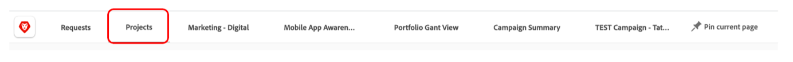
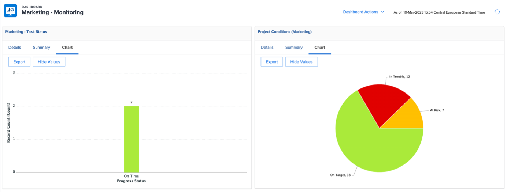

# Insights para um Gerente de projeto

## Relatórios de progresso interativos do projeto

Na linha &quot;PIN&quot;, clique em &quot;Reconhecimento de aplicativo móvel&quot; e, em seguida, clique em &quot;Métricas&quot;:

Aqui você tem uma visualização gráfica do status de um único projeto/campanha.

>[!NOTE]
>
> Cada área é clicável para obter mais detalhes, esse é o caso da maioria dos insights no Workfront. Experimente!

## Relatórios específicos de campanha

Na linha &quot;PIN&quot;, clique em &quot;Projetos:

Na coluna à esquerda, clique em &quot;Status da campanha&quot;:

A parte superior fornece insights sobre 1 única campanha sobre 1/ Campanha **planejada vs. real** horas gastas e 2/ A **Condição da campanha** para cada canal:

A parte inferior fornece informações sobre o status de **Entregáveis da campanha**:

## Insights com base em vários projetos

Ainda na coluna à esquerda, clique em &#39;Monitoramento&#39;

A parte superior fornece informações sobre o status de um grupo de projetos, tanto do ponto de vista do **Status das tarefas** quanto do ponto de vista da **Condição do projeto**:

A parte inferior mostra todas as **aprovações de risco** e será necessário perseguir:

## O painel de conteúdo

Ainda na coluna à esquerda, clique em &quot;PAINEL DE CONTEÚDO&quot;:

A parte superior fornece bons insights sobre todo o status da aprovação de prova do seu **documento** (foi aprovada, quantas versões eram necessárias etc.)

A parte inferior é uma **Revisão de aprovação de prova** que fornece outro ângulo de visão para os status de aprovação de prova:

Próxima etapa: [Fase 4 - Insights para um Gerente de marketing](./marketing-manager.md)

[Retorne à Fase 4 - Insights: visão geral](./overview.md)

[Voltar a todos os módulos](../../overview.md)
