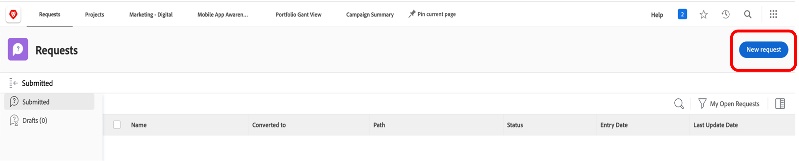
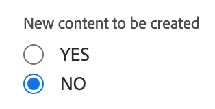
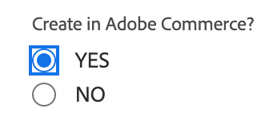
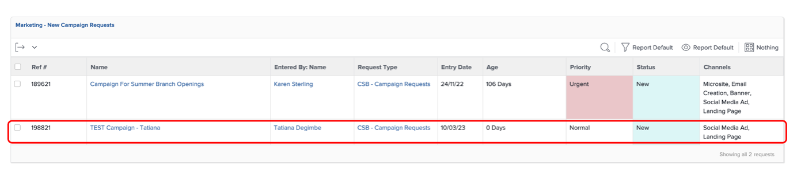
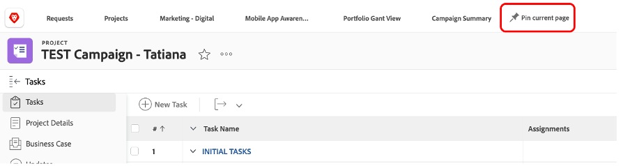

# Planejamento

>[!NOTE]
>
> Durante a Inicialização, você terá várias funções: Solicitante, Gerente de projeto, Designer e Gerência superior. Você terá uma visão geral da experiência do usuário de cada perfil.

Agora vamos dar uma olhada na Plataforma de gerenciamento de trabalho, Adobe Workfront. A Workfront torna suas metas visíveis para toda a organização para que todos possam priorizar estrategicamente o trabalho, acompanhar o progresso e medir os resultados. E à medida que seus objetivos evoluem, o Workfront transmite informações em cascata para equipes que executam trabalhos em campo. O resultado? Maior alinhamento, foco e velocidade para alcançar o sucesso.

Faça logon no seu perfil do Workfront navegando até [adobebootcampemea-02032301.testdrive.workfront.com](https://adobebootcampemea-02032301.testdrive.workfront.com) e fazendo logon com as credenciais fornecidas pela equipe do Adobe.

Você será confrontado com esta página de logon.  Entre com seu endereço de e-mail profissional que você assinou para o bootcamp como nome de usuário:

Depois de fazer logon, você será confrontado com esta página inicial:

## Preparação do Workfront para uso

Agora, prepararemos nossa página inicial como se estivéssemos usando o Workfront regularmente.  Isso significa que vamos obter páginas relevantes para o nosso fluxo de trabalho de depois e &quot;fixá-las&quot; em cima da nossa página inicial.

Primeiro, vamos abrir a página de carga de trabalho de nossa EQUIPE.  Clique no waffle no canto superior direito e selecione &#39;Equipes&#39;

Quando nossa EQUIPE (Marketing - Digital) estiver na tela, basta &quot;FIXAR&quot; na sua faixa superior:

A faixa de opções superior agora deve ter esta aparência:

Agora vamos fixar um projeto que analisaremos mais detalhadamente mais adiante.  Clique na página Projetos fixados e clique no botão de pesquisa.  Digite &quot;Campanha de conscientização para aplicativos móveis&quot; e clique no nome do projeto:

Quando o projeto estiver na tela, fixe-o na faixa superior como fizemos antes:

A faixa de opções superior agora deve ter esta aparência:

Finalmente, clique no waffle superior direito mais uma vez e selecione PORTFOLIO.

Clique no botão de pesquisa e digite &#39;TRANSFORMAR&#39;.  Clique no Portfolio &quot;Transformar a experiência do cliente&quot; para abri-lo:

Quando o Portfolio estiver aberto, fixe-o na faixa superior:

A faixa de opções superior agora deve ter esta aparência:

Agora estamos prontos para iniciar nosso fluxo de trabalho com uma interface que nos mostra exatamente o que precisamos regularmente.

## Solicitante

Agora iniciaremos a entrada do trabalho real com o chapéu do Solicitante. Um Solicitante, por exemplo, um Gerente de produto, gostaríamos de formalizar uma solicitação para nossa nova Campanha da Adobe e fornecer as informações do Resumo de marketing.

- Na parte superior esquerda, clique em Solicitações:

- Em seguida, clique em &quot;Nova solicitação&quot;:

- Como tipo de solicitação, selecione &quot;Solicitações de marketing&quot; e, em seguida, &quot;CSB - Solicitações de campanha&quot;:

- Insira o assunto: &quot;Adobe Campaign - \*team\*&quot; (preencha o número da equipe). Você pode adicionar uma descrição e uma prioridade.

- Tudo abaixo do cabeçalho &quot;CSB - Resumo da campanha de marketing&quot; é totalmente personalizável. Nesse caso, todos esses são campos personalizados que você pode adaptar às suas necessidades de resumo de marketing. Estes são os Campos resumidos que criamos para este Bootcamp:

- Vamos começar a preencher o Resumo:

   - Defina a data de início como 06/01/2023 - Defina a data de término como 30/06/2023:

  

   - Selecione AEM Assets, pois teremos alguns ativos disponíveis para serem usados nesta campanha lá:

  

   - Em &quot;Novo conteúdo&quot;, observe que se você clicar em sim, um campo extra (condicional) será exibido com um aviso de linha do tempo:

  

   - Como nosso prazo é curto, vamos alterar nossa opção para &quot;NÃO&quot;:

  

   - Nos canais, optamos por pré-selecionar alguns por padrão. E esses são os que precisaremos para a próxima etapa, portanto, nenhuma alteração é necessária aqui:

  

   - Adobe Commerce, selecione sim:

  

- Por fim, na seção documentos, é possível adicionar qualquer documentação relevante à sua solicitação.  Aqui, vamos usar o conector AEM para mostrar como você pode obter conteúdo existente da nossa instância do AEM Assets.

   - Clique em &quot;Adicionar ou vincular arquivos&quot; e selecione Vincular em &quot;experience-manager&quot;.

  

   - Agora você se depara com as Pastas do AEM Assets e pode navegar por elas (e/ou usar o mecanismo de pesquisa) para obter os documentos/ativos necessários para sua solicitação:

  

   - Você pode anexar qualquer item do AEM Assets que considere relevante para este projeto, se houver. Quando terminar, clique em &quot;Link&quot; para vincular aos ativos ou em &quot;Fechar&quot; se não estiver vinculando nenhuma pasta.

  

- Concluímos nossa solicitação e estamos prontos para enviá-la:

## Gerente de projetos

Agora que enviamos nossa solicitação como &quot;Solicitante&quot; (por exemplo, Gerente de produto), vamos alterar a função e usar a do Gerente de projeto.

- Clique no logotipo &quot;Adobe&quot; e você será direcionado para a página &quot;Novas solicitações de marketing&quot; (esta é uma página inicial típica do &quot;Gerenciador de projetos&quot;):

- Na seção &quot;Marketing - Novas solicitações de campanha&quot;, você pode encontrar sua solicitação recém-criada:

- Clique no nome da solicitação:

- Clique em &quot;Detalhes da solicitação&quot;:

- Role para baixo até a seção &quot;CSB - Resumo da campanha de marketing&quot; e expanda-a:

- Você pode ver todos os detalhes do resumo do Solicitante e, com essas informações, pode iniciar um plano de projeto com base em um modelo.
   - Na parte superior, ao lado do nome da Solicitação, clique nos três pontos:

  

   - Clique em &quot;Converter em projeto a partir de modelo&quot;:

  

   - Selecione &quot;CSB - Campanha de marketing&quot; e clique em &quot;Usar modelo&quot;:

  

   - Clique em &quot;Converter em projeto&quot; na parte inferior da página:

  

- Agora temos o fluxo de trabalho do projeto do Campaign com base no modelo. Vamos fixar nosso projeto para depois. Clique em &#39;Fixar página atual&#39;:

- Algumas áreas de atenção:

1. Noção de duração - É a janela de oportunidade para concluir uma tarefa.\
   Noção de Horas planejadas - é o tempo real necessário para concluir uma tarefa.

1. Noção de Predecessores (também conhecidos como dependências) - são as restrições que as tarefas podem ter entre si (normalmente, esta tarefa não pode ser iniciada antes que esta outra seja concluída). O que nos permite ter um Gráfico de Gant claro com o caminho crítico para cada projeto. Clique no ícone abaixo para exibir o Gráfico de Gant:
   

1. Noção de atribuições - no momento em que o projeto é criado, as atribuições ainda são generalistas, pois vêm de um modelo. Elas são feitas para Funções de trabalho - representadas pelo ícone de martelo (ou seja, um grupo de pessoas que têm as habilidades para concluir essa tarefa específica) ou para Equipes - representadas pelo ícone de pessoas (ou seja, definido pelo grupo de pessoas da sua empresa). Agora é o momento de atribuir essas tarefas a indivíduos.

- Hoje, vamos nos concentrar em Equipes pré-atribuições e como atribuí-los a indivíduos.

- Como você pode ver, a tarefa 11 &quot;Produzir anúncio de mídia social&quot; é atribuída à equipe &quot;Marketing - Digital&quot;:
  

- Vamos ver como isso reflete o planejamento dessa equipe, abrindo a página Gerenciamento de recursos. Clique no PIN &quot;Marketing - Digital&quot; na parte superior da página:
  

- Agora você tem esta exibição de Planejamento de equipes:

1. A parte superior cobre o Trabalho não atribuído dessa equipe específica. Ele lista os projetos nos quais a Equipe tem atribuição(ões) e clicando na seta aqui, você tem a visibilidade das tarefas exatas que precisam ser cobertas pelo projeto:
   

1. A parte inferior abrange o Trabalho atribuído para os indivíduos na equipe, mas não apenas: mostra realmente a carga de trabalho real de cada membro da equipe, mas também seu cronograma (por exemplo, segunda a sexta ou segunda a sexta), suas férias, etc.
   

- Para atribuir uma tarefa a um indivíduo, basta arrastar a tarefa da parte superior para a linha de um indivíduo na parte inferior. Veja como a carga de trabalho de Bea foi ajustada e os detalhes de suas atribuições de tarefas foram adicionados:
  

Próxima Etapa: [Fase 1 - Planejamento: Outro pré-trabalho](./prework.md)

[Voltar ao resumo criativo](../../creative-brief.md)

[Voltar a todos os módulos](../../overview.md)
