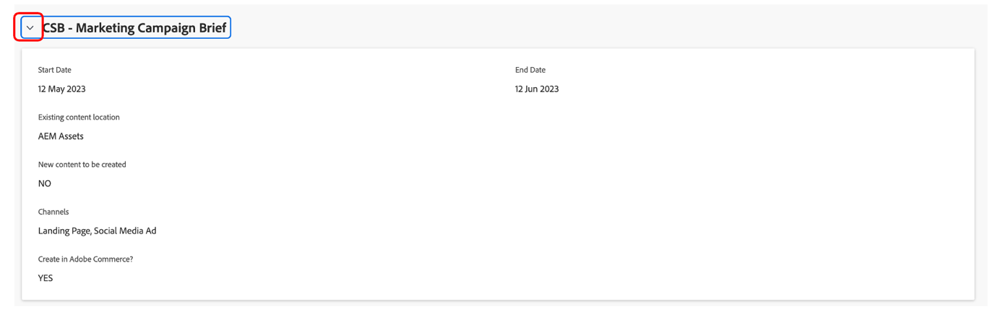
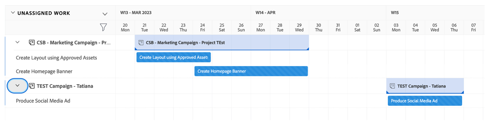

# Planejamento

>[!NOTE]
>
> Durante o Bootcamp, você vai usar vários chapéus: Solicitante, Gerente de projeto, Designer e Gerenciamento Superior. Isso lhe dará uma ideia da experiência de usuário de cada perfil.

Agora vamos ver a Plataforma de gerenciamento de trabalho, Adobe Workfront. O Workfront torna suas metas visíveis para toda a organização, para que todos possam priorizar estrategicamente o trabalho, acompanhar o progresso e medir os resultados. E à medida que suas metas evoluem, a Workfront coloca as informações em cascata em equipes executando trabalhos no local. O resultado? Maior alinhamento, foco e velocidade atingindo o sucesso.

Faça logon no perfil do Workfront navegando até [adobebootcampemea-02032301.testdrive.workfront.com](https://adobebootcampemea-02032301.testdrive.workfront.com) e fazendo logon com as credenciais fornecidas pela equipe do Adobe.

Você enfrentará esta página de logon.  Faça logon com seu endereço de email profissional que você assinou para o bootcamp como nome de usuário:

Após o logon bem-sucedido, você verá esta página inicial:

## Preparação do Workfront para uso

Agora prepararemos nossa página inicial como se estivéssemos usando o Workfront regularmente.  Isso significa que obteremos páginas relevantes para o nosso fluxo de trabalho mais tarde e as &#39;PIN&#39; mais tarde na parte superior da nossa página inicial.

Primeiro de tudo, vamos buscar a página da carga de trabalho do TEAM.  Clique no waffle na parte superior direita e selecione &#39;Equipes&#39;

Assim que o TEAM (Marketing - Digital) estiver na tela, basta &#39;PIN&#39; para a faixa superior:

A faixa superior agora deve ter esta aparência:

Vamos agora fixar um projeto que vamos analisar mais detalhadamente mais adiante.  Clique na página Projetos PINTOS e clique no botão de pesquisa.  Digite &#39;Campanha de conscientização do aplicativo móvel&#39; e clique no nome do projeto:

Quando o projeto estiver na tela, coloque-o na faixa superior como fizemos antes:

A faixa superior agora deve ter esta aparência:

Finalmente, clique novamente no waffle superior direito e selecione PORTFOLIO.

Clique no botão de pesquisa e digite &#39;TRANSFORM&#39;.  Clique na Portfolio &quot;Transformar a experiência do cliente&quot; para abri-la:

Depois que o Portfolio estiver aberto, coloque-o na faixa superior:

A faixa superior agora deve ter esta aparência:

Agora estamos prontos para iniciar nosso fluxo de trabalho com uma interface que nos mostra exatamente o que precisamos regularmente.

## Solicitante

Iniciaremos agora a entrada de trabalho real com o chapéu do Requestor. Um Solicitante, por exemplo um Gerente de produto, gostaríamos de formalizar uma solicitação para nossa nova Campanha Adobe e fornecer as informações do resumo de marketing.

- No canto superior esquerdo, clique em Solicitações:

- Em seguida, clique em &quot;Nova solicitação&quot;:

- Como tipo de solicitação, selecione &quot;Solicitações de marketing&quot; e, em seguida, &quot;CSB - Solicitações de campanha&quot;:

- Insira o assunto: &quot;Adobike Campaign - \*equipe\*&quot; (preencha o número da equipe). Você pode adicionar uma descrição e uma prioridade.

- Tudo o que está abaixo do cabeçalho &quot;CSB - resumo da campanha de marketing&quot; é totalmente personalizável. Nesse caso, esses são todos campos personalizados que você pode adaptar às suas próprias necessidades do Marketing Breve. Estes são os campos Brief que criamos para este Bootcamp:

- Vamos começar a preencher o resumo:

   - Defina a data de início como 06/01/2023 - Defina a data de término como 30/06/2023:

   

   - Selecione AEM Assets, pois teremos alguns ativos disponíveis para serem usados nesta campanha:

   

   - Em &quot;Novo conteúdo&quot;, observe que se você clicar em sim, um campo extra (condicional) será exibido com um aviso de linha do tempo:

   

   - Já que estamos num prazo apertado, vamos mudar nossa escolha para &quot;NÃO&quot;:

   

   - Nos canais, escolhemos pré-selecionar alguns por padrão. E esses são os que precisaremos para o próximo passo, então nenhuma mudança é necessária aqui:

   

   - Adobe Commerce, selecione sim:

   

- Por fim, na seção documentos , você pode adicionar qualquer documentação relevante para sua solicitação.  Aqui, vamos usar o conector de AEM para mostrar como você pode obter conteúdo existente de nossa instância do AEM Assets.

   - Clique em &quot;Adicionar ou vincular arquivos&quot; e selecione Link no &quot;experience-manager&quot;.

   

   - Agora você está diante das Pastas do AEM Assets e pode navegar por elas (e/ou usar o mecanismo de pesquisa) para obter os documentos/ativos necessários para sua solicitação:

   

   - Você pode anexar quaisquer itens do AEM Assets que considere relevantes para este projeto, se houver. Quando terminar, clique em &quot;Vincular&quot; para vincular aos ativos ou em &quot;Fechar&quot; se não estiver vinculando nenhuma pasta.

   

- Agora concluímos nossa solicitação e estamos prontos para enviá-la:

## Gerente de projetos

Agora que enviamos nossa solicitação como &quot;Solicitante&quot; (por exemplo, Gerente de produto), vamos alterar o chapéu e usar o do Gerenciador de projetos.

- Clique no logotipo &#39;Adobe&#39; e você será direcionado para a página &#39;Novas solicitações de marketing&#39; (esta é uma página inicial típica do &#39;Gerenciador de projetos&#39;):

- Na seção &quot;Marketing - Novas solicitações de campanha&quot;, você pode encontrar sua solicitação recém-criada:

- Clique no nome da solicitação:

- Clique em &quot;Detalhes da solicitação&quot;:

- Role para baixo até a seção &quot;CSB - Marketing Campaign Brief&quot; e expanda-a:

- Você pode ver todos os detalhes do resumo do Solicitante e, com essas informações, pode iniciar um plano de projeto com base em um template.
   - Na parte superior, ao lado do nome da Solicitação, clique nos três pontos:

   

   - Clique em &quot;Converter em projeto do modelo&quot;:

   

   - Selecione &#39;CSB - Campanha de marketing&#39; e clique em &#39;Usar modelo&#39;:

   

   - Clique em &quot;Converter em projeto&quot; na parte inferior da página:

   

- Agora temos nosso workflow do projeto do Campaign com base no template . Vamos PIN nosso projeto para mais tarde. Clique em &quot;Fixar página atual&quot;:

- Algumas áreas de atenção:

1. Noção de duração - É a janela de oportunidade para concluir uma tarefa.\
   Noção de Horas Planejadas - é o tempo real necessário para concluir uma tarefa.

1. Noção de predecessores (também conhecidos como dependências) - essas são as restrições que as tarefas podem ter entre si (normalmente, essa tarefa não pode ser iniciada antes que esta outra seja concluída). O que nos permite ter um Gráfico de Gant claro com o caminho crítico para cada projeto. Clique no ícone abaixo para exibir o Gráfico de Gant:
   

1. Noção de atribuições - no momento em que o projeto é criado, as atribuições ainda são generalistas, pois vêm de um template. Elas são feitas nas Funções de trabalho - representadas pelo ícone de martelo (ou seja, um grupo de pessoas que tem as habilidades de concluir essa tarefa em particular) ou nas Equipes - representadas pelo ícone de pessoas (ou seja, uma definição feita pelo grupo de pessoas de sua empresa). Agora é o momento de atribuir essas tarefas a indivíduos.

- Hoje vamos nos concentrar em pré-atribuições de equipes e como atribuí-las a indivíduos.

- Como você pode ver, a tarefa 11 &quot;Produzir anúncio de mídia social&quot; é atribuída à equipe &quot;Marketing - Digital&quot;:
   

- Vamos ver como isso reflete no planejamento dessa equipe, abrindo a página Gerenciamento de Recursos. Clique no PIN &quot;Marketing - Digital&quot; na parte superior da página:
   

- Agora você tem esta exibição de planejamento de equipes:

1. A parte superior cobre o trabalho Não atribuído para essa equipe específica. Ele lista os projetos nos quais a Equipe tem atribuições e, clicando na seta aqui, você tem a visibilidade das tarefas exatas que precisam ser cobertas pelo projeto:
   

1. A parte inferior cobre o trabalho Atribuído para os indivíduos da equipe, mas não apenas: mostra efetivamente a carga de trabalho real de cada membro da equipe, mas também o seu calendário (por exemplo, Mon-Fri ou Mon-Sat), os seus feriados, etc.
   

- Para atribuir uma tarefa a um indivíduo, basta arrastar a tarefa da parte superior para a linha de um indivíduo na parte inferior - Veja como a carga de trabalho do Bea foi ajustada e os detalhes de suas atribuições de tarefas foram adicionados:
   

Próxima etapa: [Fase 1 - Planejamento: Outro pré-trabalho](./prework.md)

[Volte para o resumo criativo](../../creative-brief.md)

[Voltar para todos os módulos](../../overview.md)
