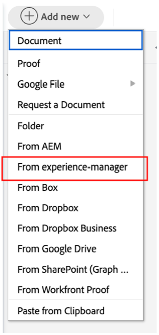

# Outro pré-trabalho

## Selecionar ativos da marca

Conforme descrito no resumo criativo, há alguns ativos que serão necessários para iniciar efetivamente nossa campanha. Esses ativos de marca serão adicionados à campanha no Workfront para que tenhamos acesso a eles centralmente.

- Expanda a tarefa 1, &#39;TASKS INICIAIS&#39; e abra a tarefa &#39;Selecionar 5 ativos da marca (frente, trás, ...)&#39; clicando nela.

- Clique em &quot;Documentos&quot; e, em seguida, em &quot;Adicionar novo:

- Selecione &quot;Do experience-manager&quot;; isso nos permitirá escolher os ativos da marca que já estão disponíveis no AEM Assets:

- Depois que a hierarquia da Pasta de AEM for exibida, navegue até o seguinte caminho: experience-manager > Adobike Assets > Bike shots Selecione 5 ativos e clique em &quot;Link&quot;.

- Agora temos nossos recursos da Marca em nossa tarefa. Isso significa que podemos definir a tarefa 2 como 100% concluída:

## Demonstração do Adobe Commerce

O Adobe Commerce é um dos vários produtos da Adobe Experience Cloud que podem ajudá-lo a oferecer as melhores experiências digitais aos seus clientes. No entanto, houve muito pouco tempo para fazer tudo em conjunto durante o período de arranque.

Este vídeo familiariza você com o Adobe Commerce e mostra o produto que criamos para usar durante o período de inicialização. Em um cenário da vida real, você carregaria os ativos de marca selecionados anteriormente no Adobe Commerce para a configuração do produto.

>[!VIDEO](https://video.tv.adobe.com/v/3418945?quality=12&learn=on)

Depois que essa tarefa for concluída, você poderá marcar a tarefa 3 como 100% concluída no Workfront.

## Campanhas flexíveis são um pré-requisito

Ao revisar nosso plano de trabalho, percebemos um pequeno problema: nosso Gerente de produto (o Solicitante) colocou uma atualização que ele esqueceu de solicitar um &quot;Banner da página inicial do produto&quot;.  Acrescentaremos isso ao nosso plano de projeto.

- Vá para a lista Tarefas e adicione a tarefa &quot;Criar banner de página inicial do produto&quot; logo abaixo da tarefa 4 &quot;PRODUÇÃO&quot;. Para fazer isso, selecione a tarefa &quot;Prepare Mobile App Content&quot; e clique no ícone &quot;add task above&quot;:

- Dê um nome significativo à tarefa adicionada, como &quot;Criar banner da página inicial do produto&quot;.

- Agora que criamos a tarefa, vamos adicionar conteúdo a ela. Clique nos três pontos à direita do título do Projeto e selecione &#39;Anexar modelo&#39;:

- Selecione &quot;Criar banner da página inicial do produto&quot; e clique em &quot;Personalizar e anexar&quot;:

- Na tela de personalização, certifique-se de mencionar a tarefa &quot;Criar banner da página inicial do produto&quot; como principal:

- Finalmente, certifique-se de marcar a tarefa pai como &quot;Criar Página Inicial do Produto&quot; com um Predecessor da tarefa 3, pois nenhuma produção pode ser iniciada até que o produto seja criado no Adobe Commerce:

Agora temos uma campanha que está completa e planejada, o que significa que agora podemos começar com a produção e entrega de nossa campanha!

Próxima etapa: [Fase 2 - Produção: Criar banner da página inicial do produto](../production/banner.md)

[Retorne à Fase 1 - Planejamento: Planejamento](./planning.md)

[Voltar para todos os módulos](../../overview.md)