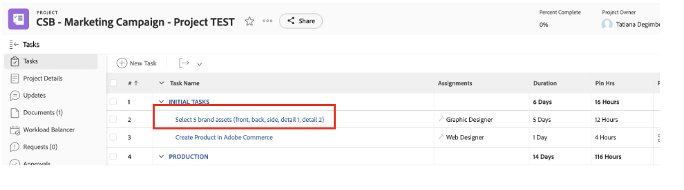

# Outro pré-trabalho

## Selecionar Assets da marca

Conforme descrito no resumo criativo, há alguns recursos que serão necessários para iniciar nossa campanha de maneira eficaz. Esses recursos de marca serão adicionados à campanha no Workfront para que tenhamos acesso a eles centralmente.

- Expanda a tarefa 1, &quot;TAREFAS INICIAIS&quot;, e abra a tarefa &quot;Selecione 5 ativos de marca (frente, trás, ...)&quot; clicando nela.

- Clique em &quot;Documentos&quot; e depois em &quot;Adicionar novo:

- Selecione &quot;From experience-manager&quot;; isso nos permitirá escolher os recursos da marca que já estão disponíveis no AEM Assets:

- Quando a hierarquia de pastas do AEM for exibida, navegue até o seguinte caminho: experience-manager > Adobe Assets > Bike shots Selecione 5 ativos e clique em &#39;Link&#39;.

- Agora temos os recursos de marca em nossa tarefa. Isso significa que podemos definir a tarefa 2 como 100% concluída:

## Demonstração do Adobe Commerce

O Adobe Commerce é um dos muitos produtos da Adobe Experience Cloud que podem ajudá-lo a oferecer as melhores experiências digitais aos seus clientes. No entanto, havia muito pouco tempo para fazer tudo junto durante o bootcamp.

Este vídeo familiariza você com o Adobe Commerce e mostra o produto que criamos para usar durante a inicialização. Em um cenário real, você faria upload dos ativos da marca selecionada anteriormente para o Adobe Commerce na configuração do produto.

>[!VIDEO](https://video.tv.adobe.com/v/3418945?quality=12&learn=on&enablevpops)

Quando essa tarefa for concluída, você poderá marcar a tarefa 3 como 100% concluída no Workfront.

## Campanhas flexíveis são um pré-requisito

Ao revisar nosso plano de trabalho, notamos um pequeno problema: nosso Gerente de produto (o Solicitante) colocou uma atualização que ele esqueceu de solicitar um &quot;Banner da página inicial do produto&quot;.  Adicionaremos isso ao nosso plano de projeto.

- Vá para a lista de Tarefas e adicione a tarefa &quot;Criar banner da página inicial do produto&quot; logo abaixo da tarefa 4 &quot;PRODUÇÃO&quot;. Para fazer isso, selecione a tarefa &quot;Preparar conteúdo do aplicativo móvel&quot; e clique no ícone &quot;adicionar tarefa acima&quot;:

- Dê um nome significativo à tarefa adicionada, como &quot;Criar banner de página inicial do produto&quot;.

- Agora que criamos a tarefa, vamos adicionar conteúdo a ela. Clique nos três pontos à direita do título do projeto e selecione &quot;Anexar modelo&quot;:

- Selecione &quot;Criar banner de página inicial do produto&quot; e clique em &quot;Personalizar e anexar&quot;:

- Na tela de personalização, mencione a tarefa &quot;Criar banner da página inicial do produto&quot; como a principal:

- Por fim, marque a tarefa pai &quot;Criar página inicial do produto&quot; com uma Predecessora da tarefa 3, pois nenhuma produção pode ser iniciada até que o produto seja criado no Adobe Commerce:

Agora temos uma campanha que está concluída e planejada, o que significa que agora podemos começar com a produção e o delivery de nossa campanha!

Próxima Etapa: [Fase 2 - Produção: Criar banner de página inicial do produto](../production/banner.md)

[Retorne à Fase 1 - Planejamento: Planejamento](./planning.md)

[Voltar a todos os módulos](../../overview.md)
