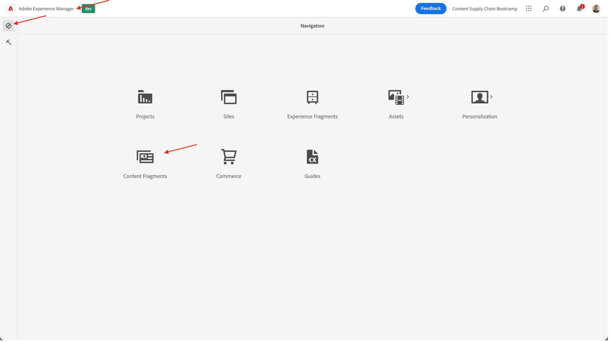

# Criar conteúdo de aplicativo móvel

## O que é a entrega de conteúdo sem periféricos?

Com um sistema de gerenciamento de conteúdo sem periféricos, o back-end e o front-end agora são dissociados. A parte sem periféricos é o back-end de conteúdo, já que um CMS sem periféricos é um sistema de gerenciamento de conteúdo somente de back-end, projetado e criado explicitamente como um repositório de conteúdo que torna o conteúdo acessível por meio de uma API, para exibição em qualquer dispositivo.

O front-end, que é desenvolvido e mantido de maneira independente, busca conteúdo do back-end headless usando uma API de entrega de conteúdo, normalmente no formato JSON. Por exemplo, isso pode ser como um aplicativo da Web ou, no nosso caso, como um aplicativo móvel.

Um CMS headless de back-end geralmente exige que o conteúdo seja estruturado, com base em um modelo ou esquema. Isso auxilia os aplicativos clientes a solicitar o conteúdo correto para renderizar uma experiência. Alguns CMS, como AEM, podem expor conteúdo estruturado e não estruturado no formato JSON.

Uma característica importante dessa topologia é que o conteúdo entregue pelo CMS headless no formato JSON é um conteúdo puro, sem informações de design ou layout. Em uma implementação CMS sem cabeçalho, toda a formatação e layout são mantidos pelo aplicativo de front-end dissociado.

Uma vantagem importante de uma topologia de CMS headless é a capacidade de reutilizar conteúdo em vários canais, que podem usar diferentes implementações de front-end do lado do cliente. Isso pode tornar o processo de desenvolvimento de front-end mais eficiente. Mas também significa que o processo de desenvolvimento da experiência de front-end pode se tornar muito centrado em código e TI, com essa última tornando-se responsável pela experiência.

## Como a entrega de conteúdo sem periféricos funciona no AEM?

O AEM as a Cloud Service é uma ferramenta flexível para o modelo de implementação headless, oferecendo três recursos avançados:

1. Modelos de conteúdo
   - Os modelos de conteúdo são uma representação estruturada do conteúdo.
   - Modelos de conteúdo são definidos pelos arquitetos de informações no editor de modelos de fragmento de conteúdo do AEM.
   - Os modelos de conteúdo são a base para os fragmentos de conteúdo.
1. Fragmentos de conteúdo
   - Os fragmentos de conteúdo são criados com base em um modelo de conteúdo.
   - São criados por autores de conteúdo por meio do editor de fragmentos de conteúdo do AEM.
   - Os fragmentos de conteúdo são armazenados no AEM Assets e gerenciados na interface de administração do Assets.
1. API de conteúdo para entrega
   - A API GraphQL do AEM é compatível com a entrega de fragmentos de conteúdo.
   - A API REST do AEM Assets é compatível com operações CRUD de fragmentos de conteúdo.
   - A entrega direta de conteúdo também é possível com a [exportação em JSON do componente principal do fragmento de conteúdo](https://experienceleague.adobe.com/docs/experience-manager-core-components/using/components/content-fragment-component.html?lang=en).

## Exercício

Para este campo de batalha, estaremos focando na parte do &quot;conteúdo&quot; - afinal, é a cadeia de fornecimento de conteúdo que estamos buscando. Já prevemos um modelo de conteúdo, bem como as APIs de entrega necessárias, para que você possa se concentrar no que é importante.

Vamos explorar nosso modelo de conteúdo primeiro: é o &quot;contrato&quot; que temos com o CMS sem cabeça, para que saibamos qual conteúdo pode vir à nossa maneira e em que formato.

- Acesse o autor do AEM em [https://author-p105462-e991028.adobeaemcloud.com/](https://author-p105462-e991028.adobeaemcloud.com/) e faça logon com as credenciais que fornecemos.

- No menu Iniciar do AEM, selecione Ferramentas > Geral \> Modelos de fragmento de conteúdo

- Na próxima tela, você obterá uma visão geral de todos os sites que usam conteúdo headless. Isso permite que você mantenha a governança em vários sites sem periféricos, sem ter que temer que eles interfiram uns com os outros. No nosso caso, estamos trabalhando com nosso site Adobike, então selecione esse modelo.

- Nesta pasta, podemos ver algum conteúdo técnico headless que estamos usando no site da Adobike. Interessado em saber mais? Sinta-se à vontade para entrar em contato. Por enquanto, vamos focar na tarefa antes das mãos: o aplicativo móvel. Passe o mouse sobre o cartão da Página inicial do aplicativo móvel e clique no ícone de lápis para abrir o modelo de conteúdo.

- No Editor do modelo de fragmento de conteúdo, é possível ver os detalhes de um determinado modelo de conteúdo. No nosso caso, podemos ver a página inicial do nosso aplicativo móvel do logotipo Adobike, um cabeçalho, algum texto gratuito opcional e um produto opcional em destaque. Todos esses itens são fáceis de configurar e atualizar, de modo que, se o modelo de conteúdo precisar de elementos extras, isso pode ser feito sem interferência do desenvolvedor no CMS.

>[!WARNING]
>
> **Observe que alterar o modelo de conteúdo tem implicações além da linha**, já que o aplicativo móvel depende do recebimento de determinadas informações para poder exibir os elementos corretos. Tenha cuidado ao atualizar ou remover campos, a adição de campos não deve ser afetada.

Agora que temos uma ideia do que nosso conteúdo deve existir, podemos fazer nosso fragmento de conteúdo.

- Clique no logotipo AEM no canto superior esquerdo para abrir a navegação e navegue até Navegação \> Fragmentos de conteúdo.

- Na interface a seguir, você obtém uma visão geral de todo o conteúdo existente no AEM. Os filtros à esquerda podem ser usados para restringir se você estiver procurando por um fragmento de conteúdo específico. Para criar um novo fragmento de conteúdo, clique no botão &quot;Criar&quot; na parte superior direita.

- No modal que abre, você verá que alguns campos ainda não são editáveis. Isso é lógico: com base em onde criamos nosso fragmento, modelos diferentes estarão disponíveis.
   
   - Primeiro, selecione onde criaremos o fragmento clicando no ícone de pasta ao lado do campo &quot;Local&quot;. Expanda a árvore de conteúdo clicando nas pastas &quot;adobike&quot; \> &quot;en&quot; \> &quot;mobile-app&quot; e, em seguida, confirme sua seleção clicando no botão &quot;Choose&quot;.
      
   - Você observará que o campo &quot;Modelo de fragmento de conteúdo&quot; agora é editável. Clique na seta ao lado do campo para abrir a lista suspensa e selecionar o modelo de conteúdo que vimos anteriormente: &quot;Página inicial do aplicativo móvel&quot;.
   - Em seguida, dê um título significativo ao seu fragmento de conteúdo (dica: inclua o número da sua equipe para encontrar o conteúdo facilmente). Você observará que o campo &quot;Nome&quot; é preenchido automaticamente - isso facilita a vida: é o nome que o sistema usa para identificar o fragmento e não deve ser tocado.
   - Finalmente, clique no botão &quot;Criar e abrir&quot;, que, como o nome indica, criará o fragmento de conteúdo e o abrirá para que você possa editá-lo imediatamente.

- Aqui, sua equipe pode decidir qual conteúdo deseja mostrar no aplicativo móvel. 
   - Certifique-se de selecionar o número da equipe, para poder verificar o conteúdo mais tarde no aplicativo móvel.
   - Para selecionar ativos de imagem, clique no ícone de pasta para procurar a imagem correta no AEM Assets.
   - Para o produto em destaque, clique no ícone de pesquisa do produto para selecionar facilmente nosso produto de Comércio &quot;Adobike 1&quot;, para que os detalhes relacionados ao comércio sejam carregados no aplicativo.
   - Certifique-se de clicar no botão &quot;Salvar&quot; quando terminar de salvar todo o conteúdo criado e publicar as alterações.
      

Agora que prevemos o aplicativo móvel com algum conteúdo, estamos prontos para entregar nossa campanha.

Próxima etapa: [Fase 3 - Entrega: Verificar aplicativo móvel](../delivery/app.md)

[Volte para a Fase 2 - Produção: Criar anúncio de mídia social](./social.md)

[Voltar para todos os módulos](../../overview.md)
