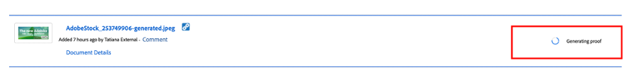
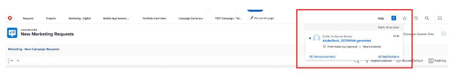

# Criar banner de página inicial do produto

## Produção do banner

A automação de conteúdo reúne o potencial do Adobe Creative Cloud com o Experience Manager Assets, oferecendo aos profissionais de marketing a capacidade de automatizar a produção de ativos em escala, acelerando drasticamente a criação de variações. Vamos usar essas funcionalidades para gerar um banner que será usado na página inicial!

- Vá para o autor do AEM em [https://author-p105462-e991028.adobeaemcloud.com/](https://author-p105462-e991028.adobeaemcloud.com/) e faça logon com as credenciais fornecidas.

- Na página inicial, navegue até Ferramentas > Assets > Perfis de processamento.

- Na interface do, você verá todos os perfis de processamento existentes. Eles podem ser usados para ativar determinadas automações.

- Os seguintes itens são de seu interesse:
   - Banner escuro da Adobe: cria um banner da Adobe com uma sobreposição escura, com base no ativo selecionado

     
   - Luz do banner da Adobe: cria um banner da Adobe com uma sobreposição de luz, com base no ativo selecionado

     
   - Adobe Banner Green: cria um banner Adobe com uma sobreposição verde, com base no ativo selecionado

     

- Depois de escolher o tipo de banner que deseja criar, selecione o perfil de processamento e clique em &quot;Aplicar perfil às pastas&quot;.

- Na próxima tela, navegue até a pasta da sua equipe no AEM Assets. Em seguida, na parte superior esquerda, selecione o botão &quot;Criar&quot; para criar uma nova pasta e dar a ela um nome significativo, por exemplo, &quot;Criar banner escuro&quot;.

- Depois de criar a pasta, marque a caixa ao lado de seu nome e, em seguida, clique no botão &quot;Aplicar&quot; na parte superior direita.

Agora que fizemos a configuração necessária, vamos gerar nosso banner.

- Clique no logotipo AEM no canto superior esquerdo para abrir a navegação e navegue até Navegação \> Assets \> Arquivos.

- Localize a pasta &quot;Generated Adobe Assets&quot; e abra-a clicando no cartão. É aqui que os banners gerados aparecerão.

- Abra uma nova guia e acesse o AEM Assets novamente. Em seguida, navegue até a pasta à qual aplicamos o perfil de processamento.

- Na pasta, faça upload da imagem para a qual deseja criar um banner arrastando e soltando-o no navegador ou clicando em Criar \> Arquivos no canto superior direito da interface.

- Aguarde um minuto para que seu ativo seja processado e, em seguida, recarregue sua tela. Se você vir seu ativo no estado &quot;Novo&quot;, saberá que o processamento foi concluído.

- Navegue de volta para a guia anterior e recarregue a tela aqui também. Você deve observar um novo ativo no estado &quot;Novo&quot;. Este é o nosso banner gerado, todo do DAM! Ainda não está vendo? Aguarde mais um minuto e recarregue a tela.

>[!NOTE]
>
> Não está satisfeito com o resultado? Aplique outro perfil de processamento à sua pasta e faça o upload do seu ativo novamente para gerar um banner diferente (ou faça upload de outro ativo, é claro). Durante o recarregamento, o sistema perguntará o que você deseja fazer com o ativo existente e selecionará &quot;Substituir&quot;.
> 

Agora temos nosso banner gerado que podemos usar posteriormente durante a entrega da campanha. Certifique-se de publicar o banner selecionando-o e clicando no botão &quot;Publish rápido&quot; na faixa de opções.

## Acompanhamento no Workfront

Se você precisar de um processo de revisão e aprovação formal e auditável do seu Assets, a Workfront é o local ideal.

>[!NOTE]
>
> Embora mencionemos isso aqui explicitamente, a intenção é atualizar as tarefas no Workfront após concluí-las. Você sempre deve se esforçar para um fluxo Criar > Revisar > Aprovar.

- Vamos voltar ao nosso projeto e expandir a opção &quot;Ir/Não ir Banner Review&quot; para abrir a referida tarefa clicando nela:

- Clique na seção de documentos da tarefa (coluna à esquerda) e clique na pasta vinculada &#39;Final&#39; do AEM Assets. Selecione o ativo clicando na zona e clique em &quot;Criar prova&quot;. Uma prova é a capacidade de revisar o conteúdo, por exemplo, imagem, texto, vídeo, site etc., de maneira estruturada e colaborativa, onde comentários, correções, modificações das partes interessadas envolvidas são coletados, versões e resultados podem ser comparados e aprovados finais gerados por um clique.

- Como queremos um processo de aprovação elaborado, selecione &quot;Prova avançada&quot;.

>[!NOTE]
>
> Decidiremos manualmente quem revisará e/ou aprovará nossa prova nesta inicialização. Na maioria dos casos de uso reais, usaríamos um modelo predefinido de fluxo(s) de aprovação já definido(s) para cada tipo de prova.

- Por padrão, estamos em um tipo de fluxo de trabalho &quot;básico&quot; e vamos selecionar seu Especialista em Workfront Bootcamp como revisor e aprovador. Digite o nome do especialista em Workfront do Bootcamp onde está escrito &quot;Digite o nome do contato ou endereço de email para adicionar um recipient:

- Defina-os como &#39;Revisor e Aprovador&#39;:

- Clique em Criar prova. O Workfront levará alguns momentos para gerar a prova:

- Seu especialista da Workfront agora receberá uma nova notificação informando que ele tem uma prova para revisar e/ou aprovar:

- Depois de clicar na notificação, eles enfrentarão sua prova e poderão fazer alguns comentários e/ou aprovar esta prova.

   - Eles podem clicar em &quot;Adicionar comentário&quot; na parte superior da tela se tiverem observações:

  

   - Eles poderão não apenas adicionar comentários, mas também usar a pequena barra de ferramentas de ponteiros para definir claramente qual área precisa ser alterada.

  

   - Ao adicionar o comentário, eles podem informar que você precisa fazer algum trabalho extra em uma nova versão da prova. Atualize sua guia Workfront e você terá uma nova notificação informando exatamente isso. Depois de saber quais alterações você precisa fazer, faça as alterações no AEM e, em seguida, acesse e faça upload da sua nova versão aqui:

  

   - Selecione o ativo atualizado (se nenhuma alteração for necessária no cenário de bootcamp, carregue o mesmo ativo novamente) e clique em &quot;Link&quot;:

  

   - Em seguida, clique em &quot;criar prova&quot; no lado direito.

  

   - Depois que a prova for gerada (isso pode levar alguns minutos), seu especialista em Workfront receberá uma notificação e poderá revisar e aprovar essa nova versão.  Por exemplo, usando o botão de comparação de prova, é possível ver uma comparação lado a lado de V1 e V2 com todos os comentários feitos.

  

  

  

Agora temos uma aprovação formal para usar nosso banner. É fácil seguir onde estamos no processo e as atualizações que você faz acionam notificações automaticamente para que você possa trabalhar da maneira mais eficiente possível.

Próxima Etapa: [Fase 2 - Produção: Criar anúncio de mídia social](./social.md)

[Voltar à Fase 1 - Planejamento: Outro pré-trabalho](../planning/prework.md)

[Voltar a todos os módulos](../../overview.md)
