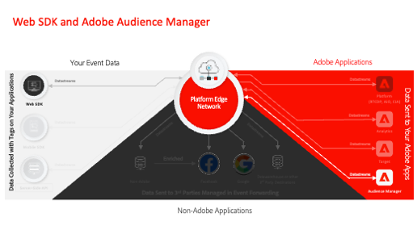

# Tutorials de Coleção de dados

A Coleção de dados é a próxima geração de recursos de Tag Management de site e SDK para dispositivos móveis do Adobe. A Coleção de dados oferece aos clientes uma forma simples de implantar e gerenciar as soluções de análise, de marketing e de anúncios necessárias para potencializar experiências de cliente relevantes. Use estes vídeos e tutoriais para ajudá-lo a conhecer esta tecnologia crítica.

## Guias de migração

<table>
<tr>
  <td>
    
    

      <a href="https://experienceleague.adobe.com/docs/platform-learn/migrate-target-to-websdk/introduction.html" target="_blank">
    <strong>Migrar Adobe Target para Web SDK</strong>
    </a>
    

    

    <em>Substituir at.js pelo Web SDK</em>
    

  </td>
  <td>
    
    

      <a href="https://experienceleague.adobe.com/en/docs/platform-learn/migrate-analytics-to-websdk/migration-to-websdk-overview" target="_blank">
    <strong>Migrar Adobe Analytics para Web SDK nas marcas</strong>
    </a>
    

    

    <em>Substituir AppMeasurement.js pela Web SDK com marcas</em>
    

  </td>
  <td>
      
    </a>
    

      <strong>Migrar Adobe Audience Manager para Web SDK</strong>
    

    

    <em>Substituir <a href="https://experienceleague.adobe.com/en/docs/audience-manager/user-guide/migrate-to-web-sdk/dil-extension-to-web-sdk" target="_blank">dil.js</a> ou <a href="https://experienceleague.adobe.com/en/docs/audience-manager/user-guide/migrate-to-web-sdk/appmeasurement-to-web-sdk" target="_blank">atualizar o encaminhamento pelo lado do servidor</a></em>
    

  </td>
</tr>
</table>

## Guias de implementação

<table>
<tr>
  <td>
    
    

      <a href="https://experienceleague.adobe.com/docs/platform-learn/implement-web-sdk/overview.html?lang=pt-BR" target="_blank">
    <strong>Implementar o Experience Cloud com o Web SDK</strong>
    </a>
    

    

    <em>Usar marcas para implementar o Platform Web SDK</em>
    

  </td>
  <td>
    
    

      <a href="https://experienceleague.adobe.com/docs/platform-learn/implement-mobile-sdk/overview.html?lang=pt-BR" target="_blank">
    <strong>Implementar o Experience Cloud em aplicativos móveis</strong>
    </a>
    

    

    <em>Usar marcas para implementar o Platform Mobile SDK</em>
    

  </td>
  <td>
    
    

      <a href="https://experienceleague.adobe.com/docs/platform-learn/migrate-target-to-websdk/introduction.html" target="_blank">
    <strong>Implementar bibliotecas herdadas com tags</strong>
    </a>
    

    

    <em>Usar marcas para implementar bibliotecas herdadas do Analytics, do Target e do Audience Manager</em>
    

  </td>
</tr>
</table>

*Apple, o logotipo da Apple, iPad, iPhone, iPod e iPod touch são marcas comerciais da Apple Inc., registradas nos EUA e em outros países. Swift e o logotipo Swift são marcas comerciais da Apple Inc.*
