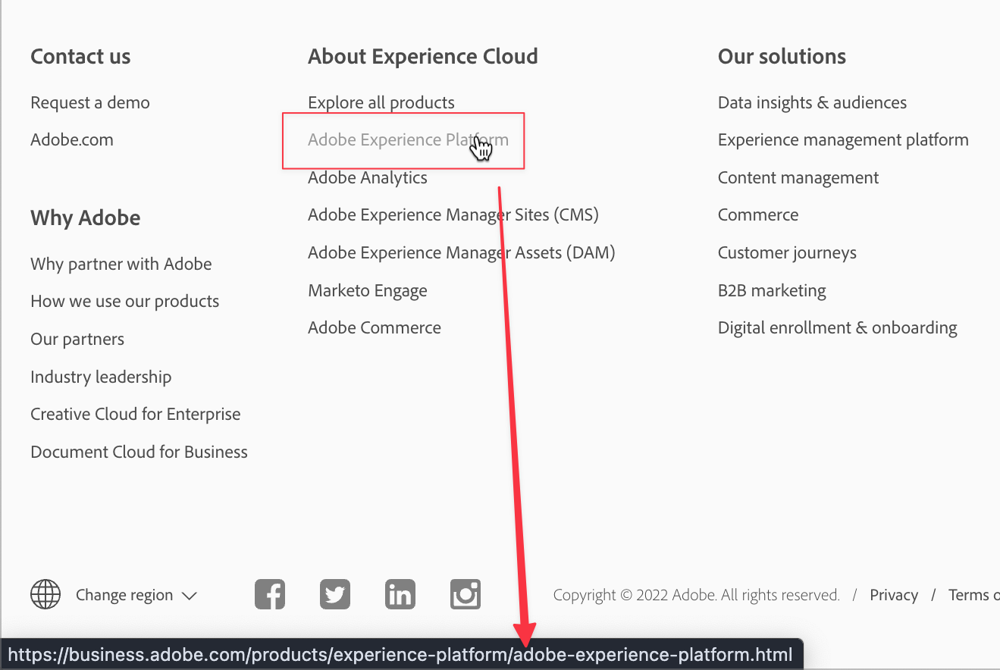

# API 101 - Uma introdução básica às APIs

API significa Application Programming Interface (Interface de programação de aplicativos). Isso significa exatamente o que diz: há interfaces entre programas e essas interfaces permitem que esses programas se comuniquem. Quando os programadores desenvolvem aplicativos de software, eles geralmente precisam de seus softwares para se comunicar com outros softwares ou hardwares. A API define o que, como, quando, onde e por quê dessas comunicações e interações.

As APIs são uma maneira de resolver desafios comerciais com software. Na maioria das empresas, esse é um esforço colaborativo. A colaboração é sempre mais fácil com uma compreensão compartilhada de termos, conceitos e etapas principais.

Se você pensar em clicar em um link em uma página da Web, o navegador usa algumas APIs ao clicar no link. O navegador reconhece o clique, faz a solicitação para a página que você deseja visitar, recupera a página pela Internet e a exibe em sua tela. Há várias etapas menores entre elas, mas seu navegador é um software que se comunica e interage com várias APIs apenas para mostrar uma página da Web. Neste artigo, destacaremos termos, conceitos e etapas importantes ao usar ou discutir APIs.

No final deste artigo, você deverá ter uma compreensão clara desses termos, conceitos e etapas fundamentais. A documentação da API pode ser abrangente e as discussões sobre o uso de APIs para tratar de casos de uso específicos podem ser muito detalhadas. Navegar pela documentação e discutir APIs é mais fácil e produtivo, com fundamentos claros e entendimento compartilhado.

>[!NOTE]
>
> Embora existam muitas APIs, o foco aqui será na Web e nas APIs de navegador: basicamente, quando um aplicativo de software interage com outro pela Internet.

## Termos e conceitos da API

O que uma palavra ou frase significa e como posso pensar sobre isso de forma simples e fácil? Em uma API, a parte &quot;aplicativo&quot; significa um aplicativo de software ou programa. A parte &quot;interface de programação&quot; se refere a como e onde um aplicativo interage com outro aplicativo para determinados fins. Em nosso exemplo de página da Web, ao clicar em um link, o navegador envia uma solicitação a um servidor para a página da Web.



Nesta captura de tela, o cursor do mouse passa sobre o link do Adobe Experience Platform. Na parte inferior está a barra de status do navegador que mostra o &quot;endereço&quot; da página que o navegador obterá. Em outras palavras, clicar no link do Adobe Experience Platform informa ao navegador para &quot;obter essa página para mim para que eu possa vê-la aqui na minha tela&quot;.

Quando um link é clicado, o navegador faz uma solicitação a um servidor para obter uma página. Esta é uma solicitação `GET`, um dos métodos de solicitação comumente usados com APIs da Web. Uma coisa que o navegador precisa para atender à solicitação é o &quot;endereço&quot; da página - onde ele está na Web?

### Partes de um URL


A maioria dos navegadores tem uma &quot;barra de endereços&quot; que mostra parte ou todo o &quot;endereço&quot; de uma página da Web. Quando o navegador &quot;obtém&quot; a página do link clicado, ele exibe o &quot;endereço&quot; da página nessa barra de endereços. Então, qual é o &quot;endereço&quot; de uma página da web?

Esse `https://business.adobe.com/products/experience-platform/adobe-experience-platform.html` acima é o endereço de uma página na Web, e é chamado de URL ou Localizador Uniforme de Recurso. Os URLs podem se referir a uma página como esta, a um arquivo de imagem, a um vídeo ou outros tipos de arquivo.


Esse endereço, o URL, tem partes específicas que são muito relevantes para as APIs da Web e do navegador.

**Esquema**

O `scheme` acima também é chamado de `protocol` com APIs da Web e geralmente é `http` ou `https`. HTTP ou HyperText Transfer Protocol é como os recursos como páginas da Web são transferidos de um servidor Web para um navegador da Web. HTTPS é a versão segura, em que a transferência ocorre pela Internet usando segurança, destinada a impedir interferência com o recurso que está sendo transferido. É comum ver um pequeno ícone de bloqueio na barra de endereços do navegador ao visualizar uma página sobre HTTPS.

Para APIs da Web, as transferências desses recursos ocorrem por meio de solicitações HTTP, ou seja, solicitações por HTTP.

**Hosts e Domínios**

O `business.adobe.com` é o host do recurso que está sendo solicitado. Quando nosso link de exemplo é clicado, o navegador usa essa parte do URL para localizar o servidor onde a página está hospedada. Nem sempre é exatamente o mesmo que o servidor Web, mas em um nível básico, podemos pensar nele como o servidor onde o navegador obterá a página solicitada.

Os nomes de domínio fazem parte do Sistema de nomes de domínio, mais conhecido como DNS. A maioria das pessoas considera `adobe.com` ou `example.com` um &quot;nome de domínio&quot;, mas há partes relevantes para APIs. `www.adobe.com` e `business.adobe.com` podem ser chamados de nomes de domínio, mas as partes `www.` e `business.` são chamadas de subdomínios. As APIs frequentemente interagem com uma URL que inclui um subdomínio como `api.example.com` ou `sub.www.example.com`.

É muito comum ver o termo _host_ se referir a um nome de domínio completo, incluindo qualquer subdomínio como `business.adobe.com`. Também é comum ver os termos _domínio_ ou _nome de domínio_ ao fazer referência a um host sem o subdomínio como `adobe.com`. Memorizar os termos específicos para cada parte e variação de um hospedeiro não é importante aqui. Mas estar ciente de que esses termos são comumente usados é importante para que você possa esclarecer qualquer especificação relevante para seus negócios e discussões.

**Origem**

Origem é outro termo de reconhecimento que está intimamente relacionado às partes de um URL. Em um nível básico, uma origem é aproximadamente o `scheme` mais o `host` mais o `domain` como `https://business.adobe.com`. Valores diferentes geralmente representam origens diferentes, como `https://business.adobe.com` e `http://business.adobe.com` não são a mesma origem porque têm esquemas diferentes. `https://www.adobe.com` e `https://business.adobe.com` também não são a mesma origem em muitos usos devido aos diferentes subdomínios.

**Caminho**

O último bit no exemplo de URL acima é o `path` para o recurso, a página no nosso exemplo. A parte `/products/experience-platform/` geralmente representa pastas ou diretórios no servidor Web. Assim como temos pastas ou diretórios em nossos computadores para documentos e fotos, também temos pastas em servidores da Web para organizar conteúdo. E finalmente, a parte `/adobe-experience-platform.html` é o nome do arquivo—a página da Web.

Há outras partes mais detalhadas de um URL que serão destacadas na próxima parte desta série.

### APIs de terceiros

Às vezes, as APIs da Web são chamadas de APIs de terceiros. Pense nisso como as partes envolvidas em uma transação. No nosso exemplo de link, você — ou, mais especificamente, seu navegador — é a primeira parte na solicitação da página. O servidor Web é o segundo. Então, onde está o terceiro?

É comum que uma página da Web inclua conteúdo ou recursos de outros hosts ou fontes. Nesses casos, quando o navegador começa a exibir a página, ele faz outro conjunto de solicitações para esses outros hosts, ou &quot;terceiros&quot;, que hospedam esses recursos. Isso é muito comum, especialmente para conteúdo de mídia como vídeos ou imagens, mas também para dados que precisam ser atualizados no momento em que são visualizados ou usados. Obter a hora atual do dia, o clima atual ou uma mensagem de boas-vindas personalizada para uma pessoa específica são exemplos em que uma API de terceiros pode fornecer o recurso certo na hora certa. É comum que essas solicitações venham dessas APIs de terceiros.

## Usos comuns de APIs da Web

Além da hora do dia, do clima ou do conteúdo personalizado, há muitos usos para APIs da Web. Plataformas de mídia social como Twitter, TikTok, Facebook, LinkedIn, Snapchat, Pinterest e outros têm uma variedade de APIs que os programadores podem usar com seus aplicativos. E é claro, o Adobe também tem [uma grande variedade de APIs](https://developer.adobe.com/apis) que os programadores usam para que o software possa interagir com produtos e serviços Adobe. Os produtos e serviços de software acessam outros produtos e serviços de software por meio dessas APIs.

## Exemplo de APIs

As APIs de navegador permitem que os programadores interajam diretamente com os recursos do navegador. A API da bateria permite que o software verifique o status da bateria de um dispositivo para que ele possa alertá-lo se necessário. A API da área de transferência permite que o software copie ou cole com a área de transferência do seu dispositivo. A API de tela cheia permite que o software apresente a opção para expandir a exibição para a tela cheia do dispositivo, como o YouTube.

A API de acesso a dados do Adobe Experience Platform é uma API da Web que permite aos programadores acessar e baixar arquivos de conjunto de dados da Adobe Experience Platform para que possam usar os dados do perfil do cliente em seus próprios programas. É muito comum que APIs como essa façam parte de um processo de automação de software em que o software é programado para executar uma sequência de etapas usando várias APIs em combinação. Geralmente, isso pode representar uma economia de custo significativa em comparação à execução manual dessas mesmas etapas.

## Endpoints de API

Quando os programadores &quot;usam&quot; um navegador ou API da Web em seus programas, eles normalmente fazem solicitações para enviar ou receber recursos, como nosso navegador de exemplo solicitando uma página da Web. A documentação da API geralmente lista &quot;pontos de extremidade&quot; para essas solicitações, por exemplo: `https://platform.adobe.io/data/foundation/export/files/{dataSetFileId}`. Esse é o padrão ou &quot;endpoint&quot; específico da API de acesso a dados da plataforma que um programador usará para obter um arquivo de conjunto de dados.

O `{dataSetFileId}` entre chaves representa um valor que o programador precisa enviar na solicitação. Portanto, a URL na solicitação de API real seria semelhante a `https://platform.adobe.io/data/foundation/export/files/xyz123brb`, em que `xyz123brb` precisa ser uma ID válida do arquivo do conjunto de dados que o programador deseja receber.

Em outras palavras, da mesma forma que o navegador obtém uma página em um URL específico, as solicitações de API obtêm recursos de, ou enviam recursos para, um endpoint específico como este exemplo de conjunto de dados.

## métodos de solicitação HTTP

Nesse ponto, deve ficar claro que as APIs da Web fazem solicitações para recursos como páginas da Web ou conjuntos de dados. Como a maioria dos conceitos de software, essas solicitações HTTP seguem padrões repetíveis. Uma solicitação é enviada de um aplicativo de software para outro aplicativo de software que avalia a solicitação e, em seguida, responde: o navegador solicita uma página de um servidor Web e responde com o conteúdo da página.

Todo o processo, da solicitação à resposta, envolve várias etapas menores e muito detalhadas, mas os métodos de solicitação são simples. Os métodos de solicitação definem a operação que está sendo solicitada.

**`GET`**

O método de solicitação `GET` é usado ao solicitar uma resposta que fornece um recurso, como nossa página da Web e exemplos de conjunto de dados. Quando clicamos em um link em um navegador ou tocamos em um link em um dispositivo móvel, estamos fazendo uma solicitação de `GET` nos bastidores.

**`POST`**

O método `POST` envia dados com a solicitação. Pode parecer estranho que uma &quot;solicitação&quot; envie dados, mas a ideia é que fazer a solicitação da API é solicitar ao terminal — o software receptor — que aceite a solicitação e, no caso de um `POST`, que também aceite os dados que estão sendo enviados. Os dados enviados normalmente são gravados em um armazenamento de dados, como um banco de dados ou arquivo, para que possam ser salvos.

**`PUT`**

O método de solicitação `PUT` é semelhante a `POST`, pois envia dados, mas se os dados que estão sendo enviados já existirem no ponto de extremidade, um `PUT` atualizará os dados existentes substituindo-os. Um `POST` não é atualizado, ele simplesmente envia, de modo que várias solicitações de `POST` podem criar vários registros dos dados enviados, em vez de atualizar qualquer registro existente.

**`PATCH`**

O método de solicitação `PATCH` é usado para enviar dados que atualizam parte de um registro existente, como quando alteramos nosso endereço atualizando nosso perfil de conta. Com uma solicitação `POST`, um perfil adicional pode ser criado, e com um `PUT`, o perfil existente pode ser substituído, mas usando o método `PATCH`, simplesmente atualizamos a parte relevante do registro existente, como nosso endereço.

**`DELETE`**

O método de solicitação `DELETE` remove um recurso especificado na solicitação, como se clicássemos em um link para excluir totalmente nosso perfil de conta.

Há vários outros, mas esta é uma lista dos métodos mais comuns ao trabalhar com APIs.

### Exemplo de solicitação

Agora que você tem os termos básicos, conceitos e etapas envolvidos com as APIs, podemos observar um exemplo de solicitação de API na prática.

A página do nosso exemplo de navegador tem uma URL de `https://business.adobe.com/products/experience-platform/adobe-experience-platform.html`. Ao clicar no link do Adobe Experience Platform, o navegador faz uma solicitação `GET` para essa página. Como temos o navegador para fazer o trabalho por nós, basta clicar, mas se um programador quiser que a solicitação aconteça em um aplicativo de software, ele precisará fornecer todos os detalhes necessários para que a solicitação de API seja atendida com êxito.

Veja como isso pode parecer no código:

```js
fetch(
  "https://business.adobe.com/products/experience-platform/adobe-experience-platform.html",
  {
    headers: {
      accept:
        "text/html,application/xhtml+xml,application/xml;q=0.9,image/webp,image/apng,*/*;q=0.8,application/signed-exchange;v=b3;q=0.9",
      "accept-language": "en-US,en;q=0.9",
      "sec-ch-ua":
        '" Not A;Brand";v="99", "Chromium";v="101", "Microsoft Edge";v="101"',
      "sec-fetch-dest": "document",
      "sec-fetch-mode": "navigate",
      "sec-fetch-site": "none",
      "sec-fetch-user": "?1",
      "upgrade-insecure-requests": "1",
    },
    referrerPolicy: "strict-origin-when-cross-origin",
    body: null,
    method: "GET",
    mode: "cors",
    credentials: "include",
  }
);
```

No código acima, você pode ver o `URL` que o navegador está solicitando e, abaixo, perto da parte inferior, está o método de solicitação `method: "GET"`. As outras linhas de código também fazem parte da solicitação, mas estão além do escopo deste artigo.


*[API]: Interface de Programação de Aplicativo
*[URL]: Localizador Uniforme de Recurso
*[HTTP]: Protocolo de Transferência de Hipertexto
*[DNS]: Sistema de Nomes de Domínio
