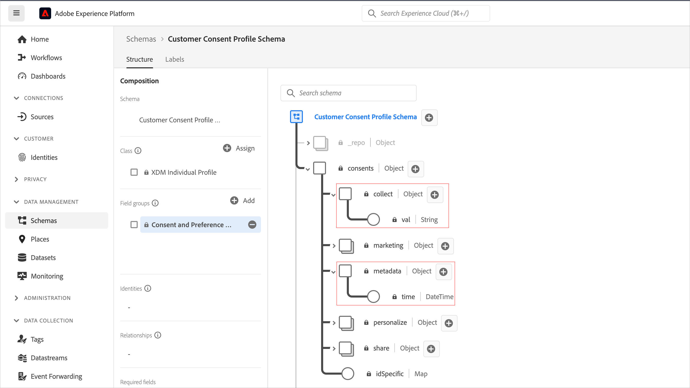
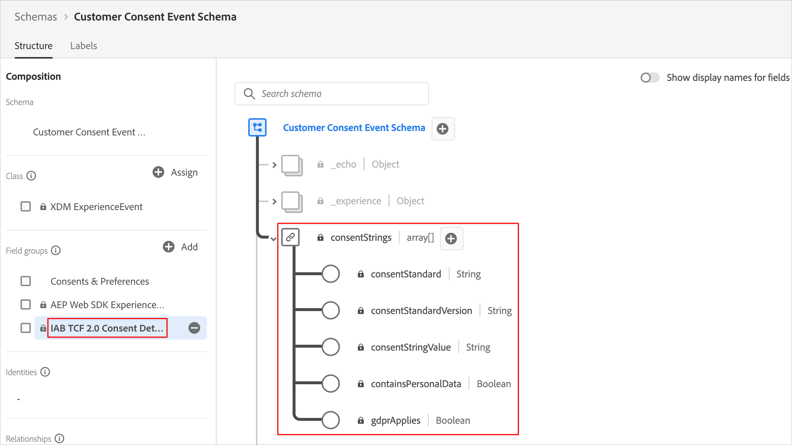
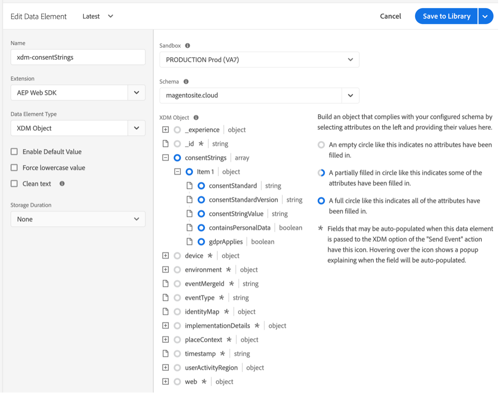

# Implementar o consentimento com uma plataforma de gerenciamento de consentimento (CMP) usando a extensão SDK da Web da plataforma

Muitas regulamentações legais de privacidade introduziram requisitos para consentimento ativo e específico quando se trata de coleta de dados, personalização e outros casos de uso de marketing. Para atender a esses requisitos, o Adobe Experience Platform permite capturar informações de consentimento em perfis de clientes individuais e usar essas preferências como um fator determinante em como os dados de cada cliente são usados nos workflows downstream da plataforma.

>[!NOTE]
>
>O Adobe Experience Platform Launch está sendo integrado à Adobe Experience Platform como um conjunto de tecnologias de coleção de dados. Várias alterações de terminologia foram implementadas na interface do que você deve estar ciente ao usar esse conteúdo:
>
> * O Platform Launch (lado do cliente) agora é **[[!DNL tags]](https://experienceleague.adobe.com/docs/experience-platform/tags/home.html?lang=pt-BR)**
> * O Platform Launch Server Side agora é **[[!DNL event forwarding]](https://experienceleague.adobe.com/docs/experience-platform/tags/event-forwarding/overview.html?lang=pt-BR)**
> * As configurações do Edge agora são **[[!DNL datastreams]](https://experienceleague.adobe.com/docs/experience-platform/edge/fundamentals/datastreams.html?lang=pt-BR)**

Este tutorial demonstra como implementar e ativar os dados de consentimento obtidos de uma Plataforma de gerenciamento de consentimento (CMP) usando a extensão SDK da Web da plataforma em Coleção de dados. Faremos isso usando os padrões Adobe e o padrão de consentimento TCF 2.0 do IAB, com o OneTrust ou o Sourcepoint como CMPs de exemplo.

Este tutorial usa a extensão SDK da Web da Platform para enviar dados de consentimento à Platform. Para obter uma visão geral do SDK da Web, consulte [esta página](https://experienceleague.adobe.com/docs/experience-platform/edge/home.html?lang=pt-BR).

## Pré-requisitos

Os pré-requisitos para usar o SDK da Web estão listados [aqui](https://experienceleague.adobe.com/docs/experience-platform/edge/fundamentals/prerequisite.html?lang=pt-BR#fundamentals).

Nessa página, há um requisito para um &quot;Conjunto de dados de evento&quot; e, como parece, esse é um conjunto de dados para manter os dados do evento da experiência. Para enviar informações de consentimento com eventos, o grupo de campos [Detalhes do consentimento da TCF 2.0 do IAB](https://experienceleague.adobe.com/docs/experience-platform/landing/governance-privacy-security/consent/iab/dataset.html?lang=pt-BR) precisa ser adicionado ao esquema do Evento de experiência:


Para o padrão de consentimento de plataforma v2.0, também precisaremos de acesso ao Adobe Experience Platform para criar um esquema e um conjunto de dados de Perfil individual XDM. Para obter um tutorial sobre a criação de esquemas, consulte [Criar um esquema usando o Editor de Esquemas](https://experienceleague.adobe.com/docs/experience-platform/xdm/tutorials/create-schema-ui.html?lang=pt-BR#tutorials). Para obter o grupo de campos Detalhes sobre Consentimento e Preferência necessário, consulte [Configurar um conjunto de dados para capturar dados de consentimento e de preferência](https://experienceleague.adobe.com/docs/experience-platform/landing/governance-privacy-security/consent/adobe/dataset.html?lang=pt-BR).

Este tutorial presume que você tem acesso à Coleção de dados e criou uma propriedade de Tags do lado do cliente com a extensão SDK da Web instalada e uma biblioteca de trabalho criada e criada para desenvolvimento. Estes tópicos são detalhados e demonstrados nestes documentos:

* [Criar ou configurar uma propriedade](https://experienceleague.adobe.com/docs/experience-platform/tags/admin/companies-and-properties.html?lang=pt-BR#create-or-configure-a-property)
* [Visão geral das bibliotecas](https://experienceleague.adobe.com/docs/experience-platform/tags/publish/libraries.html?lang=pt-BR)
* [Visão geral da publicação](https://experienceleague.adobe.com/docs/experience-platform/tags/publish/overview.html?lang=pt-BR)

Também usaremos a extensão do Chrome [Platform Debugger](https://chrome.google.com/webstore/detail/adobe-experience-platform/bfnnokhpnncpkdmbokanobigaccjkpob) para inspecionar e validar nossa implementação.

Para implementar o exemplo da TCF do IAB com um CMP em seu próprio site, você precisará acessar um CMP como OneTrust ou Sourcepoint para gerar os dados que eles fornecem, ou você pode simplesmente seguir aqui e ver os resultados abaixo.

## Uso do SDK da Web com o Padrão de consentimento de Adobe (v1.0 ou v2.0)

>[!NOTE]
>
>O padrão 1.0 está sendo eliminado em favor da v2.0. O padrão 2.0 permite que você adicione dados de consentimento adicionais, que podem ser usados para aplicar manualmente as preferências de consentimento. As capturas de tela abaixo da extensão SDK da Web da Platform são da versão [2.4.0](https://experienceleague.adobe.com/docs/experience-platform/edge/release-notes.html?lang=pt-BR#version-2.4.0) da extensão compatível com v1.0 ou v2.0 do Padrão de consentimento de Adobe.

Para obter mais informações sobre esses padrões, consulte [Suporte às preferências de consentimento do cliente](https://experienceleague.adobe.com/docs/experience-platform/edge/consent/supporting-consent.html?lang=pt-BR).

### Etapa 1: configurar o consentimento na extensão SDK da Web

Depois de instalarmos a extensão SDK da Web da Platform em uma propriedade de tags, podemos configurar as opções para endereçar dados de consentimento na tela de configuração da extensão:


A seção &quot;Privacidade&quot; define o nível de consentimento para o SDK se o usuário não tiver fornecido preferências de consentimento anteriormente. Isso define o estado padrão para consentimento e coleta de dados do evento no SDK. A configuração escolhida responde à pergunta &quot;o que o SDK deve fazer se o usuário ainda não tiver fornecido preferências de consentimento explícitas?&quot;

* Entrada - Coleta eventos que ocorrem antes de o usuário fornecer preferências de consentimento.
* Fora - Solta eventos que ocorrem antes de o usuário fornecer preferências de consentimento.
* Pendente - Enfileira eventos que ocorrem antes de o usuário fornecer preferências de consentimento.
* Fornecido pelo elemento de dados

Se a configuração de consentimento padrão for &quot;Dentro&quot;, isso informará ao SDK que não deve aguardar o consentimento explícito e que deve coletar os eventos que ocorrem antes que o usuário forneça preferências de consentimento. Normalmente, essas preferências são tratadas e armazenadas em um CMP.

Se a configuração de consentimento padrão for &quot;Fora&quot;, isso informará ao SDK que não deve coletar eventos que ocorram antes da definição das preferências de aceitação do usuário. A atividade do visitante que ocorre antes da definição da preferência de consentimento não será incluída em nenhum dado enviado pelo SDK após a definição do consentimento. Por exemplo, se você rolar e visualizar uma página da Web antes de selecionar o banner de consentimento e essa configuração &quot;Fora&quot; for usada, essa atividade de rolagem e o tempo de exibição não serão enviados se o usuário fornecer consentimento explícito para a coleta de dados posteriormente.

Se a configuração de consentimento padrão for &quot;Pendente&quot;, o SDK enfileirará todos os eventos que ocorrerem antes de o usuário fornecer preferências de consentimento, de modo que os eventos possam ser enviados depois que as preferências de consentimento forem definidas e depois que o SDK for configurado inicialmente durante uma visita.

Com essa configuração &quot;Pendente&quot;, tentar executar qualquer comando que exija preferências de aceitação do usuário (por exemplo, o comando de evento) resultará na fila do comando no SDK. Esses comandos não são processados até que você comunique as preferências de aceitação do usuário ao SDK.

Depois que uma CMP coleta as preferências do usuário, podemos comunicar essas preferências ao SDK. Em uma seção posterior abaixo, veremos como obter esses dados de aceitação e usá-los com a extensão SDK da Web.

&quot;Fornecido por elemento de dados&quot; permite acessar um elemento de dados que contém quaisquer dados de preferência de consentimento capturados pelo código personalizado ou por um CMP no site ou na camada de dados. Um elemento de dados usado para essa finalidade deve resolver como &quot;dentro&quot;, &quot;fora&quot; ou &quot;pendente&quot;.

Observação: essa configuração do SDK não persiste nos perfis dos usuários. Ela é específica para definir o comportamento do SDK antes que as preferências de consentimento explícito sejam fornecidas pelo visitante.

Para saber mais sobre como configurar a extensão SDK da Web, consulte a [Visão geral da extensão SDK da Web da plataforma](https://experienceleague.adobe.com/docs/experience-platform/edge/extension/web-sdk-extension-configuration.html?lang=pt-BR#configure-the-extension) e o [Suporte às preferências de consentimento do cliente](https://experienceleague.adobe.com/docs/experience-platform/edge/consent/supporting-consent.html?lang=pt-BR).

Neste exemplo, vamos escolher a opção para &quot;Pendente&quot; e selecionar **Salvar** para salvar nossas configurações.

### Etapa 2: Comunicando Preferências De Consentimento

Agora que definimos o comportamento padrão do SDK, podemos usar tags para enviar as preferências de consentimento explícito de um visitante para a Platform. O envio de dados de consentimento usando o padrão Adobe 1.0 ou 2.0 é facilmente implementado usando a ação `setConsent` do SDK da Web nas regras de tag.

#### Definição do consentimento com o padrão de consentimento da plataforma 1.0

Vamos criar uma regra para demonstrar isso. Na propriedade da tag da Platform, selecione Regras e, em seguida, no botão azul Adicionar regras. Vamos nomear a regra &quot;setAdobeConsent&quot; e selecionar para adicionar um evento. Para o Tipo de evento, escolha &quot;Janela carregada&quot;, que acionará essa regra sempre que uma página for carregada em nosso site. Em seguida, em &quot;Ações&quot;, selecione &quot;Adicionar&quot; para abrir a tela de configuração de ação. Aqui é onde definiremos os dados de consentimento. Selecione a lista suspensa &quot;Extensão&quot;, selecione &quot;SDK da Web da plataforma&quot;, selecione o &quot;Tipo de ação&quot; e selecione &quot;Definir consentimento&quot;.

Em &quot;Informações de consentimento&quot;, escolha &quot;Preencher um formulário&quot;. Nesta ação de regra, usaremos o SDK da Web para definir o consentimento para o padrão de consentimento Adobe 1.0, preenchendo o formulário exibido:


Podemos optar por transmitir &quot;Entrada&quot;, &quot;Saída&quot; ou &quot;Fornecido pelo elemento de dados&quot; com esta ação Definir consentimento. Um elemento de dados aqui deve resolver para &quot;in&quot; ou &quot;out&quot;.

Neste exemplo, selecionaremos &quot;Em&quot; para indicar que o visitante consentiu em permitir que o SDK da Web envie dados para a Platform. Selecione o botão azul &quot;Manter alterações&quot; para salvar esta ação e, em seguida, &quot;Salvar&quot; para salvar esta regra.

Observação: após a opção de não participação de um visitante do site, o SDK não permitirá que você defina o consentimento dos usuários para no.

As regras de tags podem ser acionadas por vários [eventos](https://experienceleague.adobe.com/docs/experience-platform/tags/extensions/adobe/core/overview.html?lang=pt-BR) predefinidos ou personalizados, que podem ser usados para transmitir esses dados de consentimento no momento adequado durante uma sessão de visitante. No exemplo acima, usamos o evento window loaded para acionar a regra. Em uma seção posterior, usaremos um evento de preferência de consentimento de um CMP para acionar uma ação Definir consentimento. Você pode usar uma ação Definir consentimento em uma regra acionada por qualquer evento que preferir que indique uma configuração de preferência de aceitação.

#### Definição do consentimento com o padrão de consentimento da plataforma 2.0

A versão 2.0 do padrão de consentimento da Platform funciona com dados [XDM](https://experienceleague.adobe.com/docs/platform-learn/tutorials/schemas/schemas-and-experience-data-model.html?lang=pt-BR). Também é necessário adicionar o grupo de campos Detalhes do consentimento e da preferência ao esquema do perfil na Platform. Consulte [Processamento de consentimento na Platform](https://experienceleague.adobe.com/docs/experience-platform/landing/governance-privacy-security/consent/adobe/overview.html?lang=pt-BR) para obter mais informações sobre a versão padrão do Adobe 2.0 e este grupo de campos.

Criaremos um elemento de dados de código personalizado para transmitir dados às propriedades de coleta e metadados do objeto de consentimentos mostrado no esquema abaixo:



Este grupo de campos Consentimentos e Detalhes da Preferência contém campos para o [tipo de dados XDM Consentimentos e Preferências](https://experienceleague.adobe.com/docs/experience-platform/xdm/data-types/consents.html?lang=pt-BR#prerequisites) que conterá os dados de preferência de consentimento que enviamos para a Platform com a extensão SDK da Web da Platform em nossa ação de regra. Atualmente, as únicas propriedades necessárias para implementar o Platform Consent Standard 2.0 são o valor de coleta (val) e o valor de tempo dos metadados, destacados acima em vermelho.

Vamos criar um elemento de dados para esses dados. Selecione Elementos de dados e o botão azul Adicionar elemento de dados. Vamos chamar isso de &quot;xdm-consent 2.0&quot; e, usando a extensão principal, selecionaremos um tipo de código personalizado. Você pode inserir ou copiar e colar os seguintes dados na janela do editor de código personalizado:

```js
var dateString = new Date().toISOString();

return {
  collect: {
    val: "y"
  },
  metadata: {
    time: dateString
  }
}
```

O campo de hora deve especificar quando o usuário atualizou suas preferências de consentimento pela última vez. Estamos criando um carimbo de data e hora aqui como exemplo usando um método padrão no objeto Date do JavaScript. Selecione Salvar para salvar o código personalizado e selecione Salvar novamente para salvar o elemento de dados.

Em seguida, selecione Regras, depois o botão azul Adicionar regra e insira o nome &quot;setConsent onLoad - Consent 2.0&quot;. Vamos escolher o evento Janela carregada como acionador de regra e selecionar Adicionar em Ações. Escolha a Extensão SDK da Web da Platform e, em Tipo de ação, escolha Definir consentimento. O padrão deve ser Adobe e a versão deve ser 2.0. Para Valor, usaremos o elemento de dados que acabamos de criar, que contém os valores de coleta e tempo necessários para enviar à Platform:


Para revisar este exemplo de ação, estamos chamando Definir consentimento da extensão SDK da Web da Platform e transmitindo o Padrão e a Versão do formulário, enquanto transmitem os valores para coletar e tempo do elemento de dados criado anteriormente.

Selecione o botão azul Salvar e novamente para salvar a regra.

Agora temos duas regras, uma para cada padrão de Consentimento da plataforma. Na prática, você provavelmente escolherá um padrão em seu(s) site(s). Em seguida, criaremos um exemplo usando o padrão de consentimento TCF 2.0 do IAB.

## Uso do SDK da Web com o Padrão de consentimento TCF 2.0 do IAB

Você pode saber mais sobre a versão 2.0 da Estrutura de transparência e consentimento do IAB no [site da IAB na Europa](https://iabeurope.eu/transparency-consent-framework/).

Para definir os dados de preferência de consentimento usando esse padrão, precisamos adicionar o grupo de campos de esquema Detalhes do consentimento da TCF 2.0 do IAB ao nosso esquema de Evento de experiência na Platform:



Esse grupo de campos contém os campos de preferência de consentimento exigidos pelo padrão TCF 2.0 do IAB. Para obter mais informações sobre esquemas e grupos de campos, consulte a [Visão geral do sistema XDM](https://experienceleague.adobe.com/docs/experience-platform/xdm/home.html?lang=pt-BR).

### Etapa 1: Criar um elemento de dados de consentimento

Para enviar dados de evento de consentimento das tags usando o padrão de consentimento TCF 2.0 do IAB, primeiro configuramos um elemento de dados xdm com os campos de consentimento necessários:


Na propriedade das tags do lado do cliente, selecione Elementos de dados e o botão azul &quot;Adicionar elemento de dados&quot;. Nomearemos esse elemento de dados como &quot;xdm-consentStrings&quot; neste exemplo. Esses campos xdm conterão os dados de consentimento do usuário necessários para o padrão TCF 2.0 do IAB.

No menu suspenso Extensão, escolha &quot;SDK da Web da Platform&quot; e, para Tipo de elemento de dados, escolha &quot;Objeto XDM&quot;. O mapeador xdm deve ser exibido, permitindo selecionar e expandir o item &quot;consentStrings&quot;, conforme mostrado na captura de tela acima.

Definiremos cada um dos consentStrings da seguinte maneira:

* **`consentStandard`**: `IAB TCF`
* **`consentStandardVersion`**: `2.0`
* **`consentStringValue`**: `%IAB TCF Consent String%`
* **`containsPersonalData`**: `False` (escolhido no botão Selecionar Valor)
* **`gdprApplies`**: `%IAB TCF Consent GDPR%`

Os campos `consentStandard` e `consentStandardVersion` são apenas cadeias de texto para o padrão que estamos usando, que é IAB TCF versão 2.0. `consentStringValue` faz referência a um elemento de dados chamado &quot;Cadeia de Consentimento da TCF do IAB&quot;. Os sinais de porcentagem ao redor do texto indicam o nome de um elemento de dados, e vamos olhar isso daqui a pouco. O campo `containsPersonalData` indica se a cadeia de consentimento da TCF 2.0 do IAB contém dados pessoais com &quot;Verdadeiro&quot; ou &quot;Falso&quot;. O campo `gdprApplies` indica &quot;true&quot; para GDPR aplicado, &quot;false&quot; para GDPR não aplicado ou &quot;undefined&quot; para desconhecido se o GDPR se aplica. Atualmente, o SDK da Web tratará &quot;indefinido&quot; como &quot;true&quot;, de modo que os dados de consentimento enviados com &quot;gdprApplies: undefined&quot; serão tratados como se o visitante estivesse localizado em uma área à qual o GDPR se aplica.

Consulte a [documentação de consentimento](https://experienceleague.adobe.com/docs/experience-platform/edge/consent/iab-tcf/with-launch.html?lang=pt-BR#getting-started) para obter mais informações sobre essas propriedades e sobre a TCF do IAB 2.0 nas tags.

### Etapa 2: Criar uma regra para definir o consentimento com o IAB TCF 2.0 Standard

Em seguida, criamos uma regra para definir o consentimento com o SDK da Web quando os dados de consentimento para esse padrão são definidos ou alterados por um visitante do site. Nesta regra, também veremos como capturar esses sinais de alteração de consentimento de um CMP como [OneTrust](https://www.onetrust.com/products/cookie-consent/) ou [Sourcepoint](https://www.sourcepoint.com/cmp/).

#### Adicionar um evento de regra

Selecione a seção Regras na propriedade da tag Platform e, em seguida, no botão azul Adicionar regra. Vamos nomear a regra setConsent - IAB e selecionar Adicionar em Eventos. Vamos nomear esse evento como tcfapi addEventListener e selecionar Abrir editor para abrir o editor de código personalizado.

Copie e cole o seguinte código na janela do editor:

```js
// Wait for window.__tcfapi to be defined, then trigger when the customer has completed their consent and preferences.
function addEventListener() {
  if (window.__tcfapi) {
    window.__tcfapi("addEventListener", 2, function (tcData, success) {
      if (success && (tcData.eventStatus === "useractioncomplete" || tcData.eventStatus === "tcloaded")) {
        // save the tcData.tcString properties in data elements
        _satellite.setVar("IAB TCF Consent String", tcData.tcString);
        _satellite.setVar("IAB TCF Consent GDPR", tcData.gdprApplies);
        trigger();
      }
    });
  } else {
    // window.__tcfapi wasn't defined. Check again in 100 milliseconds
    setTimeout(addEventListener, 100);
  }
}
addEventListener();
```

Este código simplesmente cria e executa uma função chamada `addEventListener`. A função verifica se o objeto `window.__tcfapi` existe e, em caso positivo, adiciona um ouvinte de eventos de acordo com as especificações da API. Você pode ler mais sobre essas especificações no [repositório IAB](https://github.com/InteractiveAdvertisingBureau/GDPR-Transparency-and-Consent-Framework) no GitHub. Se esse ouvinte de eventos for adicionado com êxito e o visitante do site tiver concluído suas opções de consentimento e preferências, o código definirá as tags, as variáveis personalizadas para a `tcData.tcString` e o indicador para as regiões do GDPR. Novamente, para saber mais sobre a TCF do IAB, consulte o [site](https://iabeurope.eu/transparency-consent-framework/) do IAB e o [repositório do GitHub](https://github.com/InteractiveAdvertisingBureau/GDPR-Transparency-and-Consent-Framework) para obter detalhes técnicos. Após definir esses valores, o código executa a função de acionamento que aciona a execução dessa regra.

Se o objeto `window.__tcfapi` não existia na primeira vez que essa função foi executada, a função verificará novamente a cada 100 milissegundos, para que o ouvinte de eventos possa ser adicionado. A última linha de código simplesmente executa a função `addEventListener` definida nas linhas de código acima dela.

Para resumir, criamos uma função para verificar o status de consentimento que um visitante do site define usando um banner de consentimento CMP (ou personalizado). Quando essa preferência de consentimento é definida, esse código cria duas variáveis personalizadas (elementos de dados de código personalizado) que podemos usar em nossa ação de regra. Depois de colar o código acima na janela do editor de código personalizado do evento, selecione o botão azul Salvar para salvar o evento de regra.

Agora vamos configurar a ação Definir regra de consentimento para usar esses valores e enviá-los para a Platform.

#### Adicionar uma ação de regra

Selecione Adicionar na seção Ações. Em Extensão, escolha SDK da Web da plataforma na lista suspensa. Em Tipo de ação, escolha Definir consentimento. Vamos nomear esta ação como setConsent.

Na configuração da ação em Informações de consentimento, escolha Preencher um formulário. Para Padrão, escolha TCF do IAB e, para Versão, digite 2.0. Para o Valor, usaremos a variável personalizada do nosso evento e inseriremos `%IAB TCF Consent String%`, que vem dos [tcData](https://github.com/InteractiveAdvertisingBureau/GDPR-Transparency-and-Consent-Framework/blob/master/TCFv2/IAB%20Tech%20Lab%20-%20CMP%20API%20v2.md#tcdata) que capturamos em nossa função personalizada de evento de regra acima.

Em GDPR Applies, usaremos a outra variável personalizada do evento e inseriremos `%IAB TCF Consent GDPR%`, que também vem do `tcData` que capturamos em nossa função personalizada de evento de regra acima. Se você souber que o GDPR definitivamente se aplicará ou não aos visitantes deste site, poderá selecionar Sim ou Não, conforme aplicável, em vez de usar a opção de variável personalizada (elemento de dados). Você também pode usar a lógica condicional em um elemento de dados para verificar se o GDPR se aplica e retornar o valor apropriado.

Em GDPR Contém dados pessoais, selecione a opção para indicar se os dados desse usuário contêm dados pessoais. Um elemento de dados aqui deve resolver como verdadeiro ou falso.


Selecione o botão azul Salvar para salvar a ação e o botão azul Salvar (ou Salvar na biblioteca) para salvar a regra. Neste ponto, você implementou com êxito o elemento de dados e a regra nas tags para definir o consentimento usando a extensão SDK da Web com o padrão de consentimento TCF 2.0 do IAB.

### Etapa 3: salvar na biblioteca e criar

Se estiver usando o pré-requisito da [biblioteca de trabalho](https://experienceleague.adobe.com/docs/platform-learn/implement-in-websites/configure-tags/add-data-elements-rules.html?lang=pt-BR#use-the-working-library-feature), você já salvou essas alterações e criou sua biblioteca de desenvolvimento:


### Etapa 4: Inspect e validar a coleta de dados

No nosso site, atualizamos a página e confirmamos a build da biblioteca na extensão do Chrome [Depurador](https://chromewebstore.google.com/detail/adobe-experience-platform/bfnnokhpnncpkdmbokanobigaccjkpob), na seção de menu de tags:


Também podemos inspecionar a chamada setConsent para os padrões Adobe 1.0 ou 2.0 na seção SDK da Web da plataforma de depurador, selecionando na linha do corpo POST na solicitação de rede em que você vê `{"consent":[{"value":{"general":"in"},"version…`:


Para validar a chamada setConsent e nossa regra para o padrão TCF do IAB 2.0, usaremos o banner de consentimento do OneTrust em nosso site de teste para definir nossas preferências de consentimento e criar o tcData descrito anteriormente:


Depois de selecionar &quot;Aceito&quot;, podemos inspecionar a chamada setConsent do padrão IAB TCF 2.0 na seção SDK da Web da plataforma de depurador, selecionando na linha Corpo do POST na solicitação de rede em que você vê `{"consent":[{"value":"someAlphaNumericCharacters…`.


Aqui vemos os dados que configuramos anteriormente em nossos elementos de dados e regra de tag. A propriedade value contém os dados tcString codificados que vimos anteriormente.

O OneTrust, o Sourcepoint e outras CMPs que implementam o padrão IAB TCF 2.0 produzirão dados semelhantes em nossas páginas. Podemos capturar esses dados e usá-los com a extensão SDK da Web em tags usando o evento de código personalizado na regra criada acima. O código personalizado será o mesmo independentemente da CMP usada para gerar os dados do IAB TCF 2.0. O código personalizado também pode ser usado com qualquer um dos padrões de Consentimento da plataforma (1.0 ou 2.0).

## Envio de dados de consentimento com eventos de experiência

Você pode ter notado que não referenciamos o elemento de dados &quot;xdm-consentStrings&quot; criado anteriormente em um campo de elemento de dados em nenhuma de nossas regras. Esse elemento de dados deve ser usado quando você precisar enviar dados de consentimento com um Evento de experiência.



Como esse elemento de dados contém todos os campos necessários para o padrão IAB TCF 2.0, você pode simplesmente fazer referência ao elemento de dados ao enviar esses dados xdm com os Eventos de experiência:


## Conclusão

Agora que inspecionamos e validamos os dados, você deve ver como implementar e ativar os dados de consentimento obtidos de uma CMP usando a extensão SDK da Web da Platform para Platform.
