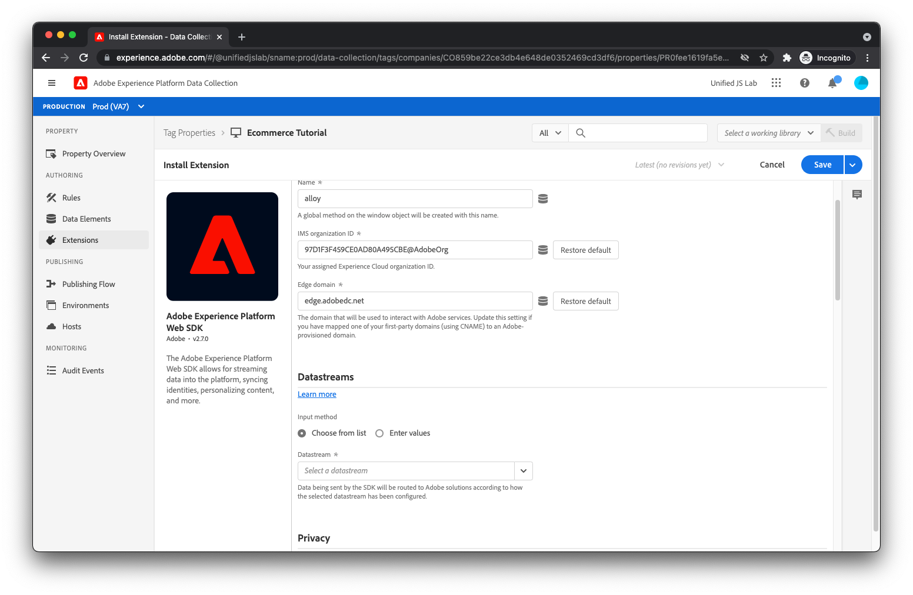

# Criar uma propriedade de tag da Adobe Experience Platform e instalar extensões

Agora que o código na página está enviando dados e eventos para a camada de dados, é hora do profissional de marketing ler os dados da camada de dados e enviar esses dados para a Adobe Experience Platform. Normalmente, isso exigiria duas bibliotecas JavaScript:

* Camada de dados de clientes Adobe: nas etapas anteriores, você criava uma matriz de camada de dados e enviava objetos para ela. Para acessar os dados, você deve carregar a biblioteca JavaScript da Camada de dados do cliente Adobe, que fornece maneiras de ser notificado sobre alterações e eventos da camada de dados e também fornece maneiras simples de acessar os dados.
* Adobe Experience Platform Web SDK: essa biblioteca JavaScript se comunica com a Adobe Experience Platform Edge Network. O SDK lida com identidade, consentimento, coleta de dados, personalização, públicos-alvo e muito mais.

Embora você possa carregar essas bibliotecas individuais no seu site e usá-las diretamente, recomendamos que use [Tags do Adobe Experience Platform](https://experienceleague.adobe.com/docs/experience-platform/tags/home.html?lang=pt-BR). Com as tags, você pode incorporar um único script ao HTML e usar a interface de usuário tags para implantar a Camada de dados do cliente Adobe e o SDK da Web da Adobe Experience Platform. As tags também permitem criar regras para enviar dados, entre outras coisas. Este tutorial usa Tags para essa finalidade e presume que você tenha um entendimento básico de como as Tags operam.

## Criar uma propriedade no Tags

Se ainda não tiver feito, [criar uma propriedade nas Tags](https://experienceleague.adobe.com/docs/experience-platform/tags/admin/companies-and-properties.html#create-or-configure-a-property).

## Instalar a extensão da Camada de dados do cliente Adobe

Instale a extensão Camada de dados do cliente Adobe navegando até o catálogo de extensões, localizando a extensão e clicando na respectiva [!UICONTROL Instalar] botão. Você deve ver uma tela de configuração.

Para este tutorial, não há necessidade de alterar os valores padrão. Clique em [!UICONTROL Salvar].

## Instalar a extensão SDK da Web do Adobe Experience Platform

Em seguida, instale a extensão Adobe Experience Platform Web SDK localizando a extensão no catálogo de extensões e clicando na respectiva [!UICONTROL Instalar] botão. Você deve ver uma tela de configuração.

Entrada [Criar um fluxo de dados](../configure-the-server/create-a-datastream.md), você criou um fluxo de dados que a Rede de borda da Adobe Experience Platform faz referência para determinar para onde enviar seus dados de entrada. Ao fazer solicitações do SDK da Web da Adobe Experience Platform para a Rede de borda, você deve indicar a rede de borda de sequência de dados que deve fazer referência.

Para fazer isso, encontre [!UICONTROL Sequência de dados] e selecione o fluxo de dados criado anteriormente. Você recebeu os mesmos ambientes de sequência de dados que viu em [Criar um fluxo de dados](../configure-the-server/create-a-datastream.md).

Conforme discutido em [Criar um fluxo de dados](../configure-the-server/create-a-dataset.md), esses ambientes de conjunto de dados têm uma relação com ambientes de tags. Por um momento, suponha que você conclua a instalação da extensão SDK da Web da Adobe Experience Platform, crie uma biblioteca de tags que inclua a extensão e, em seguida, publique a biblioteca em um ambiente de desenvolvimento de tags. Quando a biblioteca de tags é carregada em sua página da Web e a extensão SDK da Web da Adobe Experience Platform faz uma solicitação para a Rede de borda, a extensão inclui a [!UICONTROL Ambiente de desenvolvimento] ID de ambiente do fluxo de dados. A Edge Network, por sua vez, usa essa ID para ler a configuração do [!UICONTROL Ambiente de desenvolvimento] ambiente de fluxo de dados e encaminhar dados para os produtos de Adobe apropriados.

No momento, você tem apenas um ambiente de fluxo de dados de desenvolvimento, um ambiente de fluxo de dados de preparo e um ambiente de fluxo de dados de produção. É por isso que a interface do usuário de configuração de extensão mostra todos pré-selecionados e inalteráveis. No entanto, é possível criar vários ambientes de desenvolvimento de fluxo de dados (um para você e um para seu colega de trabalho, talvez) usando a interface do usuário de fluxo de dados. Se você tivesse vários ambientes de fluxo de dados de desenvolvimento, seria possível selecionar qual deles deseja usar para essa propriedade de tag.

Por fim, role para baixo e desmarque [!UICONTROL Ativar a coleta de dados de cliques]. Por padrão, o SDK rastreia automaticamente os links para você. Neste tutorial, no entanto, demonstraremos como você pode rastrear seus próprios cliques em links usando informações de links personalizados.

Clique no link [!UICONTROL Salvar] botão para concluir a instalação da extensão SDK da Web do Adobe Experience Platform.

As extensões apropriadas foram instaladas. Está na hora de criar regras e elementos de dados.
