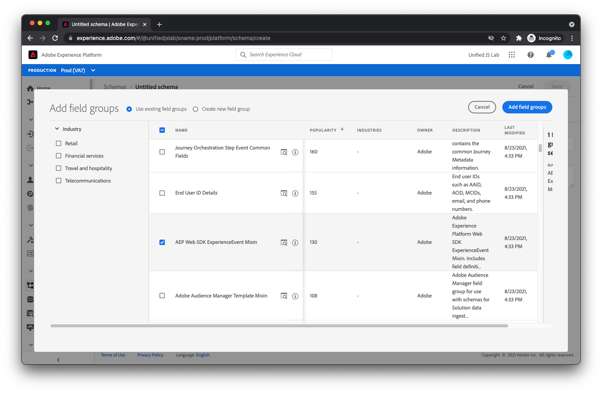

# Criar um esquema

Conforme discutido em [Estruturação dos dados](../structuring-your-data.md), os dados enviados para o Adobe Experience Platform devem estar no XDM. Mais especificamente, seus dados devem corresponder a um _schema_. Um esquema é basicamente uma descrição de como os dados devem ser. Ele descreve os nomes dos campos e onde eles devem estar localizados nos dados. Ele também descreve o tipo de valor que cada campo deve ter (por exemplo, um booleano, uma string com um comprimento de 12 caracteres, uma matriz de números).

O Adobe Experience Platform fornece alguns elementos básicos prontos para uso, conhecidos como grupos de campo, comuns no setor. Por exemplo, para o setor de serviços financeiros, há grupos de campos para transferências de saldo e aplicações de empréstimos. Para o setor de viagens e hospitalidade, há grupos de campo para reservas de voos e hospedagem.

Recomendamos que você use os grupos de campos internos sempre que possível ao criar seu esquema. Também entendemos que você pode precisar de campos específicos para sua própria empresa. Por esse motivo, você pode criar seus próprios grupos de campos personalizados para usar dentro dos esquemas criados.

Vamos analisar a criação de um esquema para um site de comércio eletrônico típico.

Primeiro, navegue até o [!UICONTROL Esquemas] exibir dentro do Adobe Experience Platform.

Selecionar [!UICONTROL Criar esquema] no canto superior direito. Um menu é exibido. Selecionar [!UICONTROL XDM ExperienceEvent].

Nesse ponto, uma caixa de diálogo deve ser exibida perguntando quais grupos de campos você deseja adicionar ao esquema. O primeiro grupo de campos que você deve selecionar é o grupo de campos chamado [!UICONTROL ExperienceEvent do SDK da Web da AEP]. Este grupo de campos adiciona um conjunto de campos que acomoda dados coletados automaticamente pelo Adobe Experience Platform Web SDK.

Como o site deste tutorial é um site de comércio eletrônico, você também deve selecionar a variável [!UICONTROL Detalhes do comércio] grupo de campos. Esse grupo permite enviar dados comerciais típicos, como quais produtos estão sendo visualizados, adicionados ao carrinho e comprados.

Clique em [!UICONTROL Adicionar grupos de campos] na parte superior direita da caixa de diálogo. Nesse ponto, você deve ver a estrutura do esquema.

Os grupos de campos adicionados estão listados à esquerda. Selecionar um grupo de campos destaca os campos à direita que foram fornecidos por esse grupo de campos. Reserve um momento para explorar os campos disponíveis.

Finalmente, selecione [!UICONTROL Esquema sem título] à esquerda da tela, forneça um nome e uma descrição à direita da tela e clique em [!UICONTROL Salvar].

Seu esquema foi criado. Em seguida, vamos aprender a criar um conjunto de dados para armazenar seus dados.

Para obter mais informações sobre a criação de schemas, consulte [Criar um esquema (IU)](https://experienceleague.adobe.com/docs/experience-platform/xdm/tutorials/create-schema-ui.html?lang=pt-BR).
