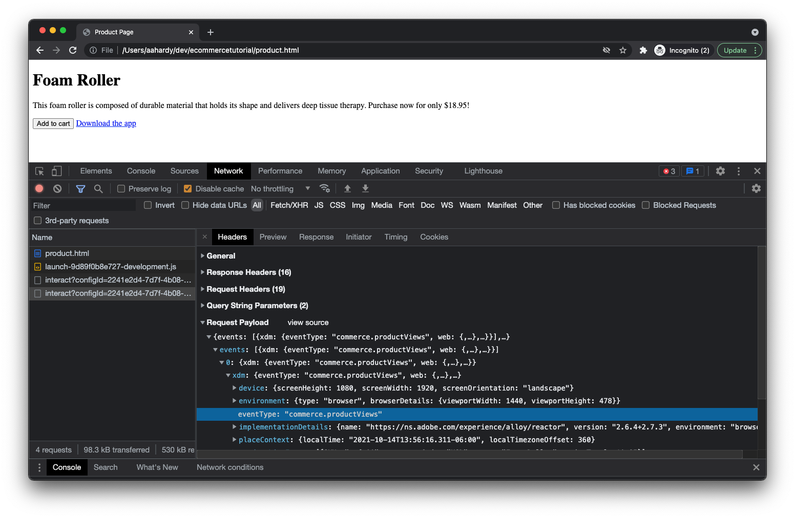

# Testar a implementação

Agora que sua página da Web está configurada e sua biblioteca de tags da Adobe Experience Platform está implantada, é hora de testar a implementação.

Abra a página do produto no navegador. Você pode fazer isso clicando em _Arquivo_ then _Abrir arquivo..._ em seu navegador ou você pode hospedar sua página em um servidor da Web e inserir o URL apropriado.

Depois que a página carregar, você verá algo como o seguinte:

Não é bonito, mas vai fazer o trabalho.

## Inspect os eventos de exibição de página e exibição de produto

Abra as ferramentas do desenvolvedor em seu navegador e clique no painel Rede. Atualize a página.

Nesse ponto, você deve ver quatro solicitações:

1. product.html - sua página da Web.
2. launch-###########-development.js - A biblioteca do Launch.
3. interagir - O evento de exibição de página que está sendo enviado para o servidor.
4. interagir - O evento de exibição de produto que está sendo enviado para o servidor.

Inspecione as cargas de cada solicitação. Para o primeiro `interact` , você poderá ver a carga sendo enviada com um `eventType` de `web.webpagedetails.pageViews`.

Para o segundo `interact` , você poderá ver a carga sendo enviada com um `eventType` de `commerce.productViews`.

Fique à vontade para contornar o resto dos dados enviados, incluindo as informações do produto.

## Inspect o carrinho aberto e adicionar aos eventos do carrinho

Em seguida, clique no botão _Adicionar ao carrinho_ botão.

Você deve ver duas solicitações adicionais, a primeira com um `eventType` de `commerce.productListOpens` (para abrir um novo carrinho) e o segundo com um `eventType` de `commerce.productListAdds` (para adicionar o produto ao carrinho).

## Evento de clique no link do aplicativo de download do Inspect

Dependendo do navegador, clicar em um link que o afaste da página atual pode limpar o painel da rede. Como você deseja inspecionar a solicitação de rede para o evento de clique em links que ocorre antes de sair da página, será necessário configurar o navegador para preservar os logs de rede nas páginas. Isso é feito verificando uma _Preservar log_ caixa de seleção no painel de rede (Chrome, Safari, Edge) ou ao clicar em um ícone de engrenagem e marcar uma _Logs persistentes_ no menu exibido (Firefox).

Em seguida, clique no botão _Baixar o aplicativo_ link .

Você deveria ver mais um `interact` solicitação exibida no painel de rede. Se você inspecionar a solicitação, deverá encontrar um `eventType` de `web.webinteraction.linkClicks` , bem como detalhes sobre o link clicado.

## Verifique se os dados chegam ao conjunto de dados do Adobe Experience Platform

Agora que as solicitações estão sendo enviadas, você também precisará verificar se os dados estão chegando com segurança no conjunto de dados da Adobe Experience Platform criado. Comece navegando até o [!UICONTROL Conjuntos de dados] visualização dentro do Adobe Experience Platform.

Selecione o conjunto de dados criado anteriormente.

Pode ser necessário aguardar alguns minutos, mas em breve você verá indicações de dados serem processados e inseridos em seu conjunto de dados. Você também deve ver se o processamento foi bem-sucedido ou falhou. Se falhar, você poderá ver por que falhou. As falhas normalmente ocorrem porque os dados que você está enviando não correspondem ao esquema e você precisará ajustar seus dados ou esquema de acordo.

## Usar a extensão do Adobe Experience Platform Debugger

Para obter mais informações sobre como sua implementação está se comportando no navegador e nos servidores do Adobe Debugger, verifique a extensão do navegador Adobe Experience Platform Debugger!

[Extensão do Adobe Experience Platform Debugger para Chrome](https://chrome.google.com/webstore/detail/adobe-experience-platform/bfnnokhpnncpkdmbokanobigaccjkpob)

[Extensão do Adobe Experience Platform Debugger para Firefox](https://addons.mozilla.org/pt-BR/firefox/addon/adobe-experience-platform-dbg/)
