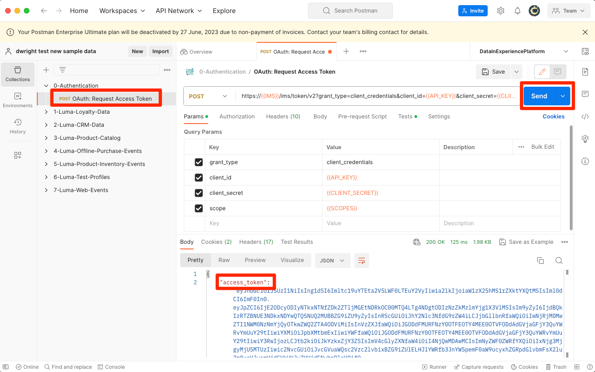
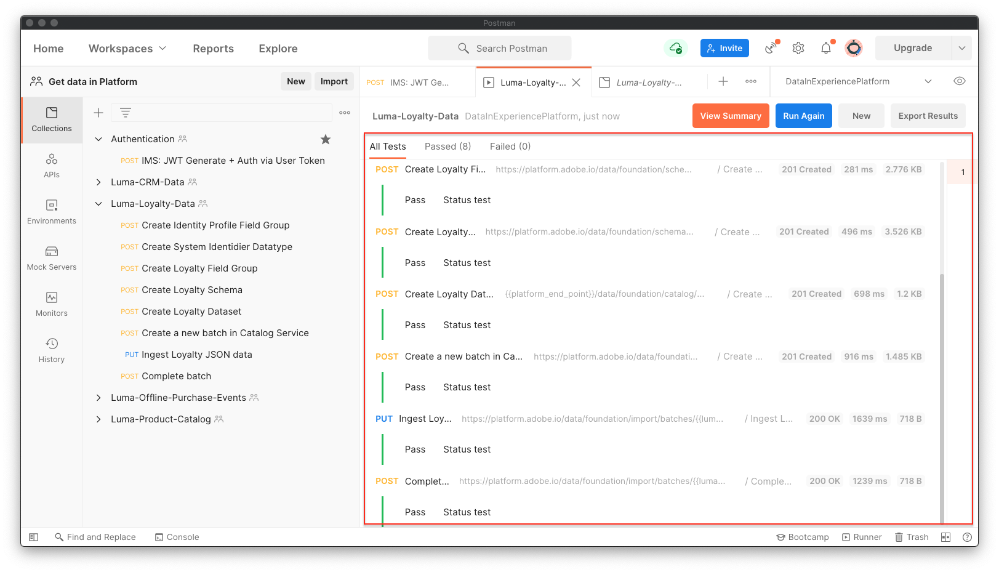

# Importar dados de amostra para a Adobe Experience Platform

Saiba como configurar um ambiente de sandbox da Experience Platform com dados de amostra. Usando uma coleção do Postman, você pode criar grupos de campos, esquemas, conjuntos de dados e, em seguida, importar dados de amostra para a Experience Platform.

## Exemplo de caso de uso de dados

Os usuários empresariais do Experience Platform geralmente precisam percorrer uma série de etapas que incluem a identificação de grupos de campos, a criação de esquemas, a preparação de dados, a criação de conjuntos de dados e a assimilação de dados antes que possam explorar os recursos de marketing oferecidos pelo Experience Platform. Este tutorial automatiza algumas etapas para que você possa colocar os dados em uma sandbox da Platform o mais rápido possível.

Este tutorial se concentra em uma marca fictícia de varejo chamada Luma. Eles investem no Adobe Experience Platform para combinar dados de fidelidade, CRM, catálogo de produtos e compra offline em perfis de clientes em tempo real e ativam esses perfis para elevar o nível do marketing. Geramos dados de amostra para o Luma e, no restante deste tutorial, você importará esses dados para um dos seus ambientes de sandbox do Experience Platform.

>[!NOTE]
>
>O resultado final deste tutorial é uma sandbox contendo dados semelhantes ao [Tutorial de introdução à Adobe Experience Platform para arquitetos de dados e engenheiros de dados](https://experienceleague.adobe.com/docs/platform-learn/getting-started-for-data-architects-and-data-engineers/overview.html?lang=pt-BR). Foi atualizado em abril de 2023 para apoiar a [Desafios do Journey Optimizer](https://experienceleague.adobe.com/docs/journey-optimizer-learn/challenges/introduction-and-prerequisites.html?lang=pt-BR). Ele foi atualizado em junho de 2023 para alternar o método de autenticação para OAuth.

## Pré-requisitos

* Você tem acesso às APIs do Experience Platform e sabe como realizar a autenticação. Caso contrário, reveja este [tutorial](https://experienceleague.adobe.com/docs/platform-learn/tutorials/platform-api-authentication.html?lang=pt-BR).
* Você tem acesso a uma sandbox de desenvolvimento de Experience Platform.
* Você sabe sua ID de locatário do Experience Platform. Você pode obtê-lo fazendo uma autenticação [solicitação de API](https://experienceleague.adobe.com/docs/experience-platform/xdm/api/getting-started.html?lang=en#know-your-tenant_id)
ou extraindo-o do URL ao fazer logon na sua conta da Platform. Por exemplo, no URL a seguir, o locatário é &quot;`techmarketingdemos`&quot; `https://experience.adobe.com/#/@techmarketingdemos/sname:prod/platform/home`.

## Usar [!DNL Postman] {#postman}

### Configurar variáveis de ambiente

Antes de seguir as etapas, verifique se você baixou o [Postman](https://www.postman.com/downloads/) aplicação. Vamos começar!

1. Baixe o [platform-utils-main.zip](../assets/data-generator/platform-utils-main.zip) que contém todos os arquivos necessários para este tutorial.

   >[!NOTE]
   >
   >Dados do usuário contidos na variável [platform-utils-main.zip](../assets/data-generator/platform-utils-main.zip) é fictício e deve ser utilizado apenas para fins de demonstração.

1. Na pasta de downloads, mova o arquivo `platform-utils-main.zip` para o local desejado em seu computador e descompacte-o.
1. No `luma-data` pasta, abra todas as `json` arquivos em um editor de texto e substituir todas as instâncias de `_yourTenantId` com sua própria id de locatário, precedida por um sublinhado.
1. Abertura `luma-offline-purchases.json`, `luma-inventory-events.json`, e `luma-web-events.json` em um editor de texto e atualize todos os carimbos de data e hora para que os eventos ocorram no último mês (por exemplo, procure `"timestamp":"2022-11` e substitui ano e mês)
1. Observe o local da pasta descompactada, conforme necessário posteriormente ao configurar o `FILE_PATH` [!DNL Postman] variável de ambiente:

   >[!NOTE]
   > Para obter o caminho do arquivo no Mac, navegue até o `platform-utils-main` pasta, clique com o botão direito do mouse na pasta e selecione **Obter informações** opção.
   >
   > 

   >[!NOTE]
   > Para obter o caminho do arquivo em suas janelas, clique em para abrir o local da pasta desejada e clique com o botão direito do mouse à direita do caminho na barra de endereços. Copie o endereço para obter o caminho do arquivo.
   > 
   > 

1. Abertura [!DNL Postman] e crie um espaço de trabalho pelo **Espaços de trabalho** menu suspenso:\
   
1. Insira um **Nome** e opcional **Resumo** para seu espaço de trabalho e clique em **Criar espaço de trabalho**. [!DNL Postman] O mudará para o novo espaço de trabalho ao criá-lo.
   
1. Agora ajuste algumas configurações para executar o [!DNL Postman] coleções neste espaço de trabalho. No cabeçalho de [!DNL Postman], clique no ícone de engrenagem e selecione **Configurações** para abrir a modal de configurações. Também é possível usar o atalho de teclado (CMD/CTRL + ,) para abrir a modal.
1. No `General` , atualize o tempo limite da solicitação em ms para `5000 ms` e habilitar `allow reading file outside this directory`
   

   >[!NOTE]
   > Se os arquivos forem carregados no diretório de trabalho, eles serão executados sem problemas nos dispositivos se os mesmos arquivos estiverem armazenados nos outros dispositivos. No entanto, se você quiser executar arquivos de fora do diretório de trabalho, uma configuração deverá ser ativada para declarar a mesma intenção. Se o seu `FILE_PATH` não é o mesmo que [!DNL Postman]caminho do diretório de trabalho do, essa opção deverá estar habilitada.

1. Feche o **Configurações** painel.
1. Selecione o **Ambientes** e selecione **Importar**:
   
1. Importe o arquivo de ambiente json baixado, `DataInExperiencePlatform.postman_environment`
1. No Postman, selecione seu ambiente na lista suspensa no canto superior direito e clique no ícone de olho para exibir as variáveis de ambiente:
   

1. Verifique se as variáveis de ambiente a seguir foram preenchidas. Para saber como obter o valor das variáveis de ambiente, verifique a [Autenticar para APIs Experience Platform](/help/platform/authentication/platform-api-authentication.md) tutorial para obter instruções passo a passo.

   * `CLIENT_SECRET`
   * `API_KEY`—`Client ID` no console Adobe Developer
   * `SCOPES`
   * `TECHNICAL_ACCOUNT_ID`
   * `IMS`
   * `IMS_ORG`—`Organization ID` no console Adobe Developer
   * `SANDBOX_NAME`
   * `TENANT_ID`—certifique-se de iniciar com um sublinhado, por exemplo `_techmarketingdemos`
   * `CONTAINER_ID`
   * `platform_end_point`
   * `FILE_PATH`—usar o caminho da pasta local onde você descompactou o arquivo `platform-utils-main.zip` arquivo. Certifique-se de que inclua o nome da pasta, por exemplo `/Users/dwright/Desktop/platform-utils-main`

1. **Salvar** o ambiente atualizado

### Importar coleções do Postman

Em seguida, é necessário importar as coleções para o Postman.

1. Selecionar **Coleções** e escolha a opção de importação:

   

1. Importe as seguintes coleções:

   * `0-Authentication.postman_collection.json`
   * `1-Luma-Loyalty-Data.postman_collection.json`
   * `2-Luma-CRM-Data.postman_collection.json`
   * `3-Luma-Product-Catalog.postman_collection.json`
   * `4-Luma-Offline-Purchase-Events.postman_collection.json`
   * `5-Luma-Product-Inventory-Events.postman_collection.json`
   * `6-Luma-Test-Profiles.postman_collection.json`
   * `7-Luma-Web-Events.postman_collection.json`

   

### Autenticar

Em seguida, é necessário autenticar e gerar um token de usuário. Esteja ciente de que os métodos de geração de token usados neste tutorial são adequados somente para uso de não produção. A Assinatura local carrega uma biblioteca JavaScript de um host de terceiros e a Assinatura remota envia a chave privada para um serviço da Web de propriedade do Adobe e operado por ele. Embora o Adobe não armazene essa chave privada, as chaves de produção nunca devem ser compartilhadas com ninguém.

1. Abra o `0-Authentication` coleção, selecione a `OAuth: Request Access Token` e clique em `SEND` para autenticar e obter o token de acesso.

   

1. Analise as variáveis de ambiente e observe que a variável `ACCESS_TOKEN` agora está preenchida.

### Importar dados

Agora você pode preparar e importar os dados para a sandbox da Platform. As coleções do Postman que você importou farão todo o trabalho pesado!

1. Abra o `1-Luma-Loyalty-Data` e clique em **Executar** na guia visão geral para iniciar um Collection Runner.

   

1. Na janela do executor de coleção, selecione o ambiente na lista suspensa, atualize o **Atraso** para `4000ms`, verifique a **Salvar respostas** e certifique-se de que a ordem de execução esteja correta. Clique em **Executar Dados De Fidelidade Do Luma** botão

   

   >[!NOTE]
   >
   >**1-Luma-Loyalty-Data** cria um esquema para dados de fidelidade do cliente. O esquema é baseado na classe Perfil individual XDM, grupo de campos padrão, grupo de campos personalizado e tipo de dados. A coleção cria um conjunto de dados usando o esquema e carrega dados de fidelidade do cliente de amostra para a Adobe Experience Platform.

   >[!NOTE]
   >
   >Se alguma solicitação de coleção falhar durante o executor de coleção do Postman, interrompa a execução e execute as solicitações de coleção uma por uma.

1. Se tudo correr bem, todas as solicitações no `Luma-Loyalty-Data` a coleção deve passar.

   

1. Agora vamos fazer logon no [Interface do Adobe Experience Platform](https://platform.adobe.com/) e navegue até os conjuntos de dados.
1. Abra o `Luma Loyalty Dataset` conjunto de dados e na janela de atividade do conjunto de dados, você pode visualizar uma execução em lote bem-sucedida que assimilou 1000 registros. Você também pode clicar na opção de visualização do conjunto de dados para verificar os registros assimilados. Talvez seja necessário aguardar vários minutos para confirmar que 1000 [!UICONTROL Novos fragmentos de perfil] foram criados.
   
1. Repita as etapas 1 a 3 para executar as outras coleções:
   * `2-Luma-CRM-Data.postman_collection.json` cria um esquema e um conjunto de dados preenchido para os dados do CRM dos clientes. O esquema é baseado na classe Perfil individual XDM, que inclui Detalhes demográficos, Detalhes de contato pessoal, Detalhes de preferência e um grupo de campos de identidade personalizado.
   * `3-Luma-Product-Catalog.postman_collection.json` cria um esquema e um conjunto de dados preenchido para informações do catálogo de produtos. O esquema é baseado em uma classe de catálogo de produtos personalizada e usa um grupo de campos de catálogo de produtos personalizado.
   * `4-Luma-Offline-Purchase-Events.postman_collection.json` O cria um esquema e um conjunto de dados preenchido para dados do evento de compra offline de clientes. O esquema é baseado na classe XDM ExperienceEvent e compreende uma identidade personalizada e grupos de campos de Detalhes do comércio.
   * `5-Luma-Product-Inventory-Events.postman_collection.json` cria um esquema e um conjunto de dados preenchido para eventos relacionados a produtos que entram e saem do estoque. O esquema é baseado em uma classe de evento comercial personalizada e um grupo de campos personalizados.
   * `6-Luma-Test-Profiles.postman_collection.json` cria um esquema e um conjunto de dados preenchido com perfis de teste para usar no Adobe Journey Optimizer
   * `7-Luma-Web-Events.postman_collection.json` O cria um esquema e um conjunto de dados preenchido com dados históricos da web simples.

## Validação

Os dados de amostra foram projetados para que, quando as coleções forem executadas, sejam criados Perfis de clientes em tempo real que combinem dados de vários sistemas. Um bom exemplo disso é o primeiro registro dos conjuntos de dados de fidelidade, CRM e compra offline. Procure esse perfil para confirmar se os dados foram assimilados. No [Interface do Adobe Experience Platform](https://experience.adobe.com/platform/):

1. Ir para **[!UICONTROL Perfis]** > **[!UICONTROL Procurar]**
1. Selecionar `Luma Loyalty Id` como o **[!UICONTROL Namespace de identidade]**
1. Pesquisar por `5625458` como o **[!UICONTROL Valor de identidade]**
1. Abra o `Daniel Wright` perfil

>[!TIP]
>
>Se você não vir o perfil, verifique [!UICONTROL Conjuntos de dados] página para confirmar que todos os conjuntos de dados foram criados e assimilados com êxito. Se estiver bom, aguarde quinze minutos e veja se o perfil está disponível no visualizador.  Se houver problemas com a assimilação de dados, verifique as mensagens de erro para tentar localizar o problema. Você também pode tentar ativar os diagnósticos de erro no [!UICONTROL Conjuntos de dados] e arraste e solte o arquivo de dados json para assimilar os dados novamente.

Ao navegar pelos dados na **[!UICONTROL Atributos]** e **[!UICONTROL Eventos]** , você verá que o perfil contém dados dos vários arquivos de dados:

## Próximas etapas

Se você quiser saber mais sobre o Adobe Journey Optimizer, esta sandbox conterá tudo o que você precisa para receber o [Desafios do Journey Optimizer](https://experienceleague.adobe.com/docs/journey-optimizer-learn/challenges/introduction-and-prerequisites.html?lang=pt-BR)

Se você quiser saber mais sobre políticas de mesclagem, governança de dados, serviço de consulta e o construtor de segmentos, vá para [lição 11 do tutorial Introdução aos arquitetos de dados e aos engenheiros de dados](https://experienceleague.adobe.com/docs/platform-learn/getting-started-for-data-architects-and-data-engineers/create-merge-policies.html?lang=en). As lições anteriores deste outro tutorial ensinaram a criar manualmente tudo o que acabou de ser preenchido por essas coleções do Postman — aproveite a vantagem inicial!

Se você quiser criar uma amostra de implementação do SDK da Web para vincular a esta sandbox, passe pelo
[Implementar o Adobe Experience Cloud com o tutorial do SDK da Web](https://experienceleague.adobe.com/docs/platform-learn/implement-web-sdk/overview.html?lang=pt-BR). Depois de definir as lições &quot;Configuração inicial&quot;, &quot;Configuração de tags&quot; e &quot;Configurar Experience Platform&quot; do tutorial do SDK da Web, faça logon no site Luma usando os primeiros dez endereços de email na `luma-crm.json` arquivo usando a senha `test` para ver os fragmentos de perfil mesclados com os dados carregados neste tutorial.

Se você quiser criar um exemplo de implementação do SDK móvel para vincular a esta sandbox, passe pelo
[Tutorial Implementar o Adobe Experience Cloud em aplicativos para dispositivos móveis](https://experienceleague.adobe.com/docs/platform-learn/implement-mobile-sdk/overview.html?lang=pt-BR). Depois de configurar as lições &quot;Configuração inicial&quot;, &quot;Implementação de aplicativo&quot; e &quot;Experience Platform&quot; do tutorial do SDK da Web, faça logon no site Luma usando os primeiros endereços de email no `luma-crm.json` arquivo para ver uma mesclagem de fragmento de perfil com dados carregados neste tutorial.

## Redefinir ambiente de sandbox {#reset-sandbox}

A redefinição de uma sandbox de não produção exclui todos os recursos associados a essa sandbox (esquemas, conjuntos de dados e assim por diante), mantendo o nome da sandbox e as permissões associadas. Essa sandbox &quot;limpa&quot; continua disponível com o mesmo nome para os usuários que têm acesso a ela.

Siga as etapas [aqui](https://experienceleague.adobe.com/docs/experience-platform/sandbox/ui/user-guide.html?lang=en#reset-a-sandbox) para redefinir um ambiente de sandbox.
