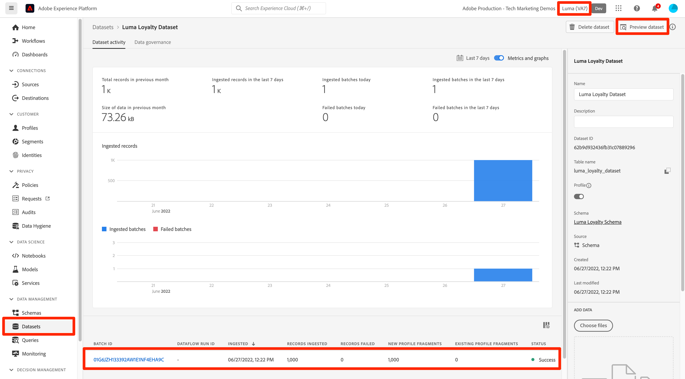

# Importar dados de amostra para o Adobe Experience Platform

Saiba como configurar um ambiente de sandbox da Experience Platform com dados de amostra. Usando uma coleção do Postman, você pode criar grupos de campos, esquemas, conjuntos de dados e, em seguida, importar dados de amostra para a Experience Platform.

## Exemplo de caso de uso de dados

Os usuários empresariais da Experience Platform geralmente precisam passar por uma série de etapas que incluem a identificação de grupos de campos, a criação de esquemas, a preparação de dados, a criação de conjuntos de dados e a assimilação de dados antes que possam explorar os recursos de marketing oferecidos pela Experience Platform. Este tutorial automatiza algumas etapas para que você possa colocar os dados em uma sandbox da Platform o mais rápido possível.

Este tutorial se concentra em uma marca fictícia de varejo chamada Luma. Eles investem no Adobe Experience Platform para combinar dados de fidelidade, CRM, catálogo de produtos e compra offline em perfis de clientes em tempo real e ativam esses perfis para elevar o nível do marketing. Geramos dados de amostra para o Luma e, no restante deste tutorial, você importará esses dados para um dos ambientes da sandbox da Experience Platform.

>[!NOTE]
>
>O resultado final deste tutorial é uma sandbox que contém dados semelhantes ao [tutorial de Introdução à Adobe Experience Platform para arquitetos de dados e engenheiros de dados](https://experienceleague.adobe.com/docs/platform-learn/getting-started-for-data-architects-and-data-engineers/overview.html?lang=pt-BR). Ele foi atualizado em abril de 2023 para oferecer suporte aos [desafios do Journey Optimizer](https://experienceleague.adobe.com/docs/journey-optimizer-learn/challenges/introduction-and-prerequisites.html?lang=pt-BR). Ele foi atualizado em junho de 2023 para alternar o método de autenticação para OAuth.

## Pré-requisitos

* Você tem acesso às APIs do Experience Platform e sabe como realizar a autenticação. Caso contrário, confira este [tutorial](https://experienceleague.adobe.com/docs/platform-learn/tutorials/platform-api-authentication.html?lang=pt-BR).
* Você tem acesso a uma sandbox de desenvolvimento do Experience Platform.
* Você sabe sua ID de locatário do Experience Platform. Você pode obtê-la fazendo uma [solicitação de API](https://experienceleague.adobe.com/docs/experience-platform/xdm/api/getting-started.html?lang=en#know-your-tenant_id) autenticada
ou extraindo-o do URL ao fazer logon na sua conta da Platform. Por exemplo, na URL a seguir, o locatário é &quot;`techmarketingdemos`&quot; `https://experience.adobe.com/#/@techmarketingdemos/sname:prod/platform/home`.

## Usando o [!DNL Postman] {#postman}

### Configurar variáveis de ambiente

Antes de seguir as etapas, verifique se você baixou o aplicativo [Postman](https://www.postman.com/downloads/). Vamos começar!

1. Baixe o arquivo [platform-utils-main.zip](../assets/data-generator/platform-utils-main.zip), que contém todos os arquivos necessários para este tutorial.

   >[!NOTE]
   >
   >Os dados do usuário contidos no arquivo [platform-utils-main.zip](../assets/data-generator/platform-utils-main.zip) são fictícios e devem ser usados apenas para fins de demonstração.

1. Na pasta de downloads, mova o arquivo `platform-utils-main.zip` para o local desejado em seu computador e descompacte-o.
1. Na pasta `luma-data`, abra todos os arquivos do `json` em um editor de texto e substitua todas as instâncias do `_yourTenantId` pela sua ID de locatário, precedida por um sublinhado.
1. Abrir `luma-offline-purchases.json`, `luma-inventory-events.json` e `luma-web-events.json` em um editor de texto e atualizar todos os carimbos de data e hora para que os eventos ocorram no último mês (por exemplo, pesquisar por `"timestamp":"2022-11` e substituir ano e mês)
1. Observe o local da pasta descompactada, conforme necessário posteriormente ao configurar a variável de ambiente `FILE_PATH` [!DNL Postman]:

   >[!NOTE]
   > Para obter o caminho do arquivo em sua Mac, navegue até a pasta `platform-utils-main`, clique com o botão direito do mouse na pasta e selecione a opção **Obter Informações**.
   >
   > 

   >[!NOTE]
   > Para obter o caminho do arquivo em suas janelas, clique em para abrir o local da pasta desejada e clique com o botão direito do mouse à direita do caminho na barra de endereços. Copie o endereço para obter o caminho do arquivo.
   > 
   > 

1. Abra [!DNL Postman] e crie um espaço de trabalho pelo menu suspenso **Espaços de Trabalho**:\
   
1. Insira um **Nome** e um **Resumo** opcional para o seu espaço de trabalho e clique em **Criar Workspace**. [!DNL Postman] mudará para seu novo espaço de trabalho quando você criá-lo.
   
1. Agora ajuste algumas configurações para executar as [!DNL Postman] coleções neste espaço de trabalho. No cabeçalho de [!DNL Postman], clique no ícone de engrenagem e selecione **Configurações** para abrir a modal de configurações. Também é possível usar o atalho de teclado (CMD/CTRL + ,) para abrir a modal.
1. Na guia `General`, atualize o tempo limite da solicitação em ms para `5000 ms` e habilite `allow reading file outside this directory`
   

   >[!NOTE]
   > Se os arquivos forem carregados no diretório de trabalho, eles serão executados sem problemas nos dispositivos se os mesmos arquivos estiverem armazenados nos outros dispositivos. No entanto, se você quiser executar arquivos de fora do diretório de trabalho, uma configuração deverá ser ativada para declarar a mesma intenção. Se o `FILE_PATH` não for o mesmo que o caminho do diretório de trabalho do [!DNL Postman], essa opção deverá ser habilitada.

1. Feche o painel **Configurações**.
1. Selecione os **Ambientes** e selecione **Importar**:
   
1. Importar o arquivo de ambiente json baixado, `DataInExperiencePlatform.postman_environment`
1. No Postman, selecione seu ambiente na lista suspensa no canto superior direito e clique no ícone de olho para exibir as variáveis de ambiente:
   

1. Verifique se as variáveis de ambiente a seguir foram preenchidas. Para saber como obter o valor das variáveis de ambiente, consulte o tutorial [Autenticar para APIs do Experience Platform](/help/platform/api/platform-api-authentication.md) para obter instruções passo a passo.

   * `CLIENT_SECRET`
   * `API_KEY`—`Client ID` no Adobe Developer Console
   * `SCOPES`
   * `TECHNICAL_ACCOUNT_ID`
   * `IMS`
   * `IMS_ORG`—`Organization ID` no Adobe Developer Console
   * `SANDBOX_NAME`
   * `TENANT_ID`—certifique-se de iniciar com um sublinhado, por exemplo `_techmarketingdemos`
   * `CONTAINER_ID`
   * `platform_end_point`
   * `FILE_PATH`—usa o caminho da pasta local onde você descompactou o arquivo `platform-utils-main.zip`. Certifique-se de que inclua o nome da pasta, por exemplo `/Users/dwright/Desktop/platform-utils-main`

1. **Salvar** o ambiente atualizado

### Importar coleções do Postman

Em seguida, é necessário importar as coleções para o Postman.

1. Selecione **Coleções** e escolha a opção de importação:

   

1. Importe as seguintes coleções:

   * `0-Authentication.postman_collection.json`
   * `1-Luma-Loyalty-Data.postman_collection.json`
   * `2-Luma-CRM-Data.postman_collection.json`
   * `3-Luma-Product-Catalog.postman_collection.json`
   * `4-Luma-Offline-Purchase-Events.postman_collection.json`
   * `5-Luma-Product-Inventory-Events.postman_collection.json`
   * `6-Luma-Test-Profiles.postman_collection.json`
   * `7-Luma-Web-Events.postman_collection.json`

   

### Autenticar

Em seguida, é necessário autenticar e gerar um token de usuário. Esteja ciente de que os métodos de geração de token usados neste tutorial são adequados somente para uso de não produção. A Assinatura local carrega uma biblioteca do JavaScript de um host de terceiros e a Assinatura remota envia a chave privada para um serviço da Web de propriedade da Adobe e operado por ela. Embora a Adobe não armazene essa chave privada, as chaves de produção nunca devem ser compartilhadas com ninguém.

1. Abra a coleção `0-Authentication`, selecione a solicitação `OAuth: Request Access Token` e clique em `SEND` para autenticar e obter o token de acesso.

   

1. Revise as variáveis de ambiente e observe que `ACCESS_TOKEN` agora está preenchido.

### Importar dados

Agora você pode preparar e importar os dados para a sandbox da Platform. As coleções do Postman que você importou farão todo o trabalho pesado!

1. Abra a coleção `1-Luma-Loyalty-Data` e clique em **Executar** na guia de visão geral para iniciar um Executor de Coleção.

   

1. Na janela de execução da coleção, selecione o ambiente na lista suspensa, atualize o **Atraso** para `4000ms`, verifique a opção **Salvar respostas** e verifique se a ordem de execução está correta. Clique no botão **Executar Dados de Fidelidade da Luma**

   

   >[!NOTE]
   >
   >**1-Luma-Loyalty-Data** cria um esquema para dados de fidelidade do cliente. O esquema é baseado na classe Perfil individual XDM, grupo de campos padrão, grupo de campos personalizado e tipo de dados. A coleção cria um conjunto de dados usando o esquema e carrega dados de fidelidade do cliente de amostra para a Adobe Experience Platform.

   >[!NOTE]
   >
   >Se alguma solicitação de coleção falhar durante o executor de coleção do Postman, interrompa a execução e execute as solicitações de coleção uma por uma.

1. Se tudo correr bem, todas as solicitações na coleção `Luma-Loyalty-Data` deverão passar.

   

1. Agora vamos fazer logon na [interface do Adobe Experience Platform](https://platform.adobe.com/) e navegar até os conjuntos de dados.
1. Abra o conjunto de dados `Luma Loyalty Dataset` e, na janela de atividade do conjunto de dados, você pode ver uma execução em lote bem-sucedida que assimilou 1000 registros. Você também pode clicar na opção de visualização do conjunto de dados para verificar os registros assimilados. Talvez seja necessário aguardar alguns minutos para confirmar que 1000 [!UICONTROL Novos fragmentos de perfil] foram criados.
   
1. Repita as etapas 1 a 3 para executar as outras coleções:
   * `2-Luma-CRM-Data.postman_collection.json` cria um esquema e um conjunto de dados preenchido para os dados do CRM dos clientes. O esquema é baseado na classe Perfil individual XDM, que inclui Detalhes demográficos, Detalhes de contato pessoal, Detalhes de preferência e um grupo de campos de identidade personalizado.
   * `3-Luma-Product-Catalog.postman_collection.json` cria um esquema e um conjunto de dados preenchido para informações do catálogo de produtos. O esquema é baseado em uma classe de catálogo de produtos personalizada e usa um grupo de campos de catálogo de produtos personalizado.
   * `4-Luma-Offline-Purchase-Events.postman_collection.json` cria um esquema e um conjunto de dados preenchido para dados de eventos de compra offline de clientes. O esquema é baseado na classe XDM ExperienceEvent e compreende uma identidade personalizada e grupos de campos de Detalhes do Commerce.
   * `5-Luma-Product-Inventory-Events.postman_collection.json` cria um esquema e um conjunto de dados preenchido para eventos relacionados a produtos que entram e saem do estoque. O esquema é baseado em uma classe de evento comercial personalizada e um grupo de campos personalizados.
   * `6-Luma-Test-Profiles.postman_collection.json` cria um esquema e conjunto de dados preenchido com perfis de teste para usar no Adobe Journey Optimizer
   * `7-Luma-Web-Events.postman_collection.json` cria um esquema e conjunto de dados preenchido com dados históricos da Web simples.

## Validação

Os dados de amostra foram projetados para que, quando as coleções forem executadas, sejam criados Perfis de clientes em tempo real que combinem dados de vários sistemas. Um bom exemplo disso é o primeiro registro dos conjuntos de dados de fidelidade, CRM e compra offline. Procure esse perfil para confirmar se os dados foram assimilados. Na [interface do Adobe Experience Platform](https://experience.adobe.com/platform/):

1. Ir para **[!UICONTROL Perfis]** > **[!UICONTROL Procurar]**
1. Selecione `Luma Loyalty Id` como o **[!UICONTROL Namespace de identidade]**
1. Procurar `5625458` como **[!UICONTROL Valor de identidade]**
1. Abrir o perfil `Daniel Wright`

>[!TIP]
>
>Se você não vir o perfil, verifique a página [!UICONTROL Conjuntos de dados] para confirmar se todos os conjuntos de dados foram criados e assimilados com êxito. Se estiver bom, aguarde quinze minutos e veja se o perfil está disponível no visualizador.  Se houver problemas com a assimilação de dados, verifique as mensagens de erro para tentar localizar o problema. Você também pode tentar habilitar diagnósticos de erro na página [!UICONTROL Conjuntos de dados] e arrastar e soltar o arquivo de dados json para assimilar os dados novamente.

Ao navegar pelos dados nas guias **[!UICONTROL Atributos]** e **[!UICONTROL Eventos]**, você verá que o perfil contém dados dos vários arquivos de dados:

## Próximas etapas

Se você quiser saber mais sobre o Adobe Journey Optimizer, esta sandbox contém tudo o que você precisa para enfrentar os [desafios do Journey Optimizer](https://experienceleague.adobe.com/docs/journey-optimizer-learn/challenges/introduction-and-prerequisites.html?lang=pt-BR)

Se você quiser saber mais sobre políticas de mesclagem, governança de dados, serviço de consulta e o construtor de segmentos, vá para a [lição 11 do tutorial Introdução aos arquitetos de dados e engenheiros de dados](https://experienceleague.adobe.com/docs/platform-learn/getting-started-for-data-architects-and-data-engineers/create-merge-policies.html?lang=en). As lições anteriores deste outro tutorial ensinaram a criar manualmente tudo o que acabou de ser preenchido por essas coleções do Postman — aproveite a vantagem inicial!

Se você quiser criar uma amostra da implementação do Web SDK para vincular a esta sandbox, passe pelo
[Tutorial sobre Implementação do Adobe Experience Cloud com Web SDK](https://experienceleague.adobe.com/docs/platform-learn/implement-web-sdk/overview.html?lang=pt-BR). Depois de definir as lições de &quot;Configuração inicial&quot;, &quot;Configuração de tags&quot; e &quot;Configurar o Experience Platform&quot; do tutorial do Web SDK, faça logon no site do Luma usando os primeiros dez endereços de email no arquivo `luma-crm.json` usando a senha `test` para ver a mesclagem dos fragmentos de perfil com os dados carregados neste tutorial.

Se você quiser criar um exemplo de implementação do Mobile SDK para vincular a esta sandbox, passe pelo
[Tutorial Implementar o Adobe Experience Cloud em aplicativos para dispositivos móveis](https://experienceleague.adobe.com/docs/platform-learn/implement-mobile-sdk/overview.html?lang=pt-BR). Depois de configurar as lições &quot;Configuração inicial&quot;, &quot;Implementação de aplicativo&quot; e &quot;Experience Platform&quot; do tutorial do Web SDK, faça logon no site do Luma usando os primeiros endereços de email no arquivo `luma-crm.json` para ver uma mesclagem de fragmento de perfil com dados carregados neste tutorial.

## Redefinir ambiente de sandbox {#reset-sandbox}

A redefinição de uma sandbox de não produção exclui todos os recursos associados a essa sandbox (esquemas, conjuntos de dados e assim por diante), mantendo o nome da sandbox e as permissões associadas. Essa sandbox &quot;limpa&quot; continua disponível com o mesmo nome para os usuários que têm acesso a ela.

Siga as etapas [aqui](https://experienceleague.adobe.com/docs/experience-platform/sandbox/ui/user-guide.html?lang=en#reset-a-sandbox) para redefinir um ambiente de sandbox.
