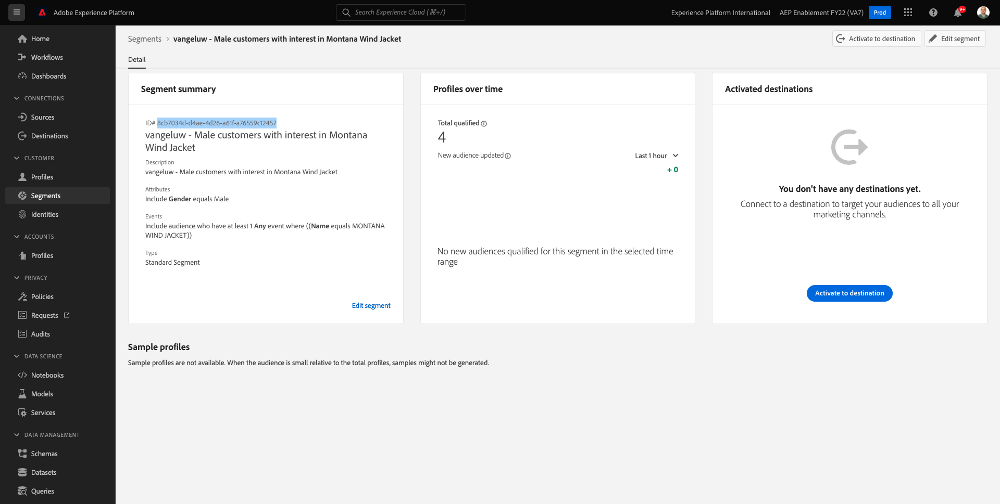
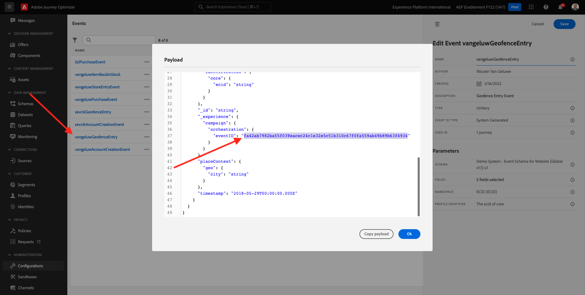
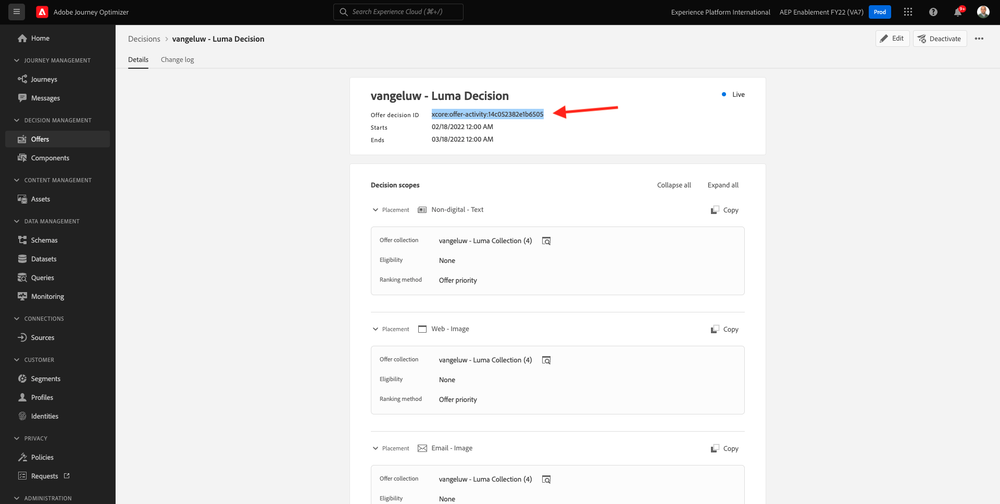
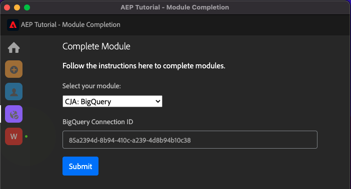
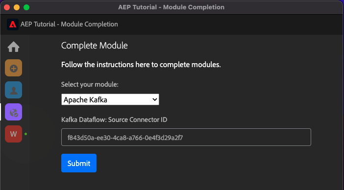

# Tutorial técnico abrangente para Adobe Experience Platform - Como a conclusão é medida?

Você pode atualizar a conclusão do Tutorial técnico abrangente para o Adobe Experience Platform usando a extensão do Chrome criada.

Depois de seguir as instruções no Módulo 0, você entrou no **ID de configuração** na extensão do Chrome e você se inscreveu. Sua extensão do Chrome agora deve ser semelhante a esta. Clique no ícone violeta para enviar a conclusão de um módulo.

Você verá isso:

Ao abrir o menu suspenso, você pode selecionar qual módulo deseja concluir:

Para concluir um módulo, você deve fornecer uma prova de conclusão.

Abaixo estão as provas esperadas de conclusão para cada módulo.

## Introdução

A prova esperada de conclusão do módulo **Introdução** é a ID do projeto Demo System para Web que você criou.

A ID do projeto do Demo System para o formato da Web é semelhante a: `--demoProfileLdap-- - OCUC`.

Selecionar **Introdução** no menu suspenso , digite o **ID do projeto Demo System** e clique no botão **Enviar** - botão.

## Coleta de dados e SDK da Web

A prova esperada de conclusão do módulo **Coleta de dados e SDK da Web** é o nome da propriedade de Coleta de dados para web.

O nome da propriedade Data Collection para o formato da Web é semelhante a este: `--demoProfileLdap-- - Demo System (05/02/2022) (enablement) 1644046719474`.

Selecionar **Coleta de dados e SDK da Web** no menu suspenso , digite o **Nome da propriedade da coleção de dados para web** e clique no botão **Enviar** - botão.

## Assimilação de dados

A prova esperada de conclusão do módulo **Assimilação de dados** é a ID do conjunto de dados para os 2 conjuntos de dados criados por você.

O formato da ID do conjunto de dados tem esta aparência: **5f069724723ef41916a8b5d2**.

`--demoProfileLdap-- - Demo System - Event Dataset for Website`

`--demoProfileLdap-- - Demo System - Profile Dataset for Website`

Selecionar **Assimilação de dados** no menu suspenso , digite o **ID do conjunto de dados** para ambos os conjuntos de dados nos campos de entrada e clique no botão **Enviar** - botão.

## Perfil do cliente em tempo real

A prova esperada de conclusão do módulo **Perfil do cliente em tempo real** é **ID do segmento** do segmento criado por meio da interface do usuário, `--demoProfileLdap-- - Male customers with interest in Montana Wind Jacket`.

O formato da ID do segmento tem esta aparência: **8cb7034d-d4ae-4d26-a61f-a76559c12457**.

Selecionar **Perfil do cliente em tempo real** no menu suspenso , digite o **ID do segmento** no campo de entrada e clique no botão **Enviar** - botão.

## Serviço de query

A prova esperada de conclusão do módulo **Serviço de query** é a ID do conjunto de dados para seu `--demoProfileLdap--_callcenter_interaction_analysis` - conjunto de dados obtido após concluir o módulo.

O formato tem esta aparência: **62076f68f14a9d194995d4e2**.

Selecionar **Serviço de query** no menu suspenso , digite o **ID do conjunto de dados** no campo de entrada e clique no botão **Enviar** - botão.

## Serviços inteligentes

A prova esperada de conclusão do módulo **Serviços inteligentes** é a ID do **Serviço de AI do cliente de propensão de compra do produto**.

O formato tem esta aparência: **12729** e você pode recuperá-lo do URL depois de ter aberto seu serviço.

Selecionar **Serviços inteligentes** no menu suspenso , digite o **ID do Serviço de IA do cliente** no campo de entrada e clique no botão **Enviar** - botão.

## Real-Time CDP

A prova esperada de conclusão do módulo **Real-Time CDP** é a ID do **Atividade do Adobe Target**.

O formato tem esta aparência: **11804**.

Selecionar **Real-Time CDP** no menu suspenso , digite o **ID de atividade do Adobe Target** no campo de entrada e clique no botão **Enviar** - botão.

## AJO: Orquestração

A prova esperada de conclusão do módulo **AJO: Orquestração** é a eventID para seu `--demoProfileLdap--AccountCreationEvent`.

O formato tem esta aparência: **227402c540eb8f8855c6b2333adf6d54d7153d9d7d56fa475a686081c57473 6**.

Selecionar **AJO: Orquestração** no menu suspenso , digite sua ** eventID** no campo de entrada e clique no botão **Enviar** - botão.

## AJO: Ações personalizadas

A prova esperada de conclusão do módulo **AJO: Ações personalizadas** é a eventID para o seu evento `--demoProfileLdap--GeofenceEntry`.

O formato tem esta aparência: **fa42ab7982ba55f039eacec24c1e32e5c51b310c67f0fa559ab49b89b63f4934**.

Selecionar **AJO: Ações personalizadas** no menu suspenso , digite o **eventID** no campo de entrada e clique no botão **Enviar** - botão.

## AJO: Ofertas

A prova esperada de conclusão do módulo **AJO: Ofertas** é a ID do **Decisão da oferta** que você criou.

Você pode encontrar a variável **ID de decisão da oferta**, que se parece com isto **xcore:offer-activity:1122fcc4603ea499**, aqui:

Selecionar **AJO: Ofertas** no menu suspenso , digite o **ID de decisão da oferta** no campo de entrada e clique no botão **Enviar** - botão.

## AJO: Eventos

A prova esperada de conclusão do módulo **AJO: Eventos** é a eventID para seu `--demoProfileLdap--StoreEntryEvent`.

O formato tem esta aparência: **e3a8f0bdc0b609667cd96a72a6b1e5aafa0ddaf6ccf121c574e6a2030860a633**.

Selecionar **AJO: Eventos** no menu suspenso , digite o **eventID** no campo de entrada e clique no botão **Enviar** - botão.

## CJA

A prova esperada de conclusão do módulo **CJA** é a ID do projeto `--demoProfileLdap-- - Omnichannel Analysis`.

O formato tem esta aparência: **6217344f6249ac70c726db60**, você pode encontrá-lo no URL quando tiver aberto o projeto.

Selecionar **CJA** no menu suspenso , digite o **ID do projeto** no campo de entrada e clique no botão **Enviar** - botão.

## CJA: BigQuery

A prova esperada de conclusão do módulo **CJA: BigQuery** é a ID do **BigQuery**-conexão.

Você pode encontrar a variável **ID da Conexão BigQuery**, que se parece com isto **85a2394d-8b94-410c-a239-4d8b94b10c38**, aqui:

Selecionar **CJA: BigQuery** no menu suspenso , digite o **ID da Conexão BigQuery** no campo de entrada e clique no botão **Enviar** - botão.

## RTCDP: EventHub

A prova esperada de conclusão do módulo **RTCDP: EventHub** é a ID do **Hub de Eventos do Microsoft Azure** no Adobe Experience Platform.

Você pode encontrar a variável **ID de Destino do Hub de Eventos do Microsoft Azure**, que se parece com isto **fa3f7ce5-86fd-4096-bf7c-e586fdc096ba**, aqui:

Selecionar **RTCDP: EventHub** no menu suspenso , digite o **ID de Destino do Hub de Eventos do Microsoft Azure** no campo de entrada e clique no botão **Enviar** - botão.

## Conexões RTCDP

A prova esperada de conclusão do módulo **Conexões RTCDP** é seu **ID de propriedade do encaminhamento de eventos**.

Você pode encontrar a variável **ID de propriedade do encaminhamento de eventos**, que se parece com isto **PR40f44184c88472e9c19d8d602aab0de**, aqui:

Selecionar **Conexões RTCDP** no menu suspenso , digite o **ID de propriedade do encaminhamento de eventos** no campo de entrada e clique no botão **Enviar** - botão.

## Apache Kafka

A prova esperada de conclusão do módulo **Apache Kafka** é a ID do conector de origem `--demoProfileLdap-- - Kafka`.

A ID tem esta aparência **f843d50a-ee30-4ca8-a766-0e4f3d29a2f7** e você pode encontrá-lo aqui:

Selecionar **Apache Kafka** no menu suspenso , digite o **ID de fluxo** no campo de entrada e clique no botão **Enviar** - botão.

[Voltar para todos os módulos](./overview.md)
