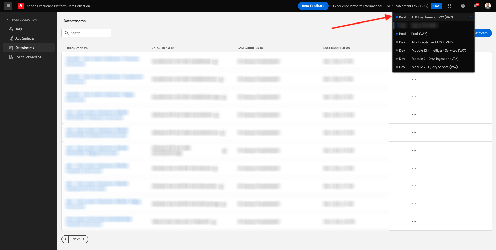
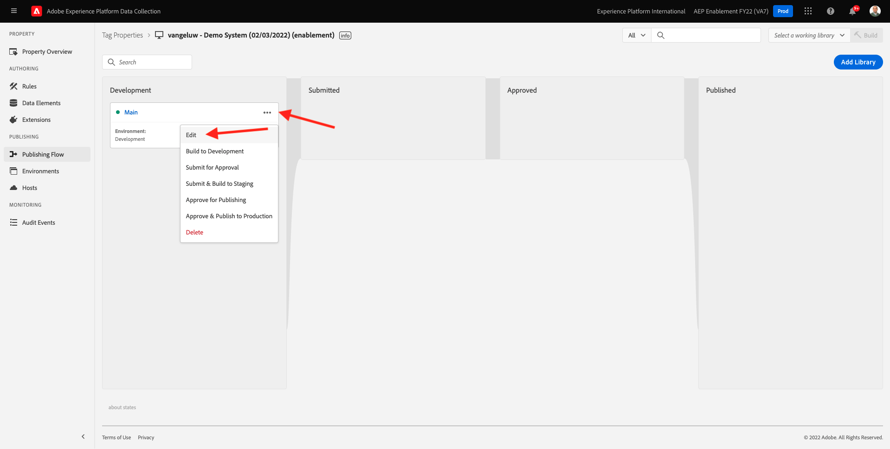

# 0.3 Criar o conjunto de dados

Ir para [https://experience.adobe.com/#/data-collection/](https://experience.adobe.com/#/data-collection/). Após o exercício anterior, você tem duas propriedades de Coleta de dados: um para web e outro para celular.

Essas propriedades estão quase prontas para serem usadas, mas antes de começar a coletar dados usando essas propriedades, é necessário configurar um conjunto de dados. Você obterá mais informações sobre o conceito do que é um armazenamento de dados e o que ele significa no Exercício 1.2.

Por enquanto, siga estes passos.

## 0.3.1 Criar seu conjunto de dados para a Web

Clique em **[!UICONTROL Datastreams]** ou **[!UICONTROL Datastreams (Beta)]**.

No canto superior direito da tela, selecione o nome da sandbox, que deve ser `--aepSandboxId--`.

Clique em **[!UICONTROL Novo fluxo de dados]**.

Para o **[!UICONTROL Nome amigável]** e para a descrição opcional, insira `--demoProfileLdap-- - Demo System Datastream`. Para Esquema de evento, selecione **Sistema de demonstração - Esquema de evento para site (Global v1.1)**. Clique em **Salvar**.

Você verá isso. Clique em **Adicionar Serviço**.

Selecionar o serviço **[!UICONTROL Adobe Experience Platform]**, que exporá campos adicionais. Você verá isso.

Para Conjunto de dados do evento, selecione **Sistema de demonstração - Conjunto de dados do evento para site (Global v1.1)** e para Conjunto de dados de perfil, selecione **Sistema de demonstração - Conjunto de dados de perfil para site (Global v1.1)**. Clique em **Salvar**.

Você verá isso agora.

É isso por enquanto. Em [Módulo 1](./../module1/data-ingestion-launch-web-sdk.md) você aprenderá mais sobre o SDK da Web e como configurar todos os seus recursos.

No menu esquerdo, clique em **[!UICONTROL Tags]**.

Filtre os resultados da pesquisa para ver suas duas propriedades de Coleta de dados. Abra a propriedade para **Web** clicando nele.

Você verá isso. Clique em **Extensões**.

Na extensão Adobe Experience Platform Web SDK, clique em **Configurar**.

Você verá isso. Para **Datastreams**, você verá um valor fictício definido como 1. Agora, é necessário clicar no botão **Escolher na lista** botão de opção. Na lista suspensa, selecione o Datastream criado anteriormente.

Certifique-se de ter selecionado o **Datastream**. DICA: Você pode filtrar os resultados na lista suspensa facilmente digitando seu `--demoProfileLdap--`.

Role para baixo até ver **Coleta de dados**. Certifique-se de que a caixa de seleção de **Ativar coleta de dados de clique** não está ativado. Clique em **Salvar** para salvar as alterações.

Ir para **Fluxo de publicação**.

Clique no botão **...** para **Principal**, depois clique em **Editar**.

Clique em **Adicionar todos os recursos alterados** e, em seguida, clique em **Salvar e criar para desenvolvimento**.

Suas alterações estão sendo publicadas e estarão prontas em alguns minutos.

## 0.3.2 Criar o conjunto de dados para dispositivos móveis

Ir para [https://experience.adobe.com/#/data-collection/](https://experience.adobe.com/#/data-collection/).

Clique em **[!UICONTROL Datastreams]** ou **[!UICONTROL Datastreams (Beta)]**.

No canto superior direito da tela, selecione o nome da sandbox, que deve ser `--aepSandboxId--`.

Clique em **[!UICONTROL Novo fluxo de dados]**.

Para o **[!UICONTROL Nome amigável]** e para a descrição opcional, insira `--demoProfileLdap-- - Demo System Datastream (Mobile)`. Para Esquema de evento, selecione **Sistema de demonstração - Esquema de evento para aplicativo móvel (Global v1.1)**. Clique em **Salvar**.

Clique em **[!UICONTROL Salvar]**.

Você verá isso. Clique em **Adicionar Serviço**.

Selecionar o serviço **[!UICONTROL Adobe Experience Platform]**, que exporá campos adicionais. Você verá isso.

Para Conjunto de dados do evento, selecione **Sistema de demonstração - Conjunto de dados do evento para aplicativo móvel (Global v1.1)** e para Conjunto de dados de perfil, selecione **Sistema de demonstração - Conjunto de dados de perfil para aplicativo móvel (Global v1.1)**. Clique em **Salvar**.

Você verá isso.

Seu conjunto de dados agora está pronto para ser usado na propriedade do cliente de coleta de dados do Adobe Experience Platform para dispositivos móveis.

Ir para **Tags** e filtre os resultados da pesquisa para ver suas duas propriedades de Coleta de dados. Abra a propriedade para **Celular** clicando nele.

Você verá isso. Clique em **Extensões**.

No **Rede de borda Adobe Experience Platform** extensão, clique em **Configurar**.

Você verá isso. Agora é necessário selecionar a sandbox e o conjunto de dados corretos que você acabou de configurar. A sandbox a ser usada é `--aepSandboxId--` e o armazenamento de dados é chamado `--demoProfileLdap-- - Demo System Datastream (Mobile)`.

Para o **Domínio de rede de borda**, use o domínio padrão que é **edge.adobedc.net**.

Clique em **Salvar** para salvar as alterações.

Ir para **Fluxo de publicação**.

Clique no botão **...** ao lado de **Principal**, depois clique em **Editar**.

Clique em **Adicionar todos os recursos alterados**, depois clique em **Salvar e criar para desenvolvimento**.

Suas alterações estão sendo publicadas e estarão prontas em alguns minutos.

Próxima etapa: [0.4 Usar o site](./ex4.md)

[Voltar ao Módulo 0](./getting-started.md)

[Voltar para todos os módulos](./../../overview.md)