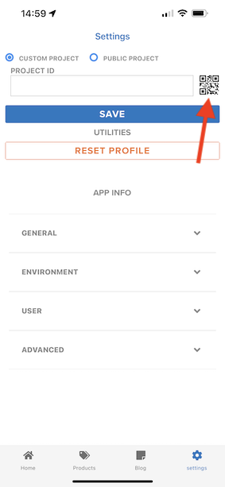

# 0.5 Usar o aplicativo móvel

## 0.5.1 Baixar o aplicativo

Ir para [https://bit.ly/dx-demo-app](https://bit.ly/dx-demo-app) no computador. Você verá isso.

Use o **Câmera** aplicativo em seu smartphone para instalar o aplicativo móvel para o sistema operacional do seu dispositivo. Para essa ativação, é necessário instalar o **Versão 2.x** que usa os SDKs do Adobe Experience Platform Mobile.

>[!NOTE]
>
>Depois de instalar o aplicativo pela primeira vez em um dispositivo iOS, você pode receber uma mensagem de erro ao tentar abrir o aplicativo, que diz: **Desenvolvedor corporativo não confiável**. Para corrigir isso, você precisa acessar **Configurações > Geral > Gerenciamento de dispositivos > Adobe Systems Inc.** e clique em **Trust Adobe Systems Inc.**.

Depois que o aplicativo for instalado, você o encontrará na tela inicial do seu dispositivo. Clique no ícone para abrir o aplicativo.

Ao usar o aplicativo pela primeira vez, você será solicitado a fazer logon usando sua Adobe ID. Conclua o processo de logon.

Depois de fazer logon, você verá uma notificação solicitando sua permissão para enviar notificações. Enviaremos notificações como parte do tutorial, portanto, clique em **Permitir**.

Você verá a página inicial do aplicativo. Ir para **Configurações**.

Nas configurações, você verá que atualmente uma **Projeto público** é carregada no aplicativo. Clique em **Projeto personalizado**.

Agora é possível carregar um projeto personalizado. Clique no código QR para carregar facilmente seu projeto.

Após o exercício 0.1, teve este resultado. Clique para abrir o **Projeto de varejo móvel** que foi criado para você.

Caso tenha fechado acidentalmente a janela do navegador, ou para futuras sessões de demonstração ou ativação, também é possível acessar o projeto do site indo até [https://builder.adobedemo.com/projects](https://builder.adobedemo.com/projects). Depois de fazer logon com sua Adobe ID, você verá isso. Clique no projeto do aplicativo móvel para abri-lo.

Você verá isso. Clique em **Integrações**.

É necessário selecionar a propriedade Coleta de dados para dispositivos móveis que foi criada no exercício 0.1. Em seguida, clique em **Executar**.

Você verá esse pop-up, que contém um código QR. Verifique este código QR no aplicativo móvel.

Em seguida, você verá a ID do projeto exibida no aplicativo, depois de clicar em **Salvar**.

Agora, volte para **Início** no aplicativo. Seu aplicativo está pronto para ser usado.

Você concluiu o módulo 0.

[Voltar ao Módulo 0](./getting-started.md)

[Voltar para todos os módulos](./../../overview.md)
